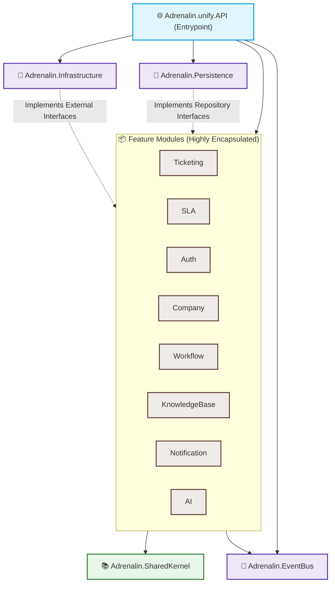
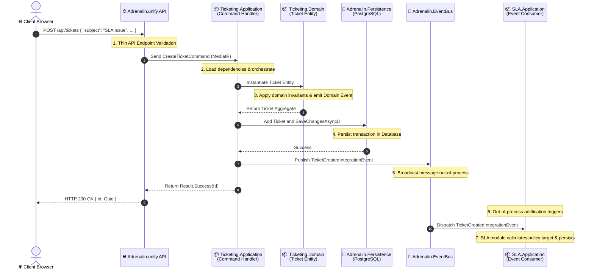

# Adrenalin Backend Architecture Blueprint & Developer Guide

> [!IMPORTANT]
> **This is the single source of truth for the Adrenalin backend architecture.** Every developer joining the team must read, understand, and strictly follow these guidelines. If we violate these architectural boundaries, our modular monolith will degrade into a spaghetti codebase.

---

## 🏛️ Overall Architectural Philosophy

Adrenalin is built as a **Modular Monolith** using **Domain-Driven Design (DDD)** and **Clean Architecture** principles.
By maintaining strict boundary controls between our modules and layers, we achieve a system that is:

1. **Highly Maintainable**: Changes in one module (e.g., SLA calculations) do not break or impact another module (e.g., KnowledgeBase).
2. **Easy to Refactor**: Modules can eventually be extracted into independent microservices if scaling requirements demand it.
3. **Highly Testable**: Core business logic has zero dependencies on external databases, APIs, or UI concerns.



---

## 🔥 The Golden Rule

Before writing a single line of code, ask yourself these questions:

| Question                                                                                                     | Destination                                      |
| :----------------------------------------------------------------------------------------------------------- | :----------------------------------------------- |
| **Is it an HTTP controller, middleware, or API configuration?**                                              | ➡️ **`Adrenalin.unify.API`**                     |
| **Is it a pure, technology-agnostic business rule or domain entity?**                                        | ➡️ **`Adrenalin.Modules.[Feature].Domain`**      |
| **Is it a use case, orchestrator, command/query handler, or validator?**                                     | ➡️ **`Adrenalin.Modules.[Feature].Application`** |
| **Is it an EF Core DbContext, entity mapping configuration, or SQL query?**                                  | ➡️ **`Adrenalin.Persistence`**                   |
| **Is it a concrete connection to a third-party API, JWT generator, or SDK (e.g., SMTP, Redis, OpenAI SDK)?** | ➡️ **`Adrenalin.Infrastructure`**                |
| **Is it an integration event or subscriber for cross-module communication?**                                 | ➡️ **`Adrenalin.EventBus`**                      |
| **Is it a general utility, generic base class, or global constant used globally?**                           | ➡️ **`Adrenalin.SharedKernel`**                  |

---

## 🌐 Adrenalin.unify.API

### What & Why

The API project is the **entry point** and **composition root** of the application. Its sole responsibility is to receive incoming HTTP requests, route them to the correct application handler, enforce cross-cutting concerns (like global error handling, logging, and security), and serialize the output back into HTTP responses.

- **Location**: `backend/Adrenalin/Adrenalin.unify.API`
- **When**: When defining REST endpoints, custom middleware, Swagger/OpenAPI options, controller-level authentication attributes, or registering dependencies during startup.

### Should Contain

- Controllers (designed as thin routing layers)
- Custom HTTP Middlewares (e.g., global exception handling, request logging)
- Swagger / OpenAPI configuration
- Authentication & CORS configurations
- `Program.cs` & Dependency Injection registries (Composition Root)

### Should NOT Contain

- Business rules (e.g., calculation logic, validations)
- Database queries or Direct EF Core DbContext usage
- AI SDK calls (e.g. OpenAI)
- Repositories

### Examples

```csharp
// 💻 PATH: Adrenalin.unify.API/Controllers/TicketsController.cs

// ✅ CORRECT: Hand off the work immediately to a mediator command handler
[HttpPost]
public async Task<IActionResult> CreateTicket([FromBody] CreateTicketRequest request)
{
    var command = new CreateTicketCommand(request.Subject, request.Body);
    var result = await _mediator.Send(command);
    return result.IsSuccess ? Ok(result.Value) : BadRequest(result.Error);
}

// ❌ WRONG: Do not query or update the database directly from a controller
[HttpPost]
public async Task<IActionResult> CreateTicketDirect([FromBody] CreateTicketRequest request)
{
    var ticket = new Ticket { Subject = request.Subject, Body = request.Body };
    _context.Tickets.Add(ticket); // <-- ARCHITECTURAL VIOLATION
    await _context.SaveChangesAsync();
    return Ok(ticket);
}
```

---

## 📚 Adrenalin.SharedKernel

### What & Why

The `SharedKernel` contains highly reusable, technology-agnostic code that is referenced and used by **every** module in the monolith. It provides standard building blocks for domain modeling and application workflows.

- **Location**: `backend/Adrenalin/Adrenalin.SharedKernel`
- **When**: When you need a generic helper, base domain element, or standard result model that has absolutely zero business logic specific to any domain.

### Should Contain

- `BaseEntity` & `AggregateRoot` classes
- Universal `Result<T>` and `Error` pattern abstractions
- `IDomainEvent` marker interfaces
- System-wide constants (e.g., core dates, global formatting)
- Global custom exception classes (e.g., `DomainException`)
- Common pagination types and request wrappers

### Should NOT Contain

- Domain-specific entities (e.g., `Ticket`, `User`, `Company`)
- Infrastructure libraries (e.g., EF Core, Redis client)
- Business processes or calculations

### Examples

```csharp
// 💻 PATH: Adrenalin.SharedKernel/Base/Entity.cs

// ✅ CORRECT: Technology-agnostic base entity representation
public abstract class Entity
{
    public Guid Id { get; protected init; } = Guid.NewGuid();
    private readonly List<IDomainEvent> _domainEvents = new();
    public IReadOnlyCollection<IDomainEvent> DomainEvents => _domainEvents.AsReadOnly();
}

// ❌ WRONG: Do not reference domain specific properties or logic here
public abstract class Entity
{
    public Guid Id { get; set; }
    public Guid? CompanyId { get; set; } // <-- WRONG: Not all entities belong to a Company
}
```

---

## 💾 Adrenalin.Persistence

### What & Why

The database encapsulation layer. It contains the schema mappings, repository implementations, migration definitions, and database-specific contexts. It is isolated so we can easily change our database provider (e.g., moving from Postgres to SQL Server) without changing a single line of business rules.

- **Location**: `backend/Adrenalin/Adrenalin.Persistence`
- **When**: When configuring tables in EF Core, writing custom database queries, running database migrations, or adding seed data.

### Should Contain

- EF Core `DbContext` definitions
- Fluent API Configuration classes (`IEntityTypeConfiguration<T>`)
- EF Core Migrations
- Concrete Repository implementations
- Database seed scripts

### Should NOT Contain

- Business validation or domain rules
- Non-database infrastructure (e.g., SMTP email dispatch, JWT generation, OpenAI SDK calls)
- Controllers or API routing logic

### Examples

```csharp
// 💻 PATH: Adrenalin.Persistence/Configurations/TicketConfiguration.cs

// ✅ CORRECT: Use Fluent API to map entities to database schemas
public class TicketConfiguration : IEntityTypeConfiguration<Ticket>
{
    public void Configure(EntityTypeBuilder<Ticket> builder)
    {
        builder.ToTable("tickets");
        builder.HasKey(t => t.Id);
        builder.Property(t => t.Subject).IsRequired().HasMaxLength(200);
    }
}

// ❌ WRONG: Do not perform business logic checks inside repository/persistence operations
public async Task SaveAsync(Ticket ticket)
{
    if (ticket.Status == TicketStatus.Resolved)
    {
        ticket.Resolve(); // <-- WRONG: Business transitions must occur in the Application/Domain layer, not when saving!
    }
    _context.Tickets.Update(ticket);
    await _context.SaveChangesAsync();
}
```

---

## 🔌 Adrenalin.Infrastructure

### What & Why

This layer contains all concrete integrations with external systems, APIs, and libraries. It acts as the gateway to the outside world, implementing interfaces defined in our Core/Modules.

- **Location**: `backend/Adrenalin/Adrenalin.Infrastructure`
- **When**: When you need to call a third-party API (e.g., OpenAI SDK), configure a cache provider (e.g., Redis client), send physical emails (e.g., SMTP / SendGrid client), or read key configurations from Azure KeyVault.

### Should Contain

- Token generators (e.g., JWT handlers)
- Mail dispatch implementations (SMTP, SendGrid, Amazon SES)
- Caching clients (Redis, Memcached)
- Storage providers (Azure Blob, AWS S3, File System)
- SDK clients (OpenAI client, Stripe client, Slack webhook sender)
- System logger wrappers

### Should NOT Contain

- Core domain model entities
- Business rules, SLA duration calculations, or workflow state transition rules

### Examples

```csharp
// 💻 PATH: Adrenalin.Infrastructure/Services/EmailSender.cs

// ✅ CORRECT: Standard, low-level wrapper around a physical communication protocol
public class EmailSender : IEmailSender
{
    private readonly SmtpClient _client;
    public async Task SendEmailAsync(string to, string subject, string body)
    {
        var mail = new MailMessage("no-reply@adrenalin.com", to, subject, body);
        await _client.SendMailAsync(mail);
    }
}

// ❌ WRONG: Do not bake core domain routing decisions here
public class EmailSender : IEmailSender
{
    public async Task SendEmailAsync(Ticket ticket)
    {
        if (ticket.Priority == TicketPriority.High) // <-- WRONG: High-level business routing inside low-level driver!
        {
             // ...
        }
    }
}
```

---

## 🚌 Adrenalin.EventBus

### What & Why

The `EventBus` is the nervous system of our Modular Monolith. It facilitates decoupled, asynchronous communication between different feature modules using integration events.

- **Location**: `backend/Adrenalin/Adrenalin.EventBus`
- **When**: When a change in one module needs to trigger actions in other modules (e.g., "Ticket Created" needs to notify the SLA tracker and the Notification module).

### Should Contain

- Integration Event contracts (plain records/DTOs containing minimal transactional state)
- Publish/Subscribe abstractions
- Concrete broker configurations (e.g., in-memory MediatR notifications, RabbitMQ, Azure Service Bus)

### Should NOT Contain

- Domain-specific validation rules
- Controller routes or DbContext instances

### Examples

```csharp
// 💻 PATH: Adrenalin.EventBus/Events/TicketCreatedIntegrationEvent.cs

// ✅ CORRECT: Lean, serializable representation of an event that has already occurred
public record TicketCreatedIntegrationEvent(Guid TicketId, string Subject, Guid CustomerId) : IIntegrationEvent;

// ❌ WRONG: Do not invoke direct operational module actions inside the event definition
public record TicketCreatedIntegrationEvent(Ticket Ticket) // <-- WRONG: Do not pass fat domain models across module boundaries!
{
    public void Handle()
    {
         Ticket.AssignToDefaultQueue(); // <-- WRONG: Violates module encapsulation boundaries
    }
}
```

---

## 📦 Feature Modules (`Adrenalin.Modules.*`)

Each feature module is treated like a mini-application, completely self-contained. Communication with other modules should strictly go through integration events (using `EventBus`) or thin, well-defined service interfaces to prevent tight coupling.

---

### 🔑 Adrenalin.Modules.Auth

- **Purpose**: Manages user authentication, authorization, registration, identity, and group membership.
- **Should Contain**:
  - `User`, `Role`, `Permission`, and `Group` entities
  - Log-in / Log-out use cases
  - JWT use cases and registration logic
  - Security policies
- **Should NOT Contain**:
  - Ticket management logic
  - Company settings configuration
  - SLA policy definitions

---

### 🏢 Adrenalin.Modules.Company

- **Purpose**: Manages business accounts, domains, settings, and contact information.
- **Should Contain**:
  - `Company` and `Contact` aggregates
  - Domain white-label configurations (e.g., custom helpdesk domain name matching)
  - Company-specific settings configurations (e.g., business hours, localized locales)
- **Should NOT Contain**:
  - Ticket assignment and queue rules
  - SLA policy calculations
  - AI response drafts and ticket predictions

---

### 🎫 Adrenalin.Modules.Ticketing

- **Purpose**: Manages the complete ticket lifecycle, user comments, satisfaction surveys (CSAT), and attachment lists.
- **Should Contain**:
  - `Ticket`, `Comment`, `Attachment`, and `CSAT` domain entities
  - Create, assign, resolve, merge, and close ticket commands
  - Adding comments and files queries
- **Should NOT Contain**:
  - Direct SMTP email dispatch implementations (call `IEmailSender` from Infrastructure instead)
  - Direct JWT parsing and token construction
  - Direct Redis cache commands

#### Examples

```csharp
// 💻 PATH: Adrenalin.Modules.Ticketing/Domain/Entities/Ticket.cs

// ✅ CORRECT: Use encapsulation to govern internal status changes and domain events
public class Ticket : Entity
{
    public TicketStatus Status { get; private set; } = TicketStatus.Open;

    public void Resolve()
    {
        if (Status == TicketStatus.Closed)
            throw new DomainException("Closed tickets cannot be resolved.");

        Status = TicketStatus.Resolved;
        AddDomainEvent(new TicketResolvedDomainEvent(Id));
    }
}

// ❌ WRONG: Do not directly reference low-level system adapters inside the domain entities
public class Ticket : Entity
{
    public void Resolve(ISmtpSender smtp)
    {
        Status = TicketStatus.Resolved;
        smtp.Send("customer@company.com", "Ticket Resolved", "Your ticket has been resolved."); // <-- VIOLATION
    }
}
```

---

### 🔀 Adrenalin.Modules.Workflow

- **Purpose**: Governs dynamic ticket state transitions, visual workflow layouts, approval flows, and validation rules.
- **Should Contain**:
  - Workflow graphs, states, and transition rules
  - Approval chains and assignment logic based on states
- **Should NOT Contain**:
  - SMTP/Email sending logic
  - OpenAI API connectors
  - Active authentication tokens or credentials

---

### ⏰ Adrenalin.Modules.SLA

- **Purpose**: Handles SLA policies, target calculation timers, business hour schedules, and notification/escalation triggers.
- **Should Contain**:
  - SLA policy rules and schedules
  - Escalation policies
  - Target calculation functions (Response Time, Resolution Time)
- **Should NOT Contain**:
  - Ticket creation controllers
  - Direct SMTP wrappers
  - Authentication workflows

#### Examples

```csharp
// 💻 PATH: Adrenalin.Modules.SLA/Application/UseCases/CalculateSLATargets.cs

// ✅ CORRECT: Business calculation using defined schedules and boundaries
public DateTime CalculateResponseDeadline(DateTime createdAt, SlaPolicy policy, BusinessHours hours)
{
    return hours.AddWorkingMinutes(createdAt, policy.ResponseTimeLimitMinutes);
}

// ❌ WRONG: Do not perform database user creation or cross-module mutations here
public void CreateEscalationUser(string name)
{
    var user = new User { Name = name }; // <-- WRONG: Violates encapsulation of Adrenalin.Modules.Auth
    _authContext.Users.Add(user);
}
```

---

### 📖 Adrenalin.Modules.KnowledgeBase

- **Purpose**: Manages public/private article libraries, nested categories, folder hierarchies, and customer self-service search.
- **Should Contain**:
  - `Article`, `Folder`, `Tag` aggregates
  - Search and portal visualization commands
  - Related attachments
- **Should NOT Contain**:
  - Ticket status modification procedures
  - Authentication credential hashing
  - SLA escalation triggers

---

### 🔔 Adrenalin.Modules.Notification

- **Purpose**: Orchestrates outbound customer alerts, event email queues, system notification history, and layout templates.
- **Should Contain**:
  - Notification template structures
  - Outgoing event subscription consumers
  - Reminders dispatch schedules
- **Should NOT Contain**:
  - Concrete SMTP communication implementations (these belong in `Infrastructure`)
  - OpenAI prompts or predictions (these belong in `Modules.AI`)

---

### 🤖 Adrenalin.Modules.AI

- **Purpose**: Orchestrates high-level AI tasks, drafts, classifications, sentiments, and recommendations.
- **Should Contain**:
  - AI prompt builders and formatting pipelines
  - Sentiment scoring orchestration logic
  - Ticket tag recommendation commands
- **Should NOT Contain**:
  - Direct SDK connections to OpenAI, Azure AI, or local models. (These are external services and belong under `Infrastructure/ExternalServices/`)

---

### 📖 Adrenalin.Modules.Lookup

- **Purpose**: Manages all system-wide reference data and master data lists used across modules (e.g. ticket types, priority levels, statuses, categories, departments).
- **Should Contain**:
  - `LookupType`, `LookupValue` aggregates
  - Commands and queries for CRUD operations on lookup data
  - Seeding and caching of static reference values
- **Should NOT Contain**:
  - Business logic specific to any module (e.g. ticket processing, SLA rules)
  - Authentication or user management
  - Workflow or escalation triggers

---

## 🧪 Testing Projects

To keep our applications reliable, we structure tests into two layers:

---

### 🔬 Adrenalin.UnitTests

- **Purpose**: Verifies that business rules and calculation logic are 100% correct.
- **Rules**:
  - No external dependencies allowed (e.g., no database, no real file system, no network connections).
  - Use mock/stub interfaces for external actions.
  - Executes extremely fast (fractions of a second).
- **Contains**:
  - Domain Entity tests (e.g., Ticket state transitions)
  - Use Case / Command Handler tests (using mock databases)
  - Validation checks (FluentValidation tests)

---

### 🧪 Adrenalin.IntegrationTests

- **Purpose**: Verifies that layers connect together correctly, schemas align with the database, and workflows perform correctly.
- **Rules**:
  - Interacts with real components (e.g., spinning up a Docker container with PostgreSQL).
  - Exercises REST controllers to perform end-to-end user actions.
- **Contains**:
  - Database constraint and index tests
  - API routing and JSON serialization validations
  - Full E2E workflows (e.g., Log in ➡️ Create Ticket ➡️ Calculate SLA deadline)

---

## 🔄 Complete End-to-End Workflow Flow: Creating a Support Ticket

To understand how these directories and files interact in a real-world scenario, let's trace a complete lifecycle: **A customer submits a new support ticket on the portal, which must persist in the database and automatically trigger an SLA escalation calculation in another module.**

### 🗺️ Visual Flow Sequence



---

### 📂 Step-by-Step File Flow Breakdown

Here is the exact sequence of files, their relative paths, and exactly how the execution traverses the codebase without getting bogged down in boilerplate code.

---

### 🏁 1. Where it Starts: The Presentation Layer

#### 📄 `Adrenalin.unify.API/Controllers/TicketsController.cs`

- **Role**: **The HTTP Entry Point**
- **What happens here**:
  1. The customer sends a `POST` request with a JSON payload to `/api/tickets`.
  2. This controller receives the request, binds it to a `CreateTicketCommand` object, and immediately hands it over to the mediator pipeline (`_mediator.Send`).
  3. **Important**: No business logic, no validation checks, and no database contexts are loaded here. It is kept extremely thin.

---

### 🚀 2. Where it Goes: Application & Domain Core (Ticketing Module)

#### 📄 `Adrenalin.Modules.Ticketing/Application/Commands/CreateTicketCommandHandler.cs`

- **Role**: **The Orchestrator / Use Case Handler**
- **What happens here**:
  1. The mediator routes the command to this handler.
  2. The handler orchestrates the operation: it calls the domain entity's factory method to create the ticket, passes the ticket to the repository, triggers database persistence, and fires an integration event to alert other modules.

#### 📄 `Adrenalin.Modules.Ticketing/Domain/Entities/Ticket.cs`

- **Role**: **The Domain Entity (Aggregate Root)**
- **What happens here**:
  1. This is where business validation lives (e.g. verifying that a subject is provided and is within allowed limits).
  2. If validation succeeds, it instantiates the `Ticket` entity, sets its default status (`Open`), and queues a local `TicketCreatedDomainEvent`.
  3. **Important**: This file contains only pure business logic and has zero dependencies on databases or web contexts.

#### 📄 `Adrenalin.Persistence/Repositories/TicketRepository.cs`

- **Role**: **The Data Access Layer**
- **What happens here**:
  1. The command handler calls this repository to register the new Ticket entity.
  2. It saves the entity into the EF Core `DbContext` which writes the records directly into the PostgreSQL database.

---

### 🚌 3. Crossing Module Boundaries: Asynchronous Communication

#### 📄 `Adrenalin.EventBus/Events/TicketCreatedIntegrationEvent.cs`

- **Role**: **The Communication Contract**
- **What happens here**:
  1. Once the database successfully saves the ticket, the Ticketing handler publishes this event to the `EventBus`.
  2. This event is a tiny record carrying only key IDs (e.g., `TicketId`, `CustomerId`).
  3. **Important**: By publishing this lightweight event, the Ticketing module remains fully decoupled from the SLA module.

---

### 🎯 4. Where it Ends: Decoupled Side-Effect (SLA Module)

#### 📄 `Adrenalin.Modules.SLA/Application/IntegrationEvents/TicketCreatedIntegrationEventConsumer.cs`

- **Role**: **The Asynchronous Event Consumer**
- **What happens here**:
  1. The `EventBus` broadcasts the integration event, and this consumer inside the **SLA Module** catches it.
  2. The SLA consumer reads the `CustomerId` from the event and triggers its internal service to calculate when the ticket must be answered based on the client's SLA tier and business hours.
  3. The SLA tracker record is then generated and persisted in the database, completing the entire end-to-end lifecycle.

---
