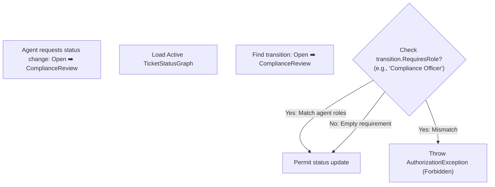

# 🔒 Authentication & Role-Based Access Control (RBAC)

This document details the security model, token validation, roles, and granular permission constraints governing the Adrenalin backend and specifically the Ticketing module.

---

## 🔑 Authentication Architecture

Adrenalin uses JWT (JSON Web Token) bearer authentication. All incoming HTTP requests to protected routes must provide a valid signature in the `Authorization` header:

```http
Authorization: Bearer <JWT_TOKEN>
```

### Required JWT Claims
The composition root decodes and maps JWT claims during HTTP middleware pipeline execution:
*   `sub` / `nameid`: The unique `Guid` user ID (mapped to `ClaimTypes.NameIdentifier`).
*   `role`: The string identifier representing the active user role (mapped to `ClaimTypes.Role`).
*   `company_id`: The unique tenant identification code matching `CompanyId`.

---

## 🏛️ RBAC Role Registry

The database seeds a set of system-wide roles. System roles (`is_system_role = true` in table configuration) are protected and cannot be deleted via the Admin dashboard.

| Role Code | User Class | Permitted Operations |
| :--- | :--- | :--- |
| `admin` | Internal Staff | Full CRUD control across all schemas, SLA configurations, role adjustments, and settings. |
| `manager` | Internal Staff | Assigns tickets across all groups, overrides SLA targets, views cross-group metrics. |
| `team_lead` | Internal Staff | Manages group assignees, executes approvals, overrides status transitions. |
| `junior_agent` | Internal Staff | Processes assigned tickets, adds public and internal comments, uploads attachments. |
| `collaborator` | Internal Staff | Observes ticket progress, posts internal comment notes only, cannot change status. |
| `pmo` | Internal Staff | Audits resolved/closed tickets, logs review notes. |
| `Customer` / `Contact` | External Client | Creates tickets, views own tickets, uploads attachments, posts public comments, submits CSAT. |

---

## 🚫 Ticketing Module Specific Constraints

The domain model contains hardcoded logic enforcing security constraints that can never be bypassed:

### 1. Comment Visibility Constraints
*   **Public Comments**: Visible to agents and customers.
*   **Internal Notes**: Visible to internal agents only. Enforced by domain checks in `TicketComment.cs`:
    > [!WARNING]
    > Customer comments (where `contact_id` is present) **cannot** have their visibility set to `CommentVisibility.Internal`. Any attempt to post an internal comment on behalf of a customer will throw a `TicketDomainException`.

### 2. Assignment Constraints
*   Agents cannot be assigned to closed tickets. Doing so will throw a domain error.

### 3. Attachment Constraints
*   Upload sizes are restricted to a maximum of **50MB**.
*   Uploaded attachments inherit the visibility of their associated comment (if uploaded as part of a reply).

---

## 🔀 Dynamic Workflow-Driven Checks (`StatusTransition.RequiresRole`)

In addition to static role checks, the `Workflow` module enables custom status transitions governed by dynamic rules stored in `workflow.status_transitions`.



### Execution Flow
1. When an agent requests a status change (`POST /api/tickets/{ticketId}/status`), the handler loads the ticket's active `TicketStatusGraph`.
2. It looks up the defined `StatusTransition` node matching the current state (`FromStatus`) and target state (`ToStatus`).
3. If the transition has `RequiresRole` configured (e.g. `RequiresRole = "Compliance Officer"`):
   - The application checks the active agent's JWT role claims or user group mappings.
   - If the agent lacks the required role, the transition is blocked, and the API returns a `403 Forbidden` response.
4. If `RequiresField` is defined (e.g. `RequiresField = "rca"`):
   - The handler checks that the target field is populated on the entity.
   - If not populated, the transition is blocked with a `400 BadRequest` validation error.
