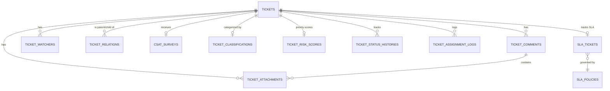

# 💾 Ticketing Database Schema & EF Core Configurations

This document details the database schema, EF Core mappings, column metadata, indexes, and constraints for the Ticketing, Workflow, and SLA systems. All tables are hosted in a PostgreSQL database mapped using EF Core.

---

## 🏛️ Schema Architecture Overview

Tables are logically partitioned into PostgreSQL schemas:
1. **`ticket` schema**: Houses the core transactional ticketing tables (e.g. `tickets`, `comments`, `attachments`, etc.).
2. **`workflow` schema**: Houses dynamic state transitions and graph validation tables.
3. **`sla` schema**: Houses SLA policies, tickets target tracking, and escalation logs.

---

## 🗃️ 1. Core Transactional Tables (`ticket` Schema)

### 🎫 `ticket.tickets`
The central transactional entity representing customer and agent support requests.

- **Primary Key**: `id` (`uuid`, default: `gen_random_uuid()`)
- **Table Comment**: `"Central transactional entity. graph_id is resolved once at creation via scope engine. version_id/module_id/sub_module_id are normalized FK refs per Addendum v7. sla_excluded=true during hypercare/delivery mode. is_on_hold_payment for payment holds."`

| Column | Type | Constraints | Description |
| :--- | :--- | :--- | :--- |
| `id` | `uuid` | PK | Unique ticket identifier. |
| `ticket_number` | `varchar(20)` | Unique | Human-readable ticket number (e.g., TK-1002). |
| `company_id` | `uuid` | FK (`company.companies`) | The business account owning the ticket. |
| `contact_id` | `uuid` | FK (`company.contacts`) | The external client contact reporting the ticket. |
| `group_id` | `uuid` | FK (`auth.groups`) | The support group assigned (e.g., Tier 2). |
| `assigned_agent_id` | `uuid` | FK (`auth.users`) | The active agent assigned. |
| `created_by_user_id`| `uuid` | FK (`auth.users`) | User ID of creator (if created internally). |
| `graph_id` | `uuid` | FK (`workflow.ticket_status_graphs`) | Active state machine graph. |
| `module_id` | `uuid` | FK (`lookup.modules`) | The product module affected. |
| `sub_module_id` | `uuid` | FK (`lookup.sub_modules`) | Specific sub-module component. |
| `version_id` | `uuid` | FK (`lookup.product_versions`) | Affected product version code. |
| `subject` | `text` | Required | Short summary of the issue. |
| `description` | `text` | Required | Exhaustive details of the ticket request. |
| `status` | `varchar(30)` | Required | State machine value (e.g., New, Open, Resolved). |
| `product_type` | `varchar(40)` | Optional | Mapped product line metadata. |
| `rca` | `text` | Required for Resolve | Root Cause Analysis log. |
| `customer_call_taken` | `boolean` | Required for Resolve | Flag verifying interactive call was recorded. |
| `sla_excluded` | `boolean` | Default `false` | Excludes ticket from SLA breaching timers. |
| `is_on_hold_payment`| `boolean` | Default `false` | Triggers custom hold on billing disputes. |
| `priority_score` | `numeric(4,2)` | Computed (0–5) | Mapped priority score based on weighting formula. |
| `impact_score` | `numeric(4,2)`| Optional | Evaluated impact level. |
| `urgency_score` | `numeric(4,2)`| Optional | Evaluated urgency level. |
| `sentiment_score` | `numeric(4,2)`| Optional | Sentiment index extracted from client text. |
| `sla_severity_score`| `numeric(4,2)`| Optional | Severity weight based on SLA tier. |
| `type_weight` | `numeric(4,2)`| Optional | Weight factor of the ticket type. |
| `tier_weight` | `numeric(4,2)`| Optional | Weight factor of client tier. |
| `priority_score_at` | `timestamptz` | Optional | Timestamp of last priority evaluation. |
| `force_p1` | `boolean` | Default `false` | TRUE when emergency force rules trigger. |
| `is_auto_resolved` | `boolean` | Default `false` | TRUE when closed by automated AI matching engine. |
| `customer_reply_count`| `integer` | Default `0` | Tracks client replies (triggers re-evaluations). |
| `row_version` | `bytea` | RowVersion | Optimistic concurrency control wrapper. |

#### Indexes
- `uq_tickets_number` / `idx_tickets_ticket_number`: Unique index on `ticket_number`.
- `idx_tickets_payment_hold`: Filtered index on `is_on_hold_payment = true` and `is_deleted = false`.
- `idx_tickets_auto_resolved`: Filtered index on `is_auto_resolved = true` and `is_deleted = false`.
- `idx_tickets_force_p1`: Filtered index on `force_p1 = true` and `is_deleted = false`.
- `idx_tickets_created_at`: Descending index on `created_at` for rapid listing scans.
- `idx_tickets_priority_score`: Descending index on `priority_score` sorting nulls last.

---

### 💬 `ticket.ticket_comments`
Stores public and internal comments (replies/notes) on a ticket.

- **Primary Key**: `id` (`uuid`)
- **Foreign Keys**: `ticket_id` references `ticket.tickets`

| Column | Type | Constraints | Description |
| :--- | :--- | :--- | :--- |
| `id` | `uuid` | PK | Unique identifier. |
| `ticket_id` | `uuid` | FK | Associated ticket. |
| `author_id` | `uuid` | FK (`auth.users`) | Agent ID if written by support staff. |
| `contact_id` | `uuid` | FK (`company.contacts`) | Contact ID if written by client customer. |
| `body` | `text` | Required | Comment text (max 10,000 characters). |
| `visibility` | `integer` | Default `Public` | Enum: Public (1), Internal (2), System (3), AI (4). |

> [!NOTE]
> Customers cannot write internal comments. If `contact_id` is populated, the `visibility` column cannot be set to `2` (Internal).

---

### 📎 `ticket.ticket_attachments`
Stores file metadata for items uploaded directly to a ticket or linked to comments.

- **Primary Key**: `id` (`uuid`)
- **Max File Size**: 50MB (`52,428,800` bytes)

| Column | Type | Constraints | Description |
| :--- | :--- | :--- | :--- |
| `id` | `uuid` | PK | Unique identifier. |
| `ticket_id` | `uuid` | FK | Associated ticket. |
| `comment_id` | `uuid` | FK | Associated comment (null if overall ticket attach). |
| `file_name` | `varchar(255)`| Required | Physical name of file. |
| `file_url` | `text` | Required | Storage URL key matching local/cloud storage. |
| `file_size_bytes` | `bigint` | Required | Size constraint validation (Max 50MB). |
| `mime_type` | `varchar(100)`| Required | Document MIME descriptor. |

---

### 👥 `ticket.ticket_watchers`
Decoupled mapping of agents observing the ticket for notifications.

- **Unique Constraint**: `(ticket_id, user_id)`

| Column | Type | Constraints | Description |
| :--- | :--- | :--- | :--- |
| `ticket_id` | `uuid` | FK | Associated ticket. |
| `user_id` | `uuid` | FK (`auth.users`) | Watching agent user ID. |
| `created_by` | `uuid` | FK | User who added this watcher. |

---

### 🔄 `ticket.ticket_relations`
Models dependencies, duplicates, and split-offs between tickets.

| Column | Type | Constraints | Description |
| :--- | :--- | :--- | :--- |
| `parent_ticket_id` | `uuid` | FK | Target ticket. |
| `child_ticket_id` | `uuid` | FK | Relational ticket (cannot be parent ticket). |
| `relation_type` | `integer` | Required | Mapped Enum (Related, Duplicate, SplitFrom, etc.). |

---

### 📝 `ticket.csat_surveys`
Tracks customer satisfaction feedback submitted upon ticket resolution.

| Column | Type | Constraints | Description |
| :--- | :--- | :--- | :--- |
| `ticket_id` | `uuid` | PK, FK | Mapped 1-to-1 with Ticket. |
| `contact_id` | `uuid` | FK | Customers submit survey feedback. |
| `rating` | `integer` | Required (1-5) | Star score feedback indicator. |
| `feedback` | `text` | Optional | Free-text feedback review. |

---

## 🕒 2. Audit & Support Logging Tables

### 📋 `ticket.ticket_status_histories`
Stores sequential state transitions to feed reports and SLA trackers.

| Column | Type | Description |
| :--- | :--- | :--- |
| `ticket_id` | `uuid` | Target ticket ID. |
| `from_status` | `varchar` | Initial status (null for creation). |
| `to_status` | `varchar` | Destination status. |
| `changed_by` | `uuid` | Operator executing state changes. |
| `changed_at` | `timestamptz`| Timestamp of transition action. |
| `reason` | `varchar` | Change notes. |

### 🛠️ `ticket.ticket_assignment_logs`
Logs ticket handoffs between agents for tracking workloads.

| Column | Type | Description |
| :--- | :--- | :--- |
| `ticket_id` | `uuid` | Target ticket ID. |
| `previous_agent_id`| `uuid` | Agent transferred from. |
| `new_agent_id` | `uuid` | Agent assigned to. |
| `assigned_by` | `uuid` | Operator assigning. |
| `notes` | `text` | Reason for handoff. |

---

## 📊 3. SLA & Target Calculation Tables (`sla` Schema)

### ⏰ `sla.sla_tickets`
Maintains operational SLA timelines, deadlines, and breaches.

- **Primary Key**: `ticket_id` (`uuid`, maps 1-to-1 to `ticket.tickets`)

| Column | Type | Description |
| :--- | :--- | :--- |
| `ticket_id` | `uuid` | Target ticket. |
| `policy_id` | `uuid` | Active policy matching client tier and ticket priority. |
| `first_response_due_at` | `timestamp` | Deadline target for initial agent comment response. |
| `first_response_at` | `timestamp` | Actual timestamp of first public agent comment. |
| `first_response_breached`| `boolean` | Flag set automatically if response misses target. |
| `resolution_due_at` | `timestamp` | Deadline target for ticket resolution. |
| `resolved_at` | `timestamp` | Actual timestamp when resolved. |
| `resolution_breached` | `boolean` | Flag set if resolution misses target. |
| `paused_minutes` | `integer` | Accumulation of pauses while status is PendingCustomer/OnHold. |
| `last_paused_at` | `timestamp` | Last timestamp the ticket SLA paused. |

### 📜 `sla.sla_policies`
Houses SLA targets mapped by customer tiers and regions.

| Column | Type | Description |
| :--- | :--- | :--- |
| `id` | `uuid` | PK |
| `name` | `varchar` | Policy Name (e.g., Gold Tier SLA). |
| `geo_region` | `varchar` | Regional scope (e.g. US, EU). |
| `tier_code` | `varchar` | Target client tier matching code (e.g., Enterprise, Standard). |
| `priority` | `varchar` | Ticket priority matching code (Urgent, High, Medium, Low). |
| `first_response_minutes` | `integer` | Target response constraint minutes. |
| `resolution_minutes` | `integer` | Target resolution constraint minutes. |

---

## 🔀 4. Workflow State Mappings (`workflow` Schema)

Governs custom state transitions configured via administration UI.

### 🌐 `workflow.ticket_status_graphs`
Defines active state machine pipelines.
- `graph_code`: Key code identifier (e.g., `STANDARD_WF`).
- `name`: Graphical mapping title.

### 🔌 `workflow.status_transitions`
Individual nodes defining state machine configurations.

| Column | Type | Description |
| :--- | :--- | :--- |
| `id` | `uuid` | PK |
| `graph_id` | `uuid` | FK references `ticket_status_graphs`. |
| `from_status` | `varchar` | Source status. |
| `to_status` | `varchar` | Dest status. |
| `requires_role` | `varchar` | Role restriction enforcing transition authorization (RBAC). |
| `requires_field` | `varchar` | Field validation constraint required before status changes. |
| `auto_trigger` | `boolean` | Flag indicating automated systemic trigger. |
