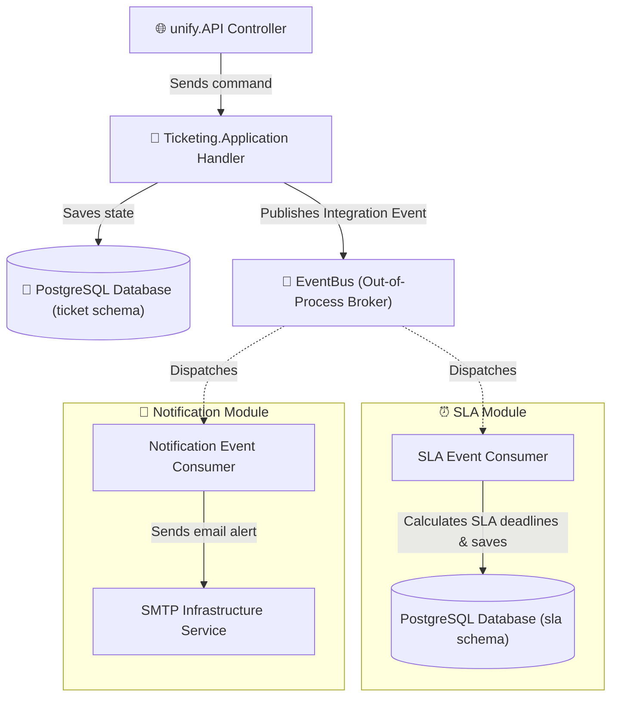
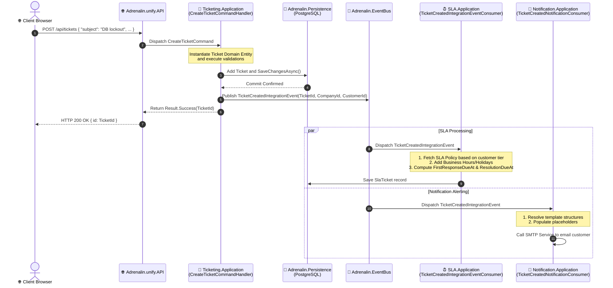

# 🚌 Cross-Module Event Flow & Dispatcher Architecture

This document details the decoupled, asynchronous cross-module communication pattern in Adrenalin. By utilizing the `Adrenalin.EventBus` project and integration events, we ensure that a failure in a side-effect service (like email notifications or SLA timer updates) never rolls back the core ticketing transactions.

---

## 🏛️ Event-Driven Communication Architecture

In Adrenalin, features are encapsulated inside isolated modules (e.g. `Ticketing`, `SLA`, `Auth`, `Notification`). 



### Key Principles
1. **Fat Domain Models stay within the Module**: We never broadcast domain aggregates (like `Ticket.cs`) on the `EventBus`. The EventBus passes lightweight DTO-like Integration Event records carrying only ID keys.
2. **Transaction Isolation**: The Ticketing transaction commits *first*. Only after `SaveChangesAsync()` succeeds in Postgres is the integration event published.
3. **Decoupled Side-Effects**: The SLA module and the Notification module listen to these events independently. If the SMTP service fails, the ticket is still successfully saved and SLA targets are still calculated.

---

## 🔄 Sequence Flow: Ticket Creation to SLA Tracking

The following sequence diagram tracks execution when a client submits a new ticket.



---

## 📜 Integration Event Registry

The system publishes events matching values from the `TriggerEvent.cs` enum based on operational mutations:

### 1. `TicketCreatedIntegrationEvent`
- **Trigger**: Fired immediately after a new ticket transaction is successfully committed to the database.
- **Publisher**: `CreateTicketCommandHandler`
- **Contract Payload**:
```csharp
public record TicketCreatedIntegrationEvent(
    Guid TicketId, 
    Guid CompanyId, 
    Guid? ContactId,
    string Subject,
    string Priority
) : IIntegrationEvent;
```
- **Primary Consumers**:
  - **SLA Module**: Matches the priority and customer tier to create the active `SlaTicket` timers.
  - **Notification Module**: Dispatches the initial "We received your ticket" auto-reply email to the customer.

### 2. `TicketUpdatedIntegrationEvent`
- **Trigger**: Fired when critical fields that affect SLA or routing (such as Priority, Status, AssignedAgentId, or GroupId) are changed.
- **Publisher**: `ChangeTicketStatusCommandHandler` / `AssignTicketCommandHandler`
- **Contract Payload**:
```csharp
public record TicketUpdatedIntegrationEvent(
    Guid TicketId, 
    string PreviousStatus,
    string NewStatus,
    Guid? PreviousAgentId,
    Guid? NewAgentId,
    string? Notes
) : IIntegrationEvent;
```
- **Primary Consumers**:
  - **SLA Module**: Pauses or resumes response/resolution timers if the ticket status changes to `PendingCustomer` or `OnHold`.
  - **Gamification Module**: Records leaderboard points when an agent successfully moves a ticket from `InProgress` to `Resolved`.
  - **Notification Module**: Emails the assignee alerting them to the ticket handoff.

---

## ⏰ Time-Based Background Triggers (`TimeBased` SLA)

While status changes are reactive, SLA breaches must be detected even when no HTTP requests are coming in. 

1. **Scheduled Cron Job**: A background worker (configured via system cron scheduler) runs every **60 seconds**.
2. **Breach Validation**: The worker queries `sla.sla_tickets` for tickets where:
   - `first_response_breached = false` AND `first_response_at IS NULL` AND `first_response_due_at < NOW()`.
   - `resolution_breached = false` AND `resolved_at IS NULL` AND `resolution_due_at < NOW()`.
3. **Trigger Event**: Updates the breach flag and publishes `SlaBreachedIntegrationEvent` to notify team leads and initiate escalation rules.
