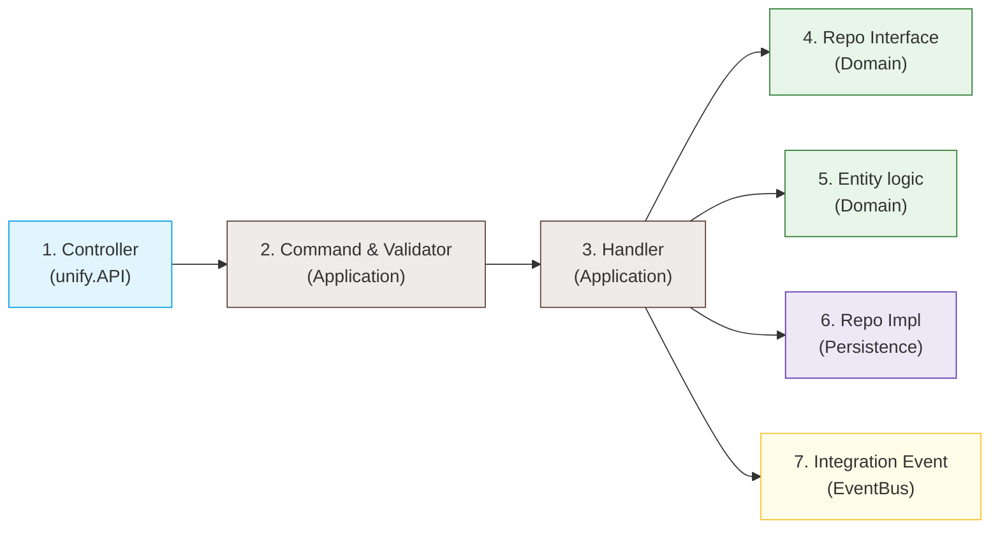

# 🗺️ Adrenalin Backend Folder Structure & Beginner's Navigation Guide

Welcome to the Adrenalin Backend! 🚀 If you are a beginner, seeing all these projects and folders can feel overwhelming at first. Don't worry! This guide is designed to de-mystify the architecture, explain **where things go**, and provide a simple **DO and DO NOT** checklist to keep you on the right path.

---

## 🏛️ The Big Picture: Our Modular Monolith

Adrenalin is structured as a **Modular Monolith** using **Domain-Driven Design (DDD)** and **Clean Architecture**. 

Think of it like a **large department store**:
*   **The Store Front (`unify.API`)**: The front desk where customers (frontend clients) make requests.
*   **The Departments (`Modules.*`)**: Encapsulated mini-shops (Ticketing, Auth, SLA) that run their own business.
*   **The Database Vault (`Persistence`)**: The master safe where all data is stored securely.
*   **The Delivery Service (`Infrastructure`)**: The external drivers who send emails or call third-party AI APIs.
*   **The Intercom (`EventBus`)**: The system departments use to broadcast announcements to each other.

---

## 📂 Visual Directory Tree (Cheat Sheet)

Here is a simplified map of the backend directory. Bookmark this!

```text
backend/Adrenalin/
│
├── 🌐 Adrenalin.unify.API/         <-- The Front Desk (HTTP Controllers, Middlewares)
│
├── 💾 Adrenalin.Persistence/       <-- The DB Vault (Migrations, EF Core DbContext, DB configurations)
│
├── 🔌 Adrenalin.Infrastructure/    <-- The Post Office (SMTP, Redis, OpenAI SDK, external integrations)
│
├── 🚌 Adrenalin.EventBus/          <-- The Intercom (Integration Events to communicate between modules)
│
├── 📚 Adrenalin.SharedKernel/      <-- The Common Toolbox (Base classes like Entity, Result<T>, global utilities)
│
├── 📦 Adrenalin.Modules.[Feature]/ <-- Feature Modules (e.g. Ticketing, Auth, SLA)
│   ├── 🪙 Domain/                  <-- Core business concepts (Pure, Zero Dependencies)
│   │   ├── 🧩 Entities/            <-- Objects with IDs (e.g., Ticket.cs, Comment.cs)
│   │   ├── 🔢 Enums/               <-- Statuses & States (e.g., TicketStatus.cs)
│   │   ├── 💎 ValueObjects/        <-- Simple attributes (e.g., SubjectText.cs, EmailAddress.cs)
│   │   ├── 📜 Interfaces/          <-- Repository & Outbound contracts (e.g., ITicketRepository.cs)
│   │   └── 🔔 Events/              <-- Local Domain Events (e.g., TicketClosedDomainEvent.cs)
│   │
│   └── 🧠 Application/             <-- Core business use cases & coordinators
│       ├── 📥 Commands/            <-- "Write" requests (e.g., CreateTicketCommand.cs)
│       ├── ⚙️ Handlers/            <-- Core work orchestrators (e.g., CreateTicketCommandHandler.cs)
│       ├── 📤 Queries/             <-- "Read" requests & handlers (e.g., GetTicketByIdQuery.cs)
│       ├── 🛡️ Validators/          <-- Input rule checkers (e.g., CreateTicketCommandValidator.cs)
│       └── 📦 DTOs/                <-- Plain data containers (e.g., TicketDto.cs)
│
└── 🧪 Testing Projects/
    ├── 🔬 Adrenalin.UnitTests/      <-- Fast business rule tests (No Database, No Network)
    └── 🧪 Adrenalin.IntegrationTests/<-- Real-world workflow tests (Real Database, E2E flows)
```

---

## 🚦 The Master Rulebook (What to DO vs. What to AVOID)

Use these quick rules to keep the architecture clean and prevent bugs.

### 1. 🌐 `Adrenalin.unify.API` (The Controller / Entrance)
*   ✅ **DO**: Map HTTP requests into Command or Query objects immediately and send them using MediatR.
*   ✅ **DO**: Configure routing, CORS, Swagger, authentication middleware, and global error handling here.
*   ❌ **DO NOT**: Write business rules, validation logic, or math here.
*   ❌ **DO NOT**: Reference `EF Core`, use DbContexts, or write SQL queries here.
*   ❌ **DO NOT**: Reference external SDKs like OpenAI or SendGrid here.

### 2. 🪙 `Adrenalin.Modules.[Feature].Domain` (The Heart)
*   ✅ **DO**: Keep this layer **100% pure C#**. It must have **zero references** to databases, web frameworks, or third-party APIs.
*   ✅ **DO**: Place business validation rules (invariants) inside your Domain Entities (e.g., `ticket.Resolve()` should throw an error if the ticket is already closed).
*   ✅ **DO**: Define Repository interfaces here (e.g., `ITicketRepository.cs`) so the domain knows *what* it needs without caring *how* the database does it.
*   ❌ **DO NOT**: Reference database libraries (like `Microsoft.EntityFrameworkCore`) or inject contexts.
*   ❌ **DO NOT**: Call SMTP clients or web services.

### 3. 🧠 `Adrenalin.Modules.[Feature].Application` (The Brain)
*   ✅ **DO**: Place your CQRS Commands, Queries, and Handlers here to coordinate the business use cases.
*   ✅ **DO**: Load entities from repositories, call domain functions on them, and save them back to persistence.
*   ✅ **DO**: Use `FluentValidation` in the `Validators/` folder to check if command payloads are valid before execution.
*   ❌ **DO NOT**: Write raw SQL queries or configure database tables.
*   ❌ **DO NOT**: Expose your database entities directly to the frontend. Convert them to clean **DTOs** (Data Transfer Objects) instead.

### 4. 💾 `Adrenalin.Persistence` (The DB Vault)
*   ✅ **DO**: Put all EF Core Configurations (`IEntityTypeConfiguration<T>`) here to map your clean C# domain entities to physical SQL tables.
*   ✅ **DO**: Write concrete Repository implementations (e.g., `TicketRepository.cs`) that fetch and save data using the EF Core DbContext.
*   ✅ **DO**: Manage DB migrations and database seed data here.
*   ❌ **DO NOT**: Put business workflow rules, calculations, or SLA escalation schedules here.

### 5. 🔌 `Adrenalin.Infrastructure` (The Post Office)
*   ✅ **DO**: Implement adapters for external communication, such as sending emails (`EmailSender.cs`), hashing passwords, generating JWTs, or connecting to external APIs (like OpenAI SDK).
*   ❌ **DO NOT**: Put core business decisions here (e.g., determining which user to assign a ticket to). Keep it purely technical.

### 6. 🚌 `Adrenalin.EventBus` (The Intercom)
*   ✅ **DO**: Use this to broadcast events across different modules (e.g. when `Ticketing` module finishes saving a ticket, it publishes `TicketCreatedIntegrationEvent` so the `SLA` and `Notification` modules can react to it in isolation).
*   ❌ **DO NOT**: Send large domain entities (like `Ticket`) across the EventBus. Send lightweight records containing only keys/IDs (like `TicketId`, `CustomerId`).

---

## 🛠️ Step-by-Step Exercise: Adding a New Feature

Let's say you want to add a feature: **"Allow customers to cancel their tickets."**
Here is the exact path of files you would create or modify:



1.  **Define the Action request**: 
    Create `CancelTicketCommand.cs` in `Modules.Ticketing/Application/Commands/`.
2.  **Add validation rules**: 
    Create `CancelTicketCommandValidator.cs` in `Modules.Ticketing/Application/Validators/` (e.g., verify that `TicketId` is not empty).
3.  **Add business logic in Entity**: 
    Open the domain entity `Ticket.cs` under `Modules.Ticketing/Domain/Entities/` and add a `Cancel()` method. Validate that closed tickets cannot be cancelled here.
4.  **Create the Handler**: 
    Create `CancelTicketCommandHandler.cs` in `Modules.Ticketing/Application/Handlers/`. This handler loads the ticket from the `ITicketRepository`, calls `ticket.Cancel()`, and saves the change.
5.  **Expose the Endpoint**: 
    Go to `Adrenalin.unify.API/Controllers/TicketsController.cs` and add a `POST /api/tickets/{id}/cancel` method that creates the Command and sends it via MediatR.
6.  *(Optional)* **Notify others**: 
    If other modules need to know, create a `TicketCancelledIntegrationEvent.cs` in `Adrenalin.EventBus/Events/` and publish it at the end of your Handler.

---

## 💡 Quick Tips for Success

1.  **Look around before coding**: The codebase has excellent examples (like `CreateTicketCommand` or `Lookup` values). If you are writing a new Command or Handler, open an existing one and copy its structure!
2.  **No shortcuts with layers**: It might feel faster to query the database directly in the controller or a domain class, but this will break tests and make the codebase hard to maintain. Keep the boundaries strict!
3.  **Use the compiler as your friend**: If you try to reference database classes in the `Domain` layer, the compiler will error out because the `Domain` project has no reference to `Persistence`. That's an intentional guardrail!
