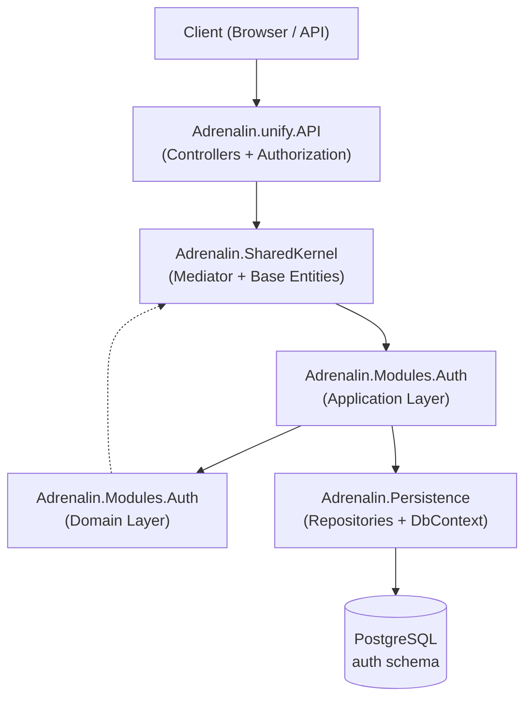
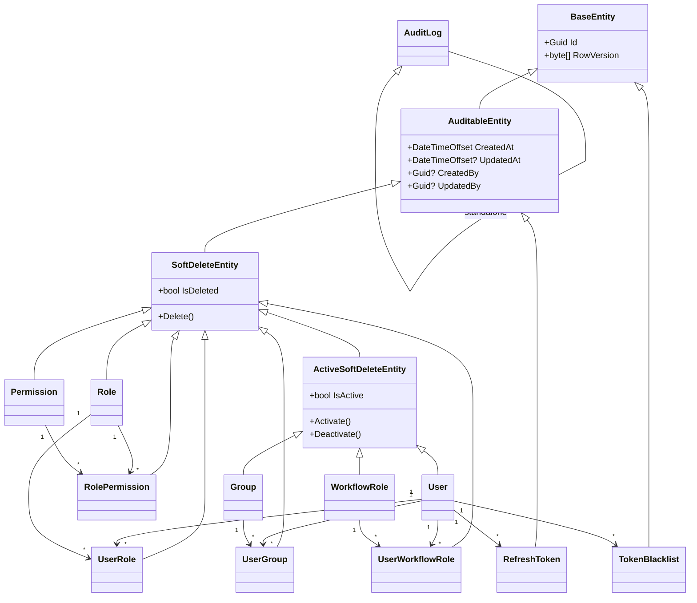
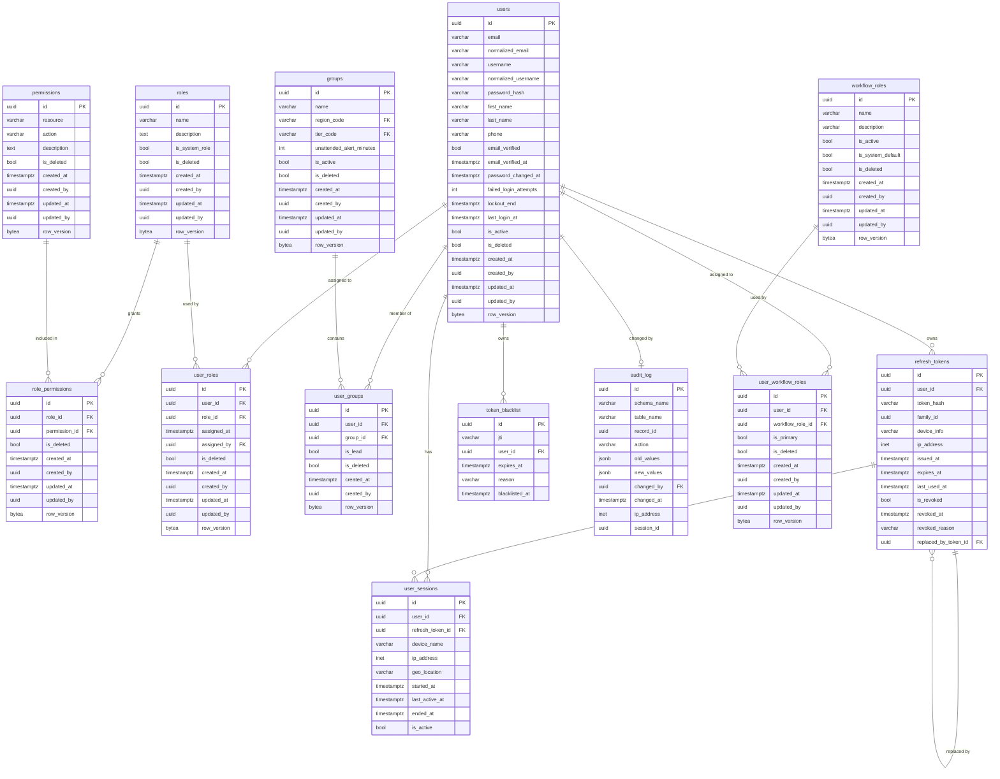
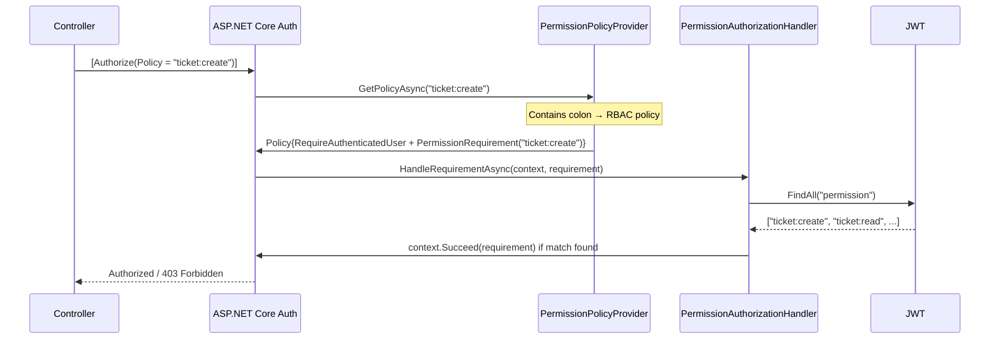
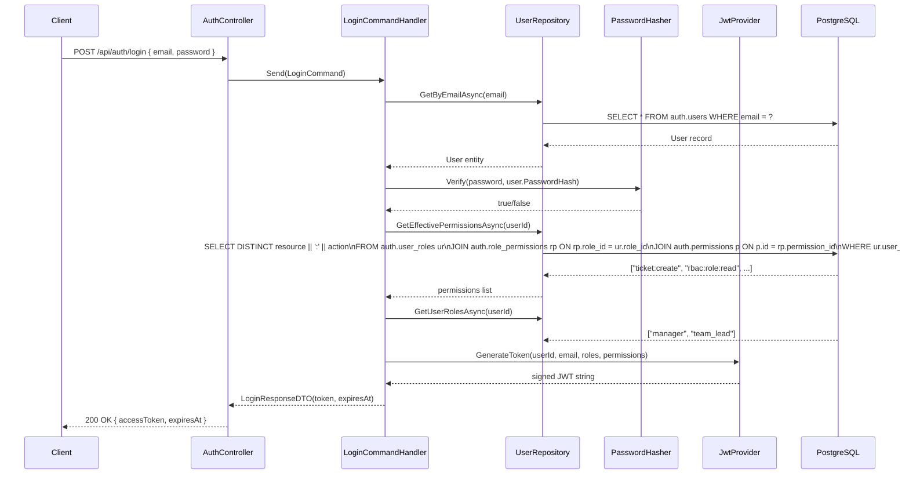
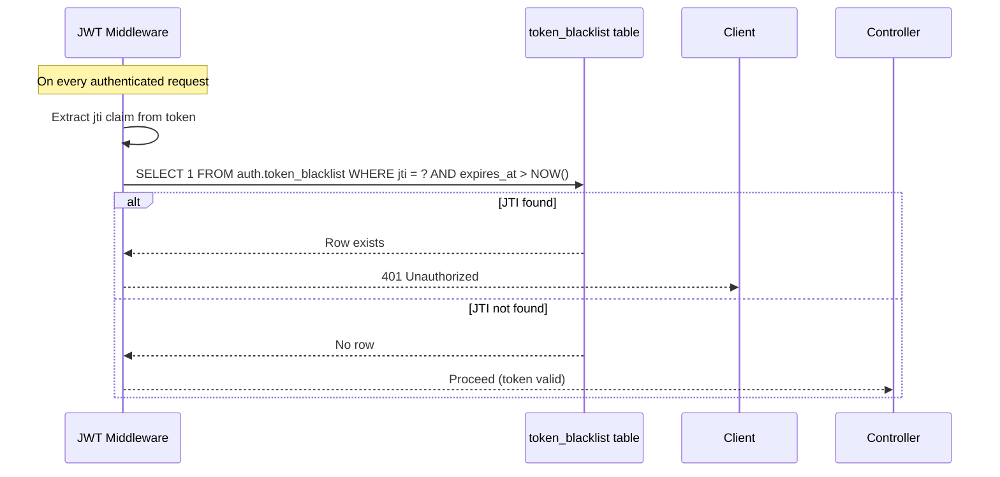
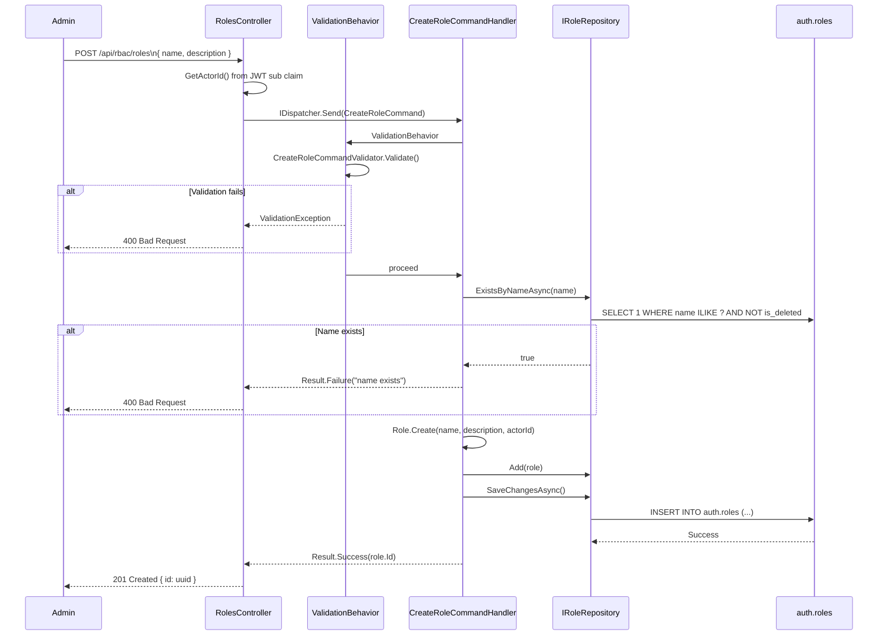

# RBAC Full Documentation — Adrenalin Unify Platform

> **Audience:** Backend Developers · Architects · Technical Leads · QA Engineers · Future Maintainers  
> **Codebase:** `Adrenalin.Modules.Auth` · `Adrenalin.Persistence` · `Adrenalin.unify.API`  
> **Stack:** .NET 10 · ASP.NET Core · Entity Framework Core · PostgreSQL · FluentValidation · JWT Bearer  
> **Generated from:** Direct source code analysis — no assumptions made

---

## Table of Contents

1. [Executive Summary](#1-executive-summary)
2. [Folder Structure Analysis](#2-folder-structure-analysis)
3. [Complete File-by-File Documentation](#3-complete-file-by-file-documentation)
4. [Domain Layer Documentation](#4-domain-layer-documentation)
5. [Application Layer Documentation](#5-application-layer-documentation)
6. [Persistence Layer Documentation](#6-persistence-layer-documentation)
7. [Database Design](#7-database-design)
8. [Security Architecture](#8-security-architecture)
9. [API Layer Documentation](#9-api-layer-documentation)
10. [Business Rules Catalog](#10-business-rules-catalog)
11. [Validation Rules Catalog](#11-validation-rules-catalog)
12. [Domain Event Documentation](#12-domain-event-documentation)
13. [Performance Considerations](#13-performance-considerations)
14. [Extension Points](#14-extension-points)
15. [End-to-End Business Flows](#15-end-to-end-business-flows)

---

## 1. Executive Summary

### Purpose of the RBAC Module

The RBAC (Role-Based Access Control) module is the security backbone of the **Adrenalin Unify ITSM Platform**. It governs which authenticated internal staff members are allowed to perform which actions on which resources, across all platform modules (Ticketing, Knowledge Base, SLA, Gamification, etc.).

### Business Problems Solved

| Problem | Solution |
|---------|----------|
| Any authenticated user could access any endpoint | Fine-grained `resource:action` permission gating on every endpoint |
| Manual policy registration per permission | Dynamic `PermissionPolicyProvider` — add `[Authorize(Policy = "ticket:create")]` on any endpoint without code changes |
| Permission state management across role changes | Soft-delete pattern with restore capability ensures history preservation |
| Audit trail for security changes | `AuditLog` entity + `AuditStampInterceptor` records who changed what |
| Session hijacking / token theft | `TokenBlacklist` for revoked JWTs; `RefreshToken` family rotation with theft detection |
| Overprivileged sessions after role removal | Permissions stamped into the JWT at login; role changes take effect on next login |

### Main Capabilities

- **Access Level role management (`Role`)** — Create, update, soft-delete named authorization roles; system roles are protected from deletion
- **Workflow Role management (`WorkflowRole`)** — Separate catalogue of stage-eligibility roles that carry **no platform permissions**; independent from Access Level roles
- **Permission management** — Define atomic `resource:action` pairs (e.g. `ticket:create`, `rbac:role:delete`)
- **Role ↔ Permission assignment** — Grant/revoke individual permissions or bulk-replace a role's full permission set
- **User ↔ Role assignment** — Assign/remove individual Access Level roles or bulk-replace a user's full role set
- **Agent Workflow Role assignment** — Set an agent's exactly-one Primary Workflow Role plus zero-or-more Additional Workflow Roles in a single atomic call
- **Group management** — Create agent groups with region/tier classification and `IsLead` membership flags
- **User ↔ Group assignment** — Add/remove members; designate group leads
- **Permission-stamped JWT** — Login embeds all effective permissions as `permission` claims into the access token
- **Dynamic policy resolution** — Any `resource:action` string used as an `[Authorize(Policy = ...)]` attribute is automatically honored without manual registration
- **Idempotent operations** — Assigning an already-assigned role/permission returns success without duplicate records
- **Soft-delete with restore** — Deleted assignments can be reinstated without creating orphan records

### High-Level Architecture



### Technology Stack

| Component | Technology |
|-----------|-----------|
| Runtime | .NET 10 |
| Web Framework | ASP.NET Core 10 |
| ORM | Entity Framework Core (Npgsql provider) |
| Database | PostgreSQL (schema: `auth`) |
| Authentication | JWT Bearer (HMAC-SHA256, `Microsoft.IdentityModel.Tokens`) |
| Authorization | ASP.NET Core Policy Authorization (custom `IAuthorizationPolicyProvider`) |
| Password Hashing | BCrypt (`PasswordHasher`) |
| Validation | FluentValidation |
| Mediator | Custom `IDispatcher` / `IPublisher` (in `Adrenalin.SharedKernel`) |
| API Documentation | Swagger (Swashbuckle) + Scalar |
| Concurrency | EF Core row-version concurrency tokens |

---

## 2. Folder Structure Analysis

```
Adrenalin/
├── Adrenalin.Modules.Auth/          ← RBAC module (Domain + Application)
│   ├── Application/
│   │   ├── Commands/                ← Write-side intent objects (CQRS commands)
│   │   │   ├── WorkflowRoleCommands.cs            ← NEW: CRUD commands for WorkflowRole
│   │   │   └── AgentWorkflowRoleAssignmentCommands.cs ← NEW: SetAgentWorkflowRolesCommand
│   │   ├── DTOs/                    ← Data transfer objects (request/response shapes)
│   │   │   └── WorkflowRoleDto.cs                 ← NEW: WorkflowRole list/detail shape
│   │   ├── Handlers/                ← Command and query handlers (use-case logic)
│   │   │   ├── WorkflowRoleCommandHandlers.cs     ← NEW: Create/Rename/Deactivate/Reactivate/Delete
│   │   │   ├── GetWorkflowRolesQueryHandler.cs    ← NEW: filterable list handler
│   │   │   └── SetAgentWorkflowRolesCommandHandler.cs ← NEW: Primary+Additional assignment
│   │   ├── Queries/                 ← Read-side intent objects (CQRS queries)
│   │   │   └── GetWorkflowRolesQuery.cs           ← NEW
│   │   └── Validators/              ← FluentValidation validators for commands
│   │       └── WorkflowRoleCommandValidators.cs   ← NEW
│   └── Domain/
│       ├── Entities/                ← Aggregate roots and entities
│       │   ├── WorkflowRole.cs                    ← NEW: stage-eligibility role master
│       │   └── UserWorkflowRole.cs                ← NEW: agent ↔ workflow role join entity
│       ├── Enums/                   ← Domain enumerations
│       └── Interfaces/              ← Repository contracts (inversion of control)
│           ├── IWorkflowRoleRepository.cs         ← NEW
│           └── IUserWorkflowRoleRepository.cs     ← NEW
│
├── Adrenalin.Persistence/           ← EF Core infrastructure
│   ├── Configurations/Auth/         ← IEntityTypeConfiguration for all Auth entities
│   │   ├── WorkflowRoleConfiguration.cs      ← NEW
│   │   └── UserWorkflowRoleConfiguration.cs  ← NEW
│   ├── Repositories/Auth/           ← Concrete repository implementations
│   │   ├── WorkflowRoleRepository.cs         ← NEW
│   │   └── UserWorkflowRoleRepository.cs     ← NEW
│   ├── Context/                     ← AdrenalinDbContext
│   └── Interceptors/                ← EF Core save interceptors (audit stamping)
│
├── Adrenalin.unify.API/             ← HTTP entry points
│   ├── Controllers/Auth/            ← RBAC controllers (Roles, Permissions, Groups, Users)
│   │   └── WorkflowRolesController.cs        ← NEW: /api/workflow-roles endpoints
│   ├── Authorization/               ← PermissionPolicyProvider + Handler + Requirement
│   └── Program.cs                   ← DI composition root
│
└── Adrenalin.SharedKernel/          ← Cross-cutting concerns
    ├── Entities/                    ← BaseEntity, AuditableEntity, SoftDeleteEntity hierarchy
    ├── Mediator/                    ← IDispatcher, IRequest, IPipelineBehavior
    └── Interfaces/                  ← IJwtProvider, IPasswordHasher, ICurrentUserService
```

### Folder Responsibility Matrix

| Folder | Responsibility | Why It Exists | Dependency Direction | Layer Owner |
|--------|---------------|---------------|----------------------|-------------|
| `Modules.Auth/Domain` | Business rules, entity invariants | Encapsulates RBAC concepts independent of infrastructure | Depends on nothing | Domain |
| `Modules.Auth/Application/Commands` | Write-side CQRS intent objects | Separates intent from implementation | Depends on SharedKernel.Mediator | Application |
| `Modules.Auth/Application/Queries` | Read-side CQRS intent objects | Enables separate read/write optimization paths | Depends on SharedKernel.Mediator, DTOs | Application |
| `Modules.Auth/Application/Handlers` | Use-case orchestration | Encapsulates one handler per command/query | Depends on Domain.Interfaces, Commands, Queries | Application |
| `Modules.Auth/Application/Validators` | Input validation | Keeps validation logic in the application layer, not controllers | Depends on FluentValidation, Commands | Application |
| `Modules.Auth/Application/DTOs` | Response shapes | Decouples API responses from domain entities | No dependencies | Application |
| `Persistence/Configurations/Auth` | Table/column/index mapping | Keeps EF configuration out of domain entities | Depends on EF Core, Domain.Entities | Infrastructure |
| `Persistence/Repositories/Auth` | Database access | Implements domain repository interfaces | Depends on EF Core, Domain.Interfaces | Infrastructure |
| `unify.API/Controllers/Auth` | HTTP routing, HTTP concerns | Adapts HTTP to application commands/queries | Depends on Application layer, SharedKernel.Mediator | Presentation |
| `unify.API/Authorization` | ASP.NET Core policy evaluation | Bridges JWT claims to `[Authorize]` attributes | Depends on Microsoft.AspNetCore.Authorization | Presentation/Infrastructure |

---

## 3. Complete File-by-File Documentation

### Domain Entities

---

#### `User.cs`

| Property | Value |
|----------|-------|
| File Name | `User.cs` |
| Namespace | `Adrenalin.Modules.Auth.Domain.Entities` |
| Layer | Domain |
| Purpose | Core identity aggregate root for all internal staff |

**Why it exists:** Represents the authenticated principal within the platform. Owns collections of roles, groups, sessions, tokens, and OTP codes. Contains account security state (lockout, failed attempts, email verification).

**Base class:** `ActiveSoftDeleteEntity` → `SoftDeleteEntity` → `AuditableEntity` → `BaseEntity`

**Key Properties:**

| Property | Type | Description |
|----------|------|-------------|
| `Id` | `Guid` | Primary key (UUID) |
| `Email` | `string` | Login identifier, stored as-is |
| `NormalizedEmail` | `string` | `ToUpperInvariant()` copy for case-insensitive uniqueness |
| `NormalizedUsername` | `string?` | Optional normalized username for lookup |
| `PasswordHash` | `string` | BCrypt hash — never plain text |
| `FirstName` / `LastName` | `string?` | Display name components |
| `EmailVerified` | `bool` | Whether email has been confirmed |
| `FailedLoginAttempts` | `int` | Incremented on wrong password; used for lockout |
| `LockoutEnd` | `DateTimeOffset?` | When `null` or past, lockout is inactive |
| `LastLoginAt` | `DateTimeOffset?` | Updated on successful authentication |
| `IsActive` | `bool` | Soft activation toggle (inherited) |
| `IsDeleted` | `bool` | Soft delete flag (inherited) |
| `UserRoles` | `ICollection<UserRole>` | Role assignments navigation |
| `UserGroups` | `ICollection<UserGroup>` | Group memberships navigation |
| `RefreshTokens` | `ICollection<RefreshToken>` | Active device sessions |
| `TokenBlacklists` | `ICollection<TokenBlacklist>` | Revoked JWT IDs |

**Key Methods:**

| Method | Description |
|--------|-------------|
| `User.Create(email, passwordHash, firstName, lastName, username, phone)` | Static factory; normalizes email; sets `EmailVerified = false` |

**Business Rules:**
- Email uniqueness is enforced at database level on `NormalizedEmail` (partial index, `is_deleted = false`)
- Password is always stored as a BCrypt hash — the `Create` method accepts the already-hashed value

---

#### `Role.cs`

| Property | Value |
|----------|-------|
| File Name | `Role.cs` |
| Namespace | `Adrenalin.Modules.Auth.Domain.Entities` |
| Layer | Domain |
| Purpose | Named authorization role that carries a set of permissions |

**Base class:** `SoftDeleteEntity`

**Key Properties:**

| Property | Type | Description |
|----------|------|-------------|
| `Name` | `string` | Unique role name (max 80 chars), trimmed on assignment |
| `Description` | `string?` | Optional human-readable description |
| `IsSystemRole` | `bool` | When `true`, the role cannot be deleted via the API |
| `UserRoles` | `ICollection<UserRole>` | Users assigned this role |
| `RolePermissions` | `ICollection<RolePermission>` | Permissions granted to this role |

**Key Methods:**

| Method | Description |
|--------|-------------|
| `Role.Create(name, description, createdBy)` | Static factory; validates name not empty; sets `IsSystemRole = false` |
| `Update(name, description, updatedBy)` | Guards against modifying deleted roles; validates name |
| `SoftDelete(actorId)` | Throws `InvalidOperationException` if `IsSystemRole = true` or already deleted |

**Business Rules:**
- System roles (`IsSystemRole = true`) are permanently protected from soft-deletion
- Soft-deleting a role cascades a soft-delete to all `UserRole` assignments via the `DeleteRoleCommandHandler`

---

#### `Permission.cs`

| Property | Value |
|----------|-------|
| File Name | `Permission.cs` |
| Namespace | `Adrenalin.Modules.Auth.Domain.Entities` |
| Layer | Domain |
| Purpose | Atomic `resource:action` capability unit |

**Base class:** `SoftDeleteEntity`

**Key Properties:**

| Property | Type | Description |
|----------|------|-------------|
| `Resource` | `string` | Lowercased resource name (e.g. `ticket`, `rbac`) |
| `Action` | `string` | Lowercased action name (e.g. `create`, `delete`) |
| `Description` | `string?` | Human-readable explanation |
| `RolePermissions` | `ICollection<RolePermission>` | Roles that carry this permission |

**Key Methods:**

| Method | Description |
|--------|-------------|
| `Permission.Create(resource, action, description, createdBy)` | Factory; normalizes to lowercase with `ToLowerInvariant()` |
| `ToKey()` | Returns `"resource:action"` — the canonical claim value used in JWT |
| `SoftDelete(actorId)` | Guards against double-deletion |

**Business Rules:**
- The `resource:action` combination is unique at the database level (`uq_permissions_resource_action`)
- Resource must match regex `^[a-z_:]+$`; Action must match `^[a-z_]+$`
- Soft-deleting a permission cascades a soft-delete to all `RolePermission` entries via `DeletePermissionCommandHandler`

---

#### `RolePermission.cs`

| Property | Value |
|----------|-------|
| File Name | `RolePermission.cs` |
| Namespace | `Adrenalin.Modules.Auth.Domain.Entities` |
| Layer | Domain |
| Purpose | Join entity linking a Role to a Permission |

**Base class:** `SoftDeleteEntity`

**Key Properties:**

| Property | Type | Description |
|----------|------|-------------|
| `RoleId` | `Guid` | FK to `auth.roles` |
| `PermissionId` | `Guid` | FK to `auth.permissions` |
| `Role` | `Role` | Navigation property |
| `Permission` | `Permission` | Navigation property |

**Key Methods:**

| Method | Description |
|--------|-------------|
| `RolePermission.Assign(roleId, permissionId, assignedBy)` | Factory; validates neither ID is empty |
| `SoftDelete(actorId)` | Marks as removed; preserves history |

---

#### `UserRole.cs`

| Property | Value |
|----------|-------|
| File Name | `UserRole.cs` |
| Namespace | `Adrenalin.Modules.Auth.Domain.Entities` |
| Layer | Domain |
| Purpose | Join entity linking a User to a Role |

**Base class:** `SoftDeleteEntity`

**Key Properties:**

| Property | Type | Description |
|----------|------|-------------|
| `UserId` | `Guid` | FK to `auth.users` |
| `RoleId` | `Guid` | FK to `auth.roles` |
| `AssignedAt` | `DateTimeOffset` | Timestamp of the assignment |
| `AssignedBy` | `Guid?` | Actor who performed the assignment |

**Key Methods:**

| Method | Description |
|--------|-------------|
| `UserRole.Assign(userId, roleId, assignedBy)` | Factory; sets `AssignedAt` and `CreatedAt` to `UtcNow` |
| `Restore(assignedBy)` | Revives a previously soft-deleted assignment (idempotent re-assign) |
| `SoftDelete(actorId)` | Guards against double-deletion |

---

#### `Group.cs`

| Property | Value |
|----------|-------|
| File Name | `Group.cs` |
| Namespace | `Adrenalin.Modules.Auth.Domain.Entities` |
| Layer | Domain |
| Purpose | Agent group for routing, SLA scoping, and notification targeting |

**Base class:** `ActiveSoftDeleteEntity`

**Key Properties:**

| Property | Type | Description |
|----------|------|-------------|
| `Name` | `string` | Unique group name (max 100 chars) |
| `RegionCode` | `string?` | Uppercased geographic region code (FK to `lookup.geo_regions`) |
| `TierCode` | `string?` | Uppercased customer tier code (FK to `lookup.customer_tiers`) |
| `UnattendedAlertMinutes` | `int` | Minutes before unassigned ticket triggers group-lead alert; minimum 1 |
| `UserGroups` | `ICollection<UserGroup>` | Group membership navigation |

**Key Methods:**

| Method | Description |
|--------|-------------|
| `Group.Create(...)` | Factory; validates name and `UnattendedAlertMinutes >= 1`; normalizes codes to uppercase |
| `Update(...)` | Guards against modifying deleted groups |
| `SoftDelete(actorId)` | Cascades soft-delete to all `UserGroup` members via `DeleteGroupCommandHandler` |

---

#### `UserGroup.cs`

| Property | Value |
|----------|-------|
| File Name | `UserGroup.cs` |
| Namespace | `Adrenalin.Modules.Auth.Domain.Entities` |
| Layer | Domain |
| Purpose | Join entity for user-group membership with lead designation |

**Base class:** `SoftDeleteEntity`

**Key Properties:**

| Property | Type | Description |
|----------|------|-------------|
| `UserId` | `Guid` | FK to `auth.users` |
| `GroupId` | `Guid` | FK to `auth.groups` |
| `IsLead` | `bool` | Whether this user is the group lead |

**Key Methods:**

| Method | Description |
|--------|-------------|
| `UserGroup.Add(userId, groupId, isLead, addedBy)` | Factory |
| `Restore(isLead, updatedBy)` | Revives soft-deleted membership |
| `SetLead(isLead, updatedBy)` | Toggles the lead flag; guards against modifying deleted membership |
| `SoftDelete(actorId)` | Removes membership |

---

#### `WorkflowRole.cs` *(NEW)*

| Property | Value |
|----------|-------|
| File Name | `WorkflowRole.cs` |
| Namespace | `Adrenalin.Modules.Auth.Domain.Entities` |
| Layer | Domain |
| Purpose | Stage-eligibility role master — determines which workflow stages an agent is eligible for. **Carries no platform permissions.** Entirely independent from `Role` (Access Level). |

**Why it exists:** Decouples the concept of "what can a user do in the platform" (Access Level `Role`) from "at which workflow stages can an agent be assigned tickets" (`WorkflowRole`). These two concerns must never be mixed in engine logic (BR-RP-004).

**Base class:** `ActiveSoftDeleteEntity` → `SoftDeleteEntity` → `AuditableEntity` → `BaseEntity`

**Key Properties:**

| Property | Type | Description |
|----------|------|-------------|
| `Name` | `string` | Unique role name (2–80 chars), trimmed on assignment |
| `Description` | `string?` | Optional description (max 2000 chars) |
| `IsSystemDefault` | `bool` | Informational flag only — does not lock or protect the role from deletion |
| `IsActive` | `bool` | When `false`, hidden from assignment pickers; existing assignments are preserved |
| `IsDeleted` | `bool` | Soft delete flag (inherited) |
| `UserWorkflowRoles` | `IReadOnlyCollection<UserWorkflowRole>` | Agent assignment navigation |

**Key Methods:**

| Method | Description |
|--------|-------------|
| `WorkflowRole.Create(name, description, isSystemDefault, actorId)` | Static factory; validates name is 2–80 chars; `IsActive` defaults to `true` |
| `Rename(name, description, actorId)` | Editable at any time, regardless of `IsSystemDefault` flag |
| `Deactivate(actorId)` | Hides from pickers (FR-RP-004); preserves existing assignments |
| `Reactivate(actorId)` | Restores visibility immediately (FR-RP-005) |
| `SoftDelete(actorId)` | Caller (handler) must verify zero active assignments and zero stage references first — this method only enforces the soft-delete invariant |

**Business Rules:**
- Name must be 2–80 characters (enforced in both `Create` and `Rename`)
- Name uniqueness is case-insensitive, enforced at the DB level via a partial expression index `lower(name) WHERE is_deleted = false`
- Deletion is blocked if the role has active agent assignments OR is referenced by any workflow stage config (BR-RP-003)
- `IsSystemDefault` is informational only — it does not prevent deletion or editing

---

#### `UserWorkflowRole.cs` *(NEW)*

| Property | Value |
|----------|-------|
| File Name | `UserWorkflowRole.cs` |
| Namespace | `Adrenalin.Modules.Auth.Domain.Entities` |
| Layer | Domain |
| Purpose | Join entity linking an agent (`User`) to a `WorkflowRole`, with a Primary/Additional distinction |

**Base class:** `SoftDeleteEntity`

**Key Properties:**

| Property | Type | Description |
|----------|------|-------------|
| `UserId` | `Guid` | FK to `auth.users` |
| `WorkflowRoleId` | `Guid` | FK to `auth.workflow_roles` |
| `IsPrimary` | `bool` | `true` = Primary Role (exactly one per user); `false` = Additional Role |
| `WorkflowRole` | `WorkflowRole?` | Navigation property |

**Key Methods:**

| Method | Description |
|--------|-------------|
| `UserWorkflowRole.Create(userId, workflowRoleId, isPrimary, actorId)` | Static factory |
| `MakePrimary(actorId)` | Promotes this assignment to Primary |
| `MakeAdditional(actorId)` | Demotes this assignment to Additional |
| `SoftDelete(actorId)` | Removes the assignment |

**Business Rules:**
- Exactly **one** active `UserWorkflowRole` per user may have `IsPrimary = true`, enforced by the partial unique index `uq_user_workflow_roles_one_primary` (`user_id WHERE is_primary = true AND is_deleted = false`)
- The cross-row "exactly one primary" invariant is enforced in `SetAgentWorkflowRolesCommandHandler`, not in this entity (since it requires seeing the user's full set of rows)
- `(UserId, WorkflowRoleId)` is unique among non-deleted rows

---

#### `RefreshToken.cs`

| Property | Value |
|----------|-------|
| File Name | `RefreshToken.cs` |
| Namespace | `Adrenalin.Modules.Auth.Domain.Entities` |
| Layer | Domain |
| Purpose | Hashed refresh token with family-based rotation tracking for theft detection |

**Key Properties:**

| Property | Type | Description |
|----------|------|-------------|
| `TokenHash` | `string` | SHA-256 of the raw token (never stored in plain) |
| `FamilyId` | `Guid` | Groups all tokens in a rotation chain; entire family revoked on reuse |
| `DeviceInfo` | `string?` | User-agent or device descriptor |
| `IpAddress` | `IPAddress?` | Origin IP (stored as PostgreSQL `inet`) |
| `IsRevoked` | `bool` | Whether the token has been revoked |
| `RevokedReason` | `RevocationReason?` | Enum: `Logout`, `SuspiciousReuse`, `AdminForce`, `RoleChange` |
| `ReplacedByTokenId` | `Guid?` | Self-referencing FK for rotation chain |

---

#### `TokenBlacklist.cs`

| Property | Value |
|----------|-------|
| File Name | `TokenBlacklist.cs` |
| Namespace | `Adrenalin.Modules.Auth.Domain.Entities` |
| Layer | Domain |
| Purpose | Revoked JWT ID store for stateless token invalidation |

**Key Properties:**

| Property | Type | Description |
|----------|------|-------------|
| `Jti` | `string` | JWT ID claim (`jti`), max 36 chars (UUID format) |
| `UserId` | `Guid` | FK to the owning user |
| `ExpiresAt` | `DateTimeOffset` | Natural JWT expiry; rows pruned nightly after this |
| `Reason` | `string?` | Optional revocation reason (max 100 chars) |
| `BlacklistedAt` | `DateTimeOffset` | When the JTI was added to the blocklist |

**Key Methods:**

| Method | Description |
|--------|-------------|
| `TokenBlacklist.Revoke(jti, userId, expiresAt, reason)` | Factory; validates `jti` is not null/empty |

---

#### `AuditLog.cs`

| Property | Value |
|----------|-------|
| File Name | `AuditLog.cs` |
| Namespace | `Adrenalin.Modules.Auth.Domain.Entities` |
| Layer | Domain |
| Purpose | Immutable cross-schema forensic audit record |

**Key Properties:**

| Property | Type | Description |
|----------|------|-------------|
| `SchemaName` | `string` | PostgreSQL schema of the changed table |
| `TableName` | `string` | Table that was modified |
| `RecordId` | `Guid` | PK of the modified record |
| `Action` | `string` | `INSERT`, `UPDATE`, or `DELETE` (max 10 chars) |
| `OldValues` | `string?` | JSONB snapshot of values before change |
| `NewValues` | `string?` | JSONB snapshot of values after change |
| `ChangedBy` | `Guid?` | FK to `auth.users`; SET NULL on user deletion |
| `IpAddress` | `IPAddress?` | Client IP at time of change |
| `SessionId` | `Guid?` | FK to `auth.user_sessions` |

---

### Domain Enums

#### `RevocationReason.cs`

| Value | Description |
|-------|-------------|
| `Logout` | User-initiated logout |
| `SuspiciousReuse` | Token reuse detected (possible theft); entire family revoked |
| `AdminForce` | Administrator-forced revocation |
| `RoleChange` | Role assignment change invalidated the session |

---

## 4. Domain Layer Documentation

### Entity Hierarchy



### Aggregate Roots

The RBAC module has no formal DDD `IAggregateRoot` marker. However, by convention the following entities act as aggregate boundaries:

| Aggregate | Root Entity | Owned Children |
|-----------|-------------|----------------|
| User aggregate | `User` | `RefreshToken`, `UserSession`, `UserOtpCode`, `UserVerificationToken`, `TokenBlacklist` |
| Role aggregate | `Role` | `RolePermission` (via navigation) |
| Group aggregate | `Group` | `UserGroup` (via navigation) |
| WorkflowRole aggregate | `WorkflowRole` | `UserWorkflowRole` (via navigation) |

### Domain Repository Interfaces

#### `IRoleRepository`

| Method | Description |
|--------|-------------|
| `GetByIdAsync(id, ct)` | Returns role by ID, ignoring soft-delete query filter |
| `GetWithPermissionsAsync(id, ct)` | Eager-loads `RolePermissions → Permission` |
| `GetAllAsync(ct)` | Returns non-deleted roles ordered by name |
| `ExistsByNameAsync(name, ct)` | Case-insensitive name uniqueness check |
| `Add(role)` | Adds to EF change tracker |
| `Update(role)` | Marks modified in change tracker |
| `SaveChangesAsync(ct)` | Commits to database |

#### `IPermissionRepository`

| Method | Description |
|--------|-------------|
| `GetByIdAsync(id, ct)` | Returns permission ignoring soft-delete filter |
| `GetAllAsync(ct)` | Returns non-deleted permissions ordered by resource then action |
| `ExistsAsync(resource, action, ct)` | Prevents duplicate `resource:action` combinations |
| `Add(permission)` | Adds to change tracker |

#### `IRolePermissionRepository`

| Method | Description |
|--------|-------------|
| `GetAsync(roleId, permissionId, ct)` | Fetches active assignment by composite key |
| `GetByRoleWithPermissionsAsync(roleId, ct)` | Eager-loads permissions for a role |
| `SoftDeleteByRoleAsync(roleId, actorId, ct)` | Bulk soft-deletes all permissions for a role |
| `SoftDeleteByPermissionAsync(permissionId, actorId, ct)` | Bulk soft-deletes all role-assignments for a permission |

#### `IUserRoleRepository`

| Method | Description |
|--------|-------------|
| `GetAsync(userId, roleId, ct)` | Gets active assignment |
| `GetIncludingDeletedAsync(userId, roleId, ct)` | Gets any assignment including soft-deleted (for restore) |
| `GetByUserAsync(userId, ct)` | All active role assignments for a user |
| `SoftDeleteByUserAsync(userId, actorId, ct)` | Bulk soft-delete all roles for a user |
| `SoftDeleteByRoleAsync(roleId, actorId, ct)` | Bulk soft-delete all users for a role |

#### `IGroupRepository`

| Method | Description |
|--------|-------------|
| `GetByIdAsync(id, ct)` | Returns group ignoring soft-delete |
| `GetWithMembersAsync(id, ct)` | Eager-loads `UserGroups → User` (non-deleted only) |
| `GetAllAsync(ct)` | Returns active, non-deleted groups |
| `ExistsByNameAsync(name, ct)` | Case-insensitive name uniqueness |

#### `IUserGroupRepository`

| Method | Description |
|--------|-------------|
| `GetAsync(userId, groupId, ct)` | Gets active membership |
| `GetIncludingDeletedAsync(userId, groupId, ct)` | Gets any membership including soft-deleted (for restore) |
| `GetByUserAsync(userId, ct)` | All active groups for a user |
| `GetByGroupAsync(groupId, ct)` | All active members in a group |
| `SoftDeleteByGroupAsync(groupId, actorId, ct)` | Bulk soft-delete all memberships in a group |

#### `IUserRepository`

| Method | Description |
|--------|-------------|
| `GetByEmailAsync(email, ct)` | Used during login |
| `GetByIdAsync(id, ct)` | General lookup, ignores soft-delete filter |
| `GetWithRolesAsync(id, ct)` | Eager-loads `UserRoles → Role` |
| `GetPagedAsync(emailQuery, isActive, page, pageSize, ct)` | Paged user listing with optional filters |
| `GetUserRolesAsync(userId, ct)` | Returns list of role name strings (for JWT claims) |
| `GetEffectivePermissionsAsync(userId, ct)` | Single-query chain: `UserRoles → RolePermissions → Permission` → `resource:action` strings |

---

#### `IWorkflowRoleRepository` *(NEW)*

| Method | Description |
|--------|-------------|
| `GetByIdAsync(id, ct)` | Returns workflow role ignoring soft-delete filter |
| `GetByNameAsync(name, ct)` | Case-insensitive name lookup (non-deleted only) |
| `ExistsByNameAsync(name, ct)` | Case-insensitive name uniqueness check |
| `GetAllAsync(ct)` | All non-deleted workflow roles ordered by name |
| `GetActiveAsync(ct)` | Active, non-deleted workflow roles ordered by name (for assignment pickers) |
| `CountAssignedAgentsAsync(workflowRoleId, ct)` | Count of agents currently assigned (Primary or Additional); used for `WorkflowRoleDto.AgentsAssignedCount` |
| `HasAnyActiveAssignmentAsync(workflowRoleId, ct)` | Deletion guard — returns `true` if any active `UserWorkflowRole` row exists |
| `Add(role)` | Adds to EF change tracker |
| `Update(role)` | Marks modified in change tracker |
| `SaveChangesAsync(ct)` | Commits to database |

#### `IUserWorkflowRoleRepository` *(NEW)*

| Method | Description |
|--------|-------------|
| `GetAsync(userId, workflowRoleId, ct)` | Gets a specific assignment for a user + workflow role |
| `GetByUserAsync(userId, ct)` | All active workflow role assignments for a user; Primary row returned first |
| `GetPrimaryAsync(userId, ct)` | Returns the user's current Primary Workflow Role assignment (with navigation loaded) |
| `GetByWorkflowRoleAsync(workflowRoleId, ct)` | All active assignments for a given workflow role (used for deletion guard) |
| `Add(assignment)` | Adds to EF change tracker |
| `Update(assignment)` | Marks modified in change tracker |
| `SaveChangesAsync(ct)` | Commits to database |

---

## 5. Application Layer Documentation

### Commands

#### `CreateRoleCommand`

**Purpose:** Create a new non-system role.

**Request Structure:**

| Field | Type | Required | Description |
|-------|------|----------|-------------|
| `Name` | `string` | Yes | Role name, max 80 chars |
| `Description` | `string?` | No | Optional description, max 500 chars |
| `ActorId` | `Guid` | Yes | ID of the authenticated user performing the action |

**Validation Rules:**
- `Name`: `NotEmpty`, `MaximumLength(80)`
- `Description`: `MaximumLength(500)` (conditional, only when not null)
- `ActorId`: `NotEmpty`

**Processing Flow:**
```
RolesController.Create()
    ↓ Extract ActorId from JWT sub claim
    ↓ Build CreateRoleCommand(name, description, actorId)
    ↓ IDispatcher.Send()
    ↓ ValidationBehavior → CreateRoleCommandValidator
    ↓ CreateRoleCommandHandler
        ↓ IRoleRepository.ExistsByNameAsync() → duplicate check
        ↓ Role.Create() → domain entity
        ↓ IRoleRepository.Add()
        ↓ IRoleRepository.SaveChangesAsync()
    ↓ Return Result<Guid>(newRoleId)
← HTTP 201 Created with { id: guid }
```

**Response:** `201 Created` → `{ "id": "uuid" }`

---

#### `UpdateRoleCommand`

**Purpose:** Rename or re-describe an existing role.

**Request Structure:**

| Field | Type | Required |
|-------|------|----------|
| `RoleId` | `Guid` | Yes |
| `Name` | `string` | Yes |
| `Description` | `string?` | No |
| `ActorId` | `Guid` | Yes |

**Processing Flow:** Loads role → checks name uniqueness (skip if name unchanged) → calls `role.Update()` → saves.

---

#### `DeleteRoleCommand`

**Purpose:** Soft-delete a role and cascade-remove all `UserRole` assignments.

**Business Rules enforced:** Cannot delete system roles (throws in `role.SoftDelete()`). Cascades `IUserRoleRepository.SoftDeleteByRoleAsync()`.

---

#### `CreatePermissionCommand`

**Purpose:** Register a new `resource:action` permission.

**Request Structure:**

| Field | Type | Validation |
|-------|------|-----------|
| `Resource` | `string` | `NotEmpty`, `MaxLength(60)`, regex `^[a-z_:]+$` |
| `Action` | `string` | `NotEmpty`, `MaxLength(60)`, regex `^[a-z_]+$` |
| `Description` | `string?` | Optional |
| `ActorId` | `Guid` | `NotEmpty` |

**Processing Flow:** Duplicate check (`resource:action`) → `Permission.Create()` → persist.

---

#### `DeletePermissionCommand`

**Purpose:** Soft-delete a permission and cascade-remove all `RolePermission` assignments.

---

#### `GrantPermissionToRoleCommand`

**Purpose:** Grant a single permission to a role. Idempotent — if the assignment already exists, returns success without creating a duplicate.

**Processing Flow:**
```
GrantPermissionToRoleCommandHandler
    ↓ Validate role exists
    ↓ Validate permission exists
    ↓ IRolePermissionRepository.GetAsync() → if found, return Success (idempotent)
    ↓ RolePermission.Assign()
    ↓ IRolePermissionRepository.Add()
    ↓ SaveChangesAsync()
```

---

#### `RevokePermissionFromRoleCommand`

**Purpose:** Soft-delete a single `RolePermission` entry.

---

#### `SetRolePermissionsCommand`

**Purpose:** Atomically replace the entire permission set for a role (bulk replace). Existing permissions are soft-deleted, then new list is inserted.

**Business Risk:** This is a destructive operation. It removes all current permissions not in the new list.

---

#### `AssignRoleToUserCommand`

**Purpose:** Assign a role to a user. Idempotent. If previously soft-deleted, restores the record rather than creating a new one.

**Processing Flow:**
```
AssignRoleToUserCommandHandler
    ↓ User exists check
    ↓ Role exists check
    ↓ IUserRoleRepository.GetAsync() → if active, return Success (idempotent)
    ↓ IUserRoleRepository.GetIncludingDeletedAsync() → if soft-deleted, call Restore()
    ↓ Else UserRole.Assign() → Add()
    ↓ SaveChangesAsync()
```

---

#### `RemoveRoleFromUserCommand`

**Purpose:** Soft-delete a `UserRole` assignment.

---

#### `SetUserRolesCommand`

**Purpose:** Atomically replace all role assignments for a user. Bulk soft-delete current, insert new list.

---

#### `CreateWorkflowRoleCommand` *(NEW)*

**Purpose:** Create a new Workflow Role (stage-eligibility catalogue entry).

**Request Structure:**

| Field | Type | Validation |
|-------|------|-----------|
| `Name` | `string` | `NotEmpty`, `Length(2, 80)` |
| `Description` | `string?` | Optional |
| `ActorId` | `Guid` | `NotEmpty` |

**Processing Flow:**
```
WorkflowRolesController.Create()
    ↓ Extract ActorId from JWT sub claim
    ↓ Build CreateWorkflowRoleCommand(name, description, actorId)
    ↓ IDispatcher.Send()
    ↓ ValidationBehavior → CreateWorkflowRoleCommandValidator
    ↓ CreateWorkflowRoleCommandHandler
        ↓ IWorkflowRoleRepository.ExistsByNameAsync() → duplicate check (case-insensitive)
        ↓ WorkflowRole.Create() → domain entity (isSystemDefault: false)
        ↓ IWorkflowRoleRepository.Add()
        ↓ IWorkflowRoleRepository.SaveChangesAsync()
        ↓ IAuditLogWriter.WriteAsync("WorkflowRoleCreated")
    ↓ Return Result<Guid>(newWorkflowRoleId)
← HTTP 201 Created with { id: guid }
```

---

#### `RenameWorkflowRoleCommand` *(NEW)*

**Purpose:** Update the name and/or description of an existing Workflow Role. Editable regardless of `IsSystemDefault` flag.

**Processing Flow:** Load role → check name uniqueness (skip if unchanged) → call `role.Rename()` → save → audit.

---

#### `DeactivateWorkflowRoleCommand` *(NEW)*

**Purpose:** Hide a Workflow Role from assignment pickers. Existing assignments are preserved (BR-RP-009).

---

#### `ReactivateWorkflowRoleCommand` *(NEW)*

**Purpose:** Restore visibility of a deactivated Workflow Role immediately.

---

#### `DeleteWorkflowRoleCommand` *(NEW)*

**Purpose:** Soft-delete a Workflow Role. Blocked if any active agent assignments or workflow stage references exist.

**Return Type:** `Result<WorkflowRoleDeletionBlockedInfo?>` — when blocked, returns counts so the UI can render "12 agents, 3 stages reference this role". When deleted successfully, the inner value is `null`.

**Processing Flow:**
```
DeleteWorkflowRoleCommandHandler
    ↓ GetByIdAsync(workflowRoleId) → 400 if not found
    ↓ IWorkflowRoleRepository.HasAnyActiveAssignmentAsync() → if true, return blocked info
    ↓ IStageRoleReferenceChecker.CountReferencingStagesAsync() → if > 0, return blocked info
    ↓ role.SoftDelete(actorId)
    ↓ IWorkflowRoleRepository.Update(role)
    ↓ SaveChangesAsync()
    ↓ IAuditLogWriter.WriteAsync("WorkflowRoleDeleted")
← HTTP 204 No Content (or 409 Conflict with blocking counts)
```

---

#### `SetAgentWorkflowRolesCommand` *(NEW)*

**Purpose:** Atomically set an agent's complete Workflow Role assignment — exactly one Primary Role plus zero or more Additional Roles. Replaces whatever was there before (idempotent). Mirrors `SetUserRolesCommand` style for Access Level roles but enforces the Primary/Additional distinction.

**Request Structure:**

| Field | Type | Description |
|-------|------|-------------|
| `UserId` | `Guid` | The agent being assigned |
| `PrimaryWorkflowRoleId` | `Guid` | Exactly one primary role |
| `AdditionalWorkflowRoleIds` | `IReadOnlyList<Guid>` | Zero or more additional roles (deduplicated; primary ID excluded automatically) |
| `ActorId` | `Guid` | ID of the performing user |

**Processing Flow:**
```
SetAgentWorkflowRolesCommandHandler
    ↓ Validate PrimaryWorkflowRoleId exists and is active
    ↓ Validate each AdditionalWorkflowRoleId exists (skip duplicates, skip if equals primary)
    ↓ Load existing UserWorkflowRole rows for this user
    ↓ Soft-delete rows not in new target set
    ↓ Create or promote primary assignment (upsert IsPrimary = true)
    ↓ Demote any other existing rows that were primary but aren't anymore
    ↓ Create or retain each additional assignment
    ↓ SaveChangesAsync()
    ↓ IAuditLogWriter.WriteAsync("AgentWorkflowRolesChanged")
← HTTP 204 No Content
```

**DB constraint relied upon:** `uq_user_workflow_roles_one_primary` partial unique index guarantees at most one `IsPrimary = true` row per user at the database level.

---

#### `CreateGroupCommand`

**Purpose:** Create a new agent group with region/tier classification.

**Request Structure:**

| Field | Type | Validation |
|-------|------|-----------|
| `Name` | `string` | `NotEmpty`, `MaxLength(100)` |
| `RegionCode` | `string?` | `MaxLength(20)` (conditional) |
| `TierCode` | `string?` | `MaxLength(10)` (conditional) |
| `UnattendedAlertMinutes` | `int` | `GreaterThanOrEqualTo(1)` |
| `ActorId` | `Guid` | `NotEmpty` |

---

#### `UpdateGroupCommand` / `DeleteGroupCommand`

Similar lifecycle to Role commands. Delete cascades all `UserGroup` memberships.

---

#### `AddUserToGroupCommand`

**Purpose:** Add a user to a group, with optional lead flag. Idempotent — restores soft-deleted membership if found.

---

#### `RemoveUserFromGroupCommand` / `SetGroupLeadCommand`

Standard membership management and lead flag toggle.

---

### Queries

| Query | Returns | Description |
|-------|---------|-------------|
| `GetAllRolesQuery` | `IReadOnlyList<RoleDto>` | All non-deleted Access Level roles |
| `GetRoleByIdQuery` | `RoleDto` | Single Access Level role |
| `GetRoleWithPermissionsQuery` | `RoleWithPermissionsDto` | Role + active permissions |
| `GetAllPermissionsQuery` | `IReadOnlyList<PermissionDto>` | All non-deleted permissions |
| `GetPermissionsByRoleQuery` | `IReadOnlyList<PermissionDto>` | Active permissions for a role |
| `GetUserWithRolesQuery` | `UserWithRolesDto` | User + active role assignments |
| `GetUsersQuery` | `PagedResultDto<UserSummaryDto>` | Paged user list with optional email/active filters |
| `GetUserEffectivePermissionsQuery` | `IReadOnlyList<string>` | All `resource:action` strings for a user (resolves role chain) |
| `GetAllGroupsQuery` | `IReadOnlyList<GroupDto>` | All active groups |
| `GetGroupByIdQuery` | `GroupDto` | Single group |
| `GetGroupWithMembersQuery` | `GroupWithMembersDto` | Group + non-deleted member list |
| `GetUserGroupsQuery` | `IReadOnlyList<GroupDto>` | All groups a user belongs to |
| `GetWorkflowRolesQuery` *(NEW)* | `IReadOnlyList<WorkflowRoleDto>` | Filterable list of Workflow Roles (`isActive`, `searchText`); includes per-role `AgentsAssignedCount` and `StagesReferencingCount` |

---

### DTOs

#### `RoleDto`
```csharp
record RoleDto(Guid Id, string Name, string? Description, bool IsSystemRole,
    DateTimeOffset CreatedAt, DateTimeOffset? UpdatedAt)
```

#### `RoleWithPermissionsDto`
```csharp
record RoleWithPermissionsDto(Guid Id, string Name, string? Description,
    bool IsSystemRole, IReadOnlyList<PermissionDto> Permissions,
    DateTimeOffset CreatedAt, DateTimeOffset? UpdatedAt)
```

#### `PermissionDto`
```csharp
record PermissionDto(Guid Id, string Resource, string Action, string? Description)
```

#### `UserWithRolesDto`
```csharp
record UserWithRolesDto(Guid Id, string Email, string? FirstName,
    string? LastName, bool IsActive, IReadOnlyList<RoleSummaryDto> Roles,
    DateTimeOffset CreatedAt, DateTimeOffset? LastLoginAt)
```

#### `GroupDto`
```csharp
record GroupDto(Guid Id, string Name, string? RegionCode, string? TierCode,
    int UnattendedAlertMinutes, bool IsActive, DateTimeOffset CreatedAt, DateTimeOffset? UpdatedAt)
```

#### `GroupWithMembersDto`
```csharp
record GroupWithMembersDto(GroupDto Group, IReadOnlyList<GroupMemberDto> Members)
```

#### `PagedResultDto<T>`
```csharp
record PagedResultDto<T>(IReadOnlyList<T> Items, int TotalCount, int PageNumber, int PageSize)
```

#### `WorkflowRoleDto` *(NEW)*
```csharp
sealed record WorkflowRoleDto(
    Guid Id,
    string Name,
    string? Description,
    bool IsActive,
    bool IsSystemDefault,
    int AgentsAssignedCount,
    int StagesReferencingCount,
    DateTimeOffset? LastModified)
```

---

### Pipeline Behaviors (Cross-cutting)

Two MediatR-style pipeline behaviors wrap every command/query:

| Behavior | Order | Responsibility |
|----------|-------|----------------|
| `ValidationBehavior<TRequest, TResponse>` | 1st (outermost) | Runs all registered FluentValidation validators; short-circuits on failure |
| `UnitOfWorkBehavior<TRequest, TResponse>` | 2nd | Wraps handler in a transaction; commits on success |

---

## 6. Persistence Layer Documentation

### DbContext — `AdrenalinDbContext`

The single context for the entire platform. RBAC-relevant `DbSet` properties:

| DbSet | Entity | Schema |
|-------|--------|--------|
| `Users` | `User` | `auth` |
| `Roles` | `Role` | `auth` |
| `Permissions` | `Permission` | `auth` |
| `RolePermissions` | `RolePermission` | `auth` |
| `UserRoles` | `UserRole` | `auth` |
| `Groups` | `Group` | `auth` |
| `UserGroups` | `UserGroup` | `auth` |
| `WorkflowRoles` | `WorkflowRole` | `auth` | *(NEW)* |
| `UserWorkflowRoles` | `UserWorkflowRole` | `auth` | *(NEW)* |
| `RefreshTokens` | `RefreshToken` | `auth` |
| `TokenBlacklists` | `TokenBlacklist` | `auth` |
| `UserSessions` | `UserSession` | `auth` |
| `UserOtpCodes` | `UserOtpCode` | `auth` |
| `UserVerificationTokens` | `UserVerificationToken` | `auth` |
| `AuditLogs` | `AuditLog` | `audit` |

### Entity Configurations (Auth Schema)

#### `UserConfiguration`

| Aspect | Detail |
|--------|--------|
| Table | `auth.users` |
| Primary Key | `id` (UUID, `gen_random_uuid()` default) |
| Concurrency | `row_version` byte array |
| Unique Index | `uq_users_normalized_email` on `normalized_email` (partial: `is_deleted = false`) |
| Active Index | `idx_users_active` on `is_active` (partial: `is_deleted = false`) |
| Lockout Index | `idx_users_lockout` on `lockout_end` (partial: `lockout_end IS NOT NULL AND is_deleted = false`) |
| FK | `created_by` → `auth.users(id)` SET NULL; `updated_by` → same |
| Max Lengths | `email`: 255, `password_hash`: 255, `first_name`/`last_name`: 100, `phone`: 30 |

#### `RoleConfiguration`

| Aspect | Detail |
|--------|--------|
| Table | `auth.roles` |
| Unique Index | `uq_roles_name_exact` on `name` |
| Column | `is_system_role` boolean |
| FK | `created_by`, `updated_by` → `auth.users` SET NULL |
| Comment | System roles: `junior_agent`, `team_lead`, `manager`, `admin`, `collaborator`, `pmo` |

#### `PermissionConfiguration`

| Aspect | Detail |
|--------|--------|
| Table | `auth.permissions` |
| Unique Index | `uq_permissions_resource_action` on `(resource, action)` |
| Max Lengths | `resource`: 60, `action`: 60 |

#### `RolePermissionConfiguration`

| Aspect | Detail |
|--------|--------|
| Table | `auth.role_permissions` |
| Unique Index | `uq_role_permissions` on `(role_id, permission_id)` |
| Index | `idx_role_permissions_role` on `role_id` |
| FK | `role_id` → `auth.roles`; `permission_id` → `auth.permissions`; `created_by`/`updated_by` → `auth.users` SET NULL |

#### `UserRoleConfiguration`

| Aspect | Detail |
|--------|--------|
| Table | `auth.user_roles` |
| Unique Index | `uq_user_roles` on `(user_id, role_id)` |
| Partial Indexes | `idx_user_roles_user` on `user_id` (`is_deleted = false`); `idx_user_roles_role` on `role_id` (`is_deleted = false`) |
| FK | `user_id` → `auth.users`; `role_id` → `auth.roles`; `assigned_by` → `auth.users` SET NULL |

#### `GroupConfiguration`

| Aspect | Detail |
|--------|--------|
| Table | `auth.groups` |
| Partial Indexes | `idx_groups_region` on `region_code`; `idx_groups_tier` on `tier_code` (both partial: `is_deleted = false`) |
| FK | `region_code` → `lookup.geo_regions`; `tier_code` → `lookup.customer_tiers` |
| Default | `unattended_alert_minutes` = 30; `is_active` = true |

#### `UserGroupConfiguration`

| Aspect | Detail |
|--------|--------|
| Table | `auth.user_groups` |
| Unique Index | `uq_user_groups` on `(user_id, group_id)` |
| Partial Indexes | `idx_user_groups_user`, `idx_user_groups_group` (`is_deleted = false`); `idx_user_groups_lead` on `(group_id, is_lead)` (partial: `is_lead = true AND is_deleted = false`) |

#### `WorkflowRoleConfiguration` *(NEW)*

| Aspect | Detail |
|--------|--------|
| Table | `auth.workflow_roles` |
| Primary Key | `workflow_roles_pkey` (id) |
| Unique Index | `uq_workflow_roles_name_ci` on `lower(name)` (partial: `is_deleted = false`) — case-insensitive uniqueness |
| Column Lengths | `name`: 80, `description`: 2000 |
| Defaults | `is_active`: `true`, `is_system_default`: `false`, `is_deleted`: `false` |
| Global Query Filter | `e => !e.IsDeleted` |
| FK | `HasMany(UserWorkflowRoles)` with `DeleteBehavior.Restrict` (handler must guard before deleting) |
| Comment | "FS-05 Workflow Role Master. Stage-eligibility catalogue only — carries no permissions. Independent from auth.roles (Access Level). Do not join the two in engine logic (BR-RP-004)." |

**Migration SQL:**
```sql
CREATE TABLE auth.workflow_roles (
    id                uuid PRIMARY KEY DEFAULT gen_random_uuid(),
    name              varchar(80) NOT NULL,
    description       varchar(2000) NULL,
    is_active         boolean NOT NULL DEFAULT true,
    is_system_default boolean NOT NULL DEFAULT false,
    is_deleted        boolean NOT NULL DEFAULT false,
    created_at        timestamptz NOT NULL DEFAULT now(),
    updated_at        timestamptz NULL,
    created_by        uuid NULL,
    updated_by        uuid NULL,
    row_version       bytea NULL
);

-- Case-insensitive uniqueness, non-deleted rows only (NFR-RP-006 / FR-RP-002)
CREATE UNIQUE INDEX uq_workflow_roles_name_ci
    ON auth.workflow_roles (lower(name))
    WHERE is_deleted = false;
```

#### `UserWorkflowRoleConfiguration` *(NEW)*

| Aspect | Detail |
|--------|--------|
| Table | `auth.user_workflow_roles` |
| Primary Key | `user_workflow_roles_pkey` (id) |
| Unique Index | `uq_user_workflow_roles_user_role` on `(user_id, workflow_role_id)` (partial: `is_deleted = false`) |
| Partial Unique Index | `uq_user_workflow_roles_one_primary` on `user_id` (partial: `is_primary = true AND is_deleted = false`) — enforces exactly one Primary Role per user at DB level |
| Column | `is_primary` boolean, default `false` |
| Global Query Filter | `e => !e.IsDeleted` |
| FK | `workflow_role_id` → `auth.workflow_roles` with `DeleteBehavior.Restrict` |
| Comment | "FS-05 §3.4 — join table for an agent's Primary Role (is_primary=true, exactly one active row per user) and Additional Roles (is_primary=false, zero or more)." |

**Migration SQL:**
```sql
CREATE TABLE auth.user_workflow_roles (
    id               uuid PRIMARY KEY DEFAULT gen_random_uuid(),
    user_id          uuid NOT NULL REFERENCES auth.users(id),
    workflow_role_id uuid NOT NULL REFERENCES auth.workflow_roles(id),
    is_primary       boolean NOT NULL DEFAULT false,
    is_deleted       boolean NOT NULL DEFAULT false,
    created_at       timestamptz NOT NULL DEFAULT now(),
    updated_at       timestamptz NULL,
    created_by       uuid NULL,
    updated_by       uuid NULL,
    row_version      bytea NULL
);

CREATE UNIQUE INDEX uq_user_workflow_roles_user_role
    ON auth.user_workflow_roles (user_id, workflow_role_id)
    WHERE is_deleted = false;

-- Enforces "exactly one Primary Role" at the DB level
CREATE UNIQUE INDEX uq_user_workflow_roles_one_primary
    ON auth.user_workflow_roles (user_id)
    WHERE is_primary = true AND is_deleted = false;
```

#### `TokenBlacklistConfiguration`
| Unique Index | `uq_token_blacklist_jti` on `jti` |
| Indexes | `idx_token_blacklist_expires` on `expires_at`; `idx_token_blacklist_user` on `user_id` |
| Comment | Auth middleware performs O(1) JTI lookup; rows pruned nightly |

#### `RefreshTokenConfiguration`

| Aspect | Detail |
|--------|--------|
| Table | `auth.refresh_tokens` |
| Unique Index | `uq_refresh_tokens_hash` on `token_hash` |
| Partial Indexes | `idx_refresh_tokens_user` on `user_id` (`is_revoked = false`); `idx_refresh_tokens_expires` on `expires_at` (`is_revoked = false`) |
| Self-referencing FK | `replaced_by_token_id` → `auth.refresh_tokens(id)` SET NULL |
| IP Type | `inet` (native PostgreSQL network address type) |

### `AuditStampInterceptor`

Intercepts `SaveChanges` to automatically populate `created_at`, `updated_at`, `created_by`, `updated_by` on all `AuditableEntity` subclasses. Reads the current user from `ICurrentUserService`.

### Query Filters

The repositories use `IgnoreQueryFilters()` selectively when they need to see soft-deleted records (e.g. for restore). Standard reads use explicit `Where(x => !x.IsDeleted)` conditions rather than global EF Core query filters.

---

## 7. Database Design

### RBAC ER Diagram



### Table-by-Table Reference

#### `auth.users`

| Column | Type | Nullable | Description |
|--------|------|----------|-------------|
| `id` | `uuid` | NOT NULL | PK, `gen_random_uuid()` |
| `email` | `varchar(255)` | NOT NULL | Login identifier |
| `normalized_email` | `varchar(255)` | NOT NULL | Uppercase copy, unique index |
| `username` | `varchar(100)` | NULL | Optional display handle |
| `normalized_username` | `varchar(100)` | NULL | Uppercase copy for lookup |
| `password_hash` | `varchar(255)` | NOT NULL | BCrypt hash |
| `first_name` | `varchar(100)` | NULL | |
| `last_name` | `varchar(100)` | NULL | |
| `phone` | `varchar(30)` | NULL | |
| `email_verified` | `bool` | NOT NULL | Default `false` |
| `failed_login_attempts` | `int` | NOT NULL | Brute-force counter |
| `lockout_end` | `timestamptz` | NULL | Lockout expiry |
| `last_login_at` | `timestamptz` | NULL | Last successful login |
| `is_active` | `bool` | NOT NULL | Default `true` |
| `is_deleted` | `bool` | NOT NULL | Soft delete |
| `row_version` | `bytea` | NULL | EF Core concurrency token |

**Constraints:** `users_pkey` (id), `uq_users_normalized_email` (normalized_email, partial is_deleted=false)  
**Indexes:** `idx_users_active`, `idx_users_last_login` (DESC), `idx_users_lockout`, `idx_users_username`

---

#### `auth.roles`

| Column | Type | Nullable | Description |
|--------|------|----------|-------------|
| `id` | `uuid` | NOT NULL | PK |
| `name` | `varchar(80)` | NOT NULL | Unique role name |
| `description` | `text` | NULL | |
| `is_system_role` | `bool` | NOT NULL | Prevents deletion if true |
| `is_deleted` | `bool` | NOT NULL | Soft delete |

**Constraints:** `roles_pkey`, `uq_roles_name_exact` (name)

---

#### `auth.permissions`

| Column | Type | Nullable | Description |
|--------|------|----------|-------------|
| `id` | `uuid` | NOT NULL | PK |
| `resource` | `varchar(60)` | NOT NULL | Lowercase resource name |
| `action` | `varchar(60)` | NOT NULL | Lowercase action name |
| `description` | `text` | NULL | |
| `is_deleted` | `bool` | NOT NULL | Soft delete |

**Constraints:** `permissions_pkey`, `uq_permissions_resource_action` (resource, action)

---

#### `auth.role_permissions`

| Column | Type | Nullable | Description |
|--------|------|----------|-------------|
| `id` | `uuid` | NOT NULL | PK |
| `role_id` | `uuid` | NOT NULL | FK → `auth.roles` |
| `permission_id` | `uuid` | NOT NULL | FK → `auth.permissions` |
| `is_deleted` | `bool` | NOT NULL | Soft delete (not a hard FK delete) |

**Constraints:** `role_permissions_pkey`, `uq_role_permissions` (role_id, permission_id)  
**Indexes:** `idx_role_permissions_role`

---

#### `auth.user_roles`

| Column | Type | Nullable | Description |
|--------|------|----------|-------------|
| `id` | `uuid` | NOT NULL | PK |
| `user_id` | `uuid` | NOT NULL | FK → `auth.users` |
| `role_id` | `uuid` | NOT NULL | FK → `auth.roles` |
| `assigned_at` | `timestamptz` | NOT NULL | Default `now()` |
| `assigned_by` | `uuid` | NULL | FK → `auth.users` SET NULL |
| `is_deleted` | `bool` | NOT NULL | Soft delete |

**Constraints:** `user_roles_pkey`, `uq_user_roles` (user_id, role_id)  
**Partial Indexes:** `idx_user_roles_user` (user_id WHERE is_deleted=false), `idx_user_roles_role` (role_id WHERE is_deleted=false)

---

#### `auth.groups`

| Column | Type | Nullable | Description |
|--------|------|----------|-------------|
| `id` | `uuid` | NOT NULL | PK |
| `name` | `varchar(100)` | NOT NULL | Unique group name |
| `region_code` | `varchar(20)` | NULL | FK → `lookup.geo_regions` |
| `tier_code` | `varchar(10)` | NULL | FK → `lookup.customer_tiers` |
| `unattended_alert_minutes` | `int` | NOT NULL | Default 30, minimum 1 |
| `is_active` | `bool` | NOT NULL | Default true |
| `is_deleted` | `bool` | NOT NULL | Soft delete |

---

#### `auth.user_groups`

| Column | Type | Nullable | Description |
|--------|------|----------|-------------|
| `id` | `uuid` | NOT NULL | PK |
| `user_id` | `uuid` | NOT NULL | FK → `auth.users` |
| `group_id` | `uuid` | NOT NULL | FK → `auth.groups` |
| `is_lead` | `bool` | NOT NULL | Group lead flag |
| `is_deleted` | `bool` | NOT NULL | Soft delete |

**Constraints:** `uq_user_groups` (user_id, group_id)  
**Partial Indexes:** `idx_user_groups_lead` (group_id, is_lead WHERE is_lead=true AND is_deleted=false) — optimized for lead lookups

---

#### `auth.workflow_roles` *(NEW)*

| Column | Type | Nullable | Description |
|--------|------|----------|-------------|
| `id` | `uuid` | NOT NULL | PK, `gen_random_uuid()` |
| `name` | `varchar(80)` | NOT NULL | Unique (case-insensitive) role name |
| `description` | `varchar(2000)` | NULL | Optional description |
| `is_active` | `bool` | NOT NULL | Default `true`; `false` hides from pickers |
| `is_system_default` | `bool` | NOT NULL | Default `false`; informational only |
| `is_deleted` | `bool` | NOT NULL | Soft delete |
| `created_at` | `timestamptz` | NOT NULL | |
| `updated_at` | `timestamptz` | NULL | |
| `created_by` / `updated_by` | `uuid` | NULL | Actor FKs |
| `row_version` | `bytea` | NULL | EF Core concurrency token |

**Constraints:** `workflow_roles_pkey` (id), `uq_workflow_roles_name_ci` on `lower(name)` WHERE `is_deleted = false`

---

#### `auth.user_workflow_roles` *(NEW)*

| Column | Type | Nullable | Description |
|--------|------|----------|-------------|
| `id` | `uuid` | NOT NULL | PK |
| `user_id` | `uuid` | NOT NULL | FK → `auth.users` |
| `workflow_role_id` | `uuid` | NOT NULL | FK → `auth.workflow_roles` (RESTRICT) |
| `is_primary` | `bool` | NOT NULL | Default `false`; exactly one `true` row per user allowed |
| `is_deleted` | `bool` | NOT NULL | Soft delete |
| `created_at` | `timestamptz` | NOT NULL | |
| `updated_at` / `created_by` / `updated_by` | various | NULL | |

**Constraints:** `user_workflow_roles_pkey`, `uq_user_workflow_roles_user_role` on `(user_id, workflow_role_id)` WHERE `is_deleted = false`  
**Partial Unique Index:** `uq_user_workflow_roles_one_primary` on `user_id` WHERE `is_primary = true AND is_deleted = false` — DB-level guarantee of exactly one Primary Role per user

---

#### `auth.token_blacklist`

| Column | Type | Nullable | Description |
|--------|------|----------|-------------|
| `id` | `uuid` | NOT NULL | PK |
| `jti` | `varchar(36)` | NOT NULL | JWT ID claim (UUID string) |
| `user_id` | `uuid` | NOT NULL | FK → `auth.users` |
| `expires_at` | `timestamptz` | NOT NULL | Used for nightly pruning |
| `reason` | `varchar(100)` | NULL | Revocation reason |
| `blacklisted_at` | `timestamptz` | NOT NULL | Default `now()` |

**Constraints:** `uq_token_blacklist_jti` (jti)

---

## 8. Security Architecture

### Authentication Flow

JWT Bearer authentication is configured in `Program.cs` with the following parameters:

| Parameter | Value |
|-----------|-------|
| Algorithm | HMAC-SHA256 |
| Issuer validation | Enabled (`ValidateIssuer = true`) |
| Audience validation | Enabled (`ValidateAudience = true`) |
| Lifetime validation | Enabled (`ValidateLifetime = true`) |
| Signing key validation | Enabled (`ValidateIssuerSigningKey = true`) |
| Clock skew | `TimeSpan.Zero` (no tolerance) |

JWT configuration is loaded from the `Jwt` section of `appsettings.json`:

```json
{
  "Jwt": {
    "Issuer": "<issuer>",
    "Audience": "<audience>",
    "SecretKey": "<256-bit-secret>",
    "ExpiryMinutes": 60
  }
}
```

### JWT Claims Structure

At login, `JwtProvider.GenerateToken()` stamps these claims into the access token:

| Claim | Value | Description |
|-------|-------|-------------|
| `sub` | User UUID | Standard subject claim |
| `email` | User email | Standard email claim |
| `jti` | Random UUID | Unique token ID (used for blacklist lookup) |
| `role` (multi-valued) | Role name strings | e.g. `manager`, `team_lead` |
| `permission` (multi-valued) | `resource:action` strings | e.g. `ticket:create`, `rbac:role:read` |

Permissions are resolved at login via the single-query chain in `UserRepository.GetEffectivePermissionsAsync()`.

### Authorization — Dynamic Policy Resolution



**Key Design:** `PermissionPolicyProvider` intercepts any policy name containing a colon (`:`) and builds a dynamic policy on the fly. This means no permission string needs to be pre-registered in `Program.cs`. Developers simply decorate an endpoint with `[Authorize(Policy = "rbac:role:delete")]` and it works automatically.

### RBAC Permission Evaluation — Login Sequence



### Token Blacklist — Revocation Mechanism



> **Note:** Token blacklist lookup middleware is present in the persistence design but not yet wired into the request pipeline in the current `Program.cs`. The infrastructure (table, entity, configuration) is complete and ready for integration.

### Password Security

`PasswordHasher` wraps BCrypt with a work factor appropriate for secure password storage. The `Verify(password, hash)` method performs constant-time comparison to prevent timing attacks.

---

## 9. API Layer Documentation

### Controller Overview

| Controller | Route Prefix | Policy Area |
|------------|-------------|-------------|
| `AuthController` | `api/auth` | None (public login/register) |
| `RolesController` | `api/rbac/roles` | `rbac:role:*`, `rbac:permission:manage` |
| `PermissionsController` | `api/rbac/permissions` | `rbac:role:read`, `rbac:permission:manage` |
| `GroupsController` | `api/rbac/groups` | `rbac:group:read`, `rbac:group:manage` |
| `UsersRbacController` | `api/rbac/users` | `rbac:user:read`, `rbac:user:assign` |
| `WorkflowRolesController` *(NEW)* | `api/workflow-roles` | `workflowrole:read`, `workflowrole:write` |

---

### `RolesController` — `/api/rbac/roles`

| Method | Route | Policy | Description |
|--------|-------|--------|-------------|
| `GET` | `/` | `rbac:role:read` | List all non-deleted roles |
| `GET` | `/{id}` | `rbac:role:read` | Get role by ID |
| `GET` | `/{id}/permissions` | `rbac:role:read` | Get role with its active permissions |
| `POST` | `/` | `rbac:role:create` | Create new role |
| `PUT` | `/{id}` | `rbac:role:update` | Update role name/description |
| `DELETE` | `/{id}` | `rbac:role:delete` | Soft-delete role (system roles blocked) |
| `POST` | `/{id}/permissions/grant` | `rbac:permission:manage` | Grant single permission to role |
| `POST` | `/{id}/permissions/revoke` | `rbac:permission:manage` | Revoke single permission from role |
| `PUT` | `/{id}/permissions` | `rbac:permission:manage` | Bulk replace all permissions on role |

**Request/Response Examples:**

`POST /api/rbac/roles`
```json
// Request
{ "name": "billing_agent", "description": "Handles billing tickets only" }

// Response 201
{ "id": "3fa85f64-5717-4562-b3fc-2c963f66afa6" }
```

`GET /api/rbac/roles/{id}/permissions`
```json
// Response 200
{
  "id": "...",
  "name": "billing_agent",
  "description": "Handles billing tickets only",
  "isSystemRole": false,
  "permissions": [
    { "id": "...", "resource": "ticket", "action": "create", "description": null },
    { "id": "...", "resource": "ticket", "action": "read", "description": null }
  ],
  "createdAt": "2026-06-07T10:00:00Z",
  "updatedAt": null
}
```

`POST /api/rbac/roles/{id}/permissions/grant`
```json
{ "permissionId": "uuid-of-permission" }
// Response 204 No Content
```

`PUT /api/rbac/roles/{id}/permissions`
```json
{ "permissionIds": ["uuid1", "uuid2", "uuid3"] }
// Response 204 No Content
```

**Error Cases:**

| Scenario | HTTP Status | Body |
|----------|-------------|------|
| Role name already exists | 400 | `{ "error": "A role named 'billing_agent' already exists." }` |
| Role not found | 404 | `{ "error": "Role {id} not found." }` |
| Attempt to delete system role | 400 | `{ "error": "System roles cannot be deleted." }` |
| Missing JWT | 401 | Standard ASP.NET Core 401 |
| Missing permission claim | 403 | Standard ASP.NET Core 403 |

---

### `PermissionsController` — `/api/rbac/permissions`

| Method | Route | Policy | Description |
|--------|-------|--------|-------------|
| `GET` | `/` | `rbac:role:read` | List all non-deleted permissions |
| `GET` | `/by-role/{roleId}` | `rbac:role:read` | Get all permissions for a specific role |
| `POST` | `/` | `rbac:permission:manage` | Create new permission |
| `DELETE` | `/{id}` | `rbac:permission:manage` | Soft-delete permission (cascades to role_permissions) |

**Request Example:**

`POST /api/rbac/permissions`
```json
{ "resource": "billing", "action": "refund", "description": "Issue customer refund" }
// Response 201
{ "id": "uuid" }
```

**Error Cases:**

| Scenario | HTTP Status |
|----------|-------------|
| `resource:action` already exists | 400 |
| Resource contains uppercase or invalid chars | 400 (validation) |

---

### `GroupsController` — `/api/rbac/groups`

| Method | Route | Policy | Description |
|--------|-------|--------|-------------|
| `GET` | `/` | `rbac:group:read` | List all active groups |
| `GET` | `/{id}` | `rbac:group:read` | Get group by ID |
| `GET` | `/{id}/members` | `rbac:group:read` | Get group with member list |
| `POST` | `/` | `rbac:group:manage` | Create group |
| `PUT` | `/{id}` | `rbac:group:manage` | Update group |
| `DELETE` | `/{id}` | `rbac:group:manage` | Soft-delete group (cascades members) |
| `POST` | `/{id}/members/add` | `rbac:group:manage` | Add user to group |
| `POST` | `/{id}/members/remove` | `rbac:group:manage` | Remove user from group |
| `PATCH` | `/{id}/members/{userId}/lead` | `rbac:group:manage` | Set group lead flag |

**Request/Response Examples:**

`POST /api/rbac/groups`
```json
{ "name": "APAC_Enterprise", "regionCode": "APAC", "tierCode": "ENT", "unattendedAlertMinutes": 15 }
// Response 201 { "id": "uuid" }
```

`GET /api/rbac/groups/{id}/members`
```json
{
  "group": { "id": "...", "name": "APAC_Enterprise", "regionCode": "APAC", ... },
  "members": [
    { "userId": "...", "email": "alice@co.com", "firstName": "Alice", "lastName": "Smith", "isLead": true },
    { "userId": "...", "email": "bob@co.com", "firstName": "Bob", "lastName": "Jones", "isLead": false }
  ]
}
```

---

### `UsersRbacController` — `/api/rbac/users`

| Method | Route | Policy | Description |
|--------|-------|--------|-------------|
| `GET` | `/` | `rbac:user:read` | Paged user list (filter by email, isActive) |
| `GET` | `/{id}/roles` | `rbac:user:read` | Get user with their active role assignments |
| `GET` | `/{id}/permissions` | `rbac:user:read` | Get all effective permissions for a user |
| `GET` | `/{id}/groups` | `rbac:user:read` | Get all groups a user belongs to |
| `POST` | `/{id}/roles/assign` | `rbac:user:assign` | Assign single role to user |
| `POST` | `/{id}/roles/remove` | `rbac:user:assign` | Remove single role from user |
| `PUT` | `/{id}/roles` | `rbac:user:assign` | Bulk replace all user roles |

**Request Examples:**

`GET /api/rbac/users?email=alice&isActive=true&pageNumber=1&pageSize=20`
```json
{
  "items": [{ "id": "...", "email": "alice@co.com", "firstName": "Alice", "lastName": "Smith", "isActive": true }],
  "totalCount": 1,
  "pageNumber": 1,
  "pageSize": 20
}
```

`POST /api/rbac/users/{id}/roles/assign`
```json
{ "roleId": "uuid-of-role" }
// Response 204 No Content
```

`PUT /api/rbac/users/{id}/roles`
```json
{ "roleIds": ["uuid1", "uuid2"] }
// Response 204 No Content
```

---

### `WorkflowRolesController` — `/api/workflow-roles` *(NEW)*

> **Note on permission strings:** The policy names below (`workflowrole:read`, `workflowrole:write`) follow the `resource:action` convention. Verify they exist in the DB before relying on them:
> ```sql
> SELECT resource, action FROM auth.permissions WHERE resource = 'workflowrole';
> ```
> Insert if missing (see 00-README.md section E).

| Method | Route | Policy | Description |
|--------|-------|--------|-------------|
| `GET` | `/` | `workflowrole:read` | List workflow roles; filterable by `isActive` and `search` text |
| `POST` | `/` | `workflowrole:write` | Create new Workflow Role |
| `PUT` | `/{id}` | `workflowrole:write` | Rename / re-describe a Workflow Role |
| `POST` | `/{id}/deactivate` | `workflowrole:write` | Deactivate (hide from pickers) |
| `POST` | `/{id}/reactivate` | `workflowrole:write` | Reactivate (restore visibility) |
| `DELETE` | `/{id}` | `workflowrole:write` | Soft-delete; returns `409 Conflict` with blocking counts if in use |
| `PUT` | `/assignments/{userId}` | `workflowrole:write` | Atomically set agent's Primary + Additional Workflow Roles |
| `POST` | `/stage-eligibility-preview` | `workflowrole:read` | Preview which stages are eligible given a role selection |

**Request/Response Examples:**

`POST /api/workflow-roles`
```json
// Request
{ "name": "L2 Engineer", "description": "Handles escalated technical tickets" }

// Response 201
{ "id": "3fa85f64-5717-4562-b3fc-2c963f66afa6" }
```

`GET /api/workflow-roles?isActive=true&search=engineer`
```json
// Response 200
[
  {
    "id": "...",
    "name": "L2 Engineer",
    "description": "Handles escalated technical tickets",
    "isActive": true,
    "isSystemDefault": false,
    "agentsAssignedCount": 4,
    "stagesReferencingCount": 2,
    "lastModified": "2026-06-01T09:00:00Z"
  }
]
```

`PUT /api/workflow-roles/assignments/{userId}`
```json
// Request
{
  "primaryWorkflowRoleId": "uuid-of-primary-role",
  "additionalWorkflowRoleIds": ["uuid-of-additional-1", "uuid-of-additional-2"]
}
// Response 204 No Content
```

`DELETE /api/workflow-roles/{id}` — when blocked:
```json
// Response 409 Conflict
{
  "message": "Cannot delete: this Workflow Role is currently in use.",
  "assignedAgentCount": 12,
  "referencingStageCount": 3
}
```

**Error Cases:**

| Scenario | HTTP Status |
|----------|-------------|
| Name already exists (case-insensitive) | 400 |
| Name < 2 or > 80 chars | 400 (validation) |
| Workflow Role not found | 400 |
| Delete blocked by active assignments or stage references | 409 |
| Missing JWT | 401 |
| Missing `workflowrole:write` claim | 403 |

---

## 10. Business Rules Catalog

| # | Rule | Enforced In | Code Location |
|---|------|-------------|---------------|
| BR-001 | Role names must be unique (case-insensitive) | Application | `CreateRoleCommandHandler`, `UpdateRoleCommandHandler` |
| BR-002 | System roles cannot be deleted | Domain | `Role.SoftDelete()` |
| BR-003 | Deleting a role cascades soft-delete to all user-role assignments | Application | `DeleteRoleCommandHandler` |
| BR-004 | Permission `resource:action` combination must be unique | Application + DB | `CreatePermissionCommandHandler`, `uq_permissions_resource_action` |
| BR-005 | Resource must be lowercase letters, underscores, or colons | Application + Domain | `CreatePermissionCommandValidator`, `Permission.Create()` |
| BR-006 | Action must be lowercase letters and underscores only | Application + Domain | `CreatePermissionCommandValidator`, `Permission.Create()` |
| BR-007 | Deleting a permission cascades soft-delete to all role-permission assignments | Application | `DeletePermissionCommandHandler` |
| BR-008 | Granting a permission already assigned to a role is idempotent (success, no duplicate) | Application | `GrantPermissionToRoleCommandHandler` |
| BR-009 | Assigning a role already assigned to a user is idempotent | Application | `AssignRoleToUserCommandHandler` |
| BR-010 | Adding a user to a group they're already in is idempotent | Application | `AddUserToGroupCommandHandler` |
| BR-011 | If a user-role assignment was previously soft-deleted, re-assigning the same role restores it (no new record) | Application | `AssignRoleToUserCommandHandler` |
| BR-012 | If a user-group membership was previously soft-deleted, re-adding the user restores it | Application | `AddUserToGroupCommandHandler` |
| BR-013 | Deleting a group cascades soft-delete to all user-group memberships | Application | `DeleteGroupCommandHandler` |
| BR-014 | Group `UnattendedAlertMinutes` must be >= 1 | Domain + Validator | `Group.Create()`, `CreateGroupCommandValidator` |
| BR-015 | Group names must be unique (case-insensitive) | Application | `CreateGroupCommandHandler`, `UpdateGroupCommandHandler` |
| BR-016 | Cannot modify a deleted group | Domain | `Group.Update()` |
| BR-017 | Cannot modify a deleted role | Domain | `Role.Update()` |
| BR-018 | Cannot modify a removed group membership | Domain | `UserGroup.SetLead()` |
| BR-019 | Effective permissions are resolved at login time and stamped into the JWT (not evaluated live per request) | Application + Infrastructure | `LoginCommandHandler`, `JwtProvider` |
| BR-020 | All entities use soft-delete — no data is permanently deleted via API operations | Architecture | All domain entities |
| BR-021 | Email uniqueness is enforced case-insensitively via `NormalizedEmail` | Domain + DB | `User.Create()`, `uq_users_normalized_email` |
| BR-022 | Passwords are stored as BCrypt hashes — never plain text | Infrastructure | `PasswordHasher`, `User.Create()` accepts pre-hashed value |
| BR-023 | JWT clock skew is set to zero — tokens expire precisely at `ExpiresAt` | Infrastructure | `Program.cs` `ClockSkew = TimeSpan.Zero` |
| BR-024 | `SetRolePermissionsCommand` replaces all permissions atomically; existing not in the list are soft-deleted | Application | `SetRolePermissionsCommandHandler` |
| BR-025 | `SetUserRolesCommand` replaces all roles atomically; existing not in the list are soft-deleted | Application | `SetUserRolesCommandHandler` |
| BR-026 | `ActorId` is always derived from the JWT `sub` claim in the controller — never from the request body | Presentation | All RBAC controllers `GetActorId()` |
| BR-027 | Region codes are stored in `UPPER_INVARIANT` form; tier codes likewise | Domain | `Group.Create()`, `Group.Update()` |
| BR-RP-001 | Workflow Role names must be 2–80 characters | Domain + Validator | `WorkflowRole.Create()`, `Rename()`, `CreateWorkflowRoleCommandValidator` |
| BR-RP-002 | Workflow Role names must be unique case-insensitively (non-deleted) | Application + DB | `CreateWorkflowRoleCommandHandler`, `RenameWorkflowRoleCommandHandler`, `uq_workflow_roles_name_ci` |
| BR-RP-003 | Deleting a Workflow Role is blocked if it has active agent assignments OR is referenced by any workflow stage config | Application | `DeleteWorkflowRoleCommandHandler` |
| BR-RP-004 | Workflow Roles and Access Level Roles are entirely separate; they must never be joined or cross-referenced in engine logic | Architecture | Separate entity hierarchies, separate tables, separate controllers |
| BR-RP-005 | Deactivating a Workflow Role hides it from pickers but preserves all existing agent assignments | Domain + Application | `WorkflowRole.Deactivate()`, `DeactivateWorkflowRoleCommandHandler` |
| BR-RP-006 | Each agent must have exactly one Primary Workflow Role when any workflow role is assigned | Domain + DB | `SetAgentWorkflowRolesCommandHandler`, `uq_user_workflow_roles_one_primary` partial unique index |
| BR-RP-007 | An agent may have zero or more Additional Workflow Roles, with no upper limit | Application | `SetAgentWorkflowRolesCommandHandler` |
| BR-RP-008 | `SetAgentWorkflowRolesCommand` atomically replaces the full assignment set (Primary + all Additionals) | Application | `SetAgentWorkflowRolesCommandHandler` |
| BR-RP-009 | `IsSystemDefault` on a Workflow Role is informational only — it does not prevent editing or deletion | Domain | `WorkflowRole` entity (no guard on `IsSystemDefault`) |

---

## 11. Validation Rules Catalog

All validators use FluentValidation and are registered in the DI container, executed by `ValidationBehavior` as the outermost pipeline stage.

| Validator | Field | Rule | Error Message |
|-----------|-------|------|---------------|
| `CreateRoleCommandValidator` | `Name` | `NotEmpty` | (default) |
| `CreateRoleCommandValidator` | `Name` | `MaximumLength(80)` | (default) |
| `CreateRoleCommandValidator` | `Description` | `MaximumLength(500)` (when not null) | (default) |
| `CreateRoleCommandValidator` | `ActorId` | `NotEmpty` | (default) |
| `UpdateRoleCommandValidator` | `RoleId` | `NotEmpty` | (default) |
| `UpdateRoleCommandValidator` | `Name` | `NotEmpty`, `MaximumLength(80)` | (default) |
| `UpdateRoleCommandValidator` | `Description` | `MaximumLength(500)` (when not null) | (default) |
| `UpdateRoleCommandValidator` | `ActorId` | `NotEmpty` | (default) |
| `DeleteRoleCommandValidator` | `RoleId` | `NotEmpty` | (default) |
| `DeleteRoleCommandValidator` | `ActorId` | `NotEmpty` | (default) |
| `CreatePermissionCommandValidator` | `Resource` | `NotEmpty` | (default) |
| `CreatePermissionCommandValidator` | `Resource` | `MaximumLength(60)` | (default) |
| `CreatePermissionCommandValidator` | `Resource` | `Matches("^[a-z_:]+$")` | `"Resource must be lowercase letters, underscores, or colons."` |
| `CreatePermissionCommandValidator` | `Action` | `NotEmpty` | (default) |
| `CreatePermissionCommandValidator` | `Action` | `MaximumLength(60)` | (default) |
| `CreatePermissionCommandValidator` | `Action` | `Matches("^[a-z_]+$")` | `"Action must be lowercase letters and underscores."` |
| `CreatePermissionCommandValidator` | `ActorId` | `NotEmpty` | (default) |
| `DeletePermissionCommandValidator` | `PermissionId` | `NotEmpty` | (default) |
| `DeletePermissionCommandValidator` | `ActorId` | `NotEmpty` | (default) |
| `GrantPermissionToRoleCommandValidator` | `RoleId` | `NotEmpty` | (default) |
| `GrantPermissionToRoleCommandValidator` | `PermissionId` | `NotEmpty` | (default) |
| `GrantPermissionToRoleCommandValidator` | `ActorId` | `NotEmpty` | (default) |
| `RevokePermissionFromRoleCommandValidator` | `RoleId` | `NotEmpty` | (default) |
| `RevokePermissionFromRoleCommandValidator` | `PermissionId` | `NotEmpty` | (default) |
| `RevokePermissionFromRoleCommandValidator` | `ActorId` | `NotEmpty` | (default) |
| `SetRolePermissionsCommandValidator` | `RoleId` | `NotEmpty` | (default) |
| `SetRolePermissionsCommandValidator` | `PermissionIds` | `NotNull` | (default) |
| `SetRolePermissionsCommandValidator` | `PermissionIds` | `Must(ids => ids.All(id => id != Guid.Empty))` | `"All permission IDs must be valid."` |
| `SetRolePermissionsCommandValidator` | `ActorId` | `NotEmpty` | (default) |
| `AssignRoleToUserCommandValidator` | `UserId` | `NotEmpty` | (default) |
| `AssignRoleToUserCommandValidator` | `RoleId` | `NotEmpty` | (default) |
| `AssignRoleToUserCommandValidator` | `ActorId` | `NotEmpty` | (default) |
| `RemoveRoleFromUserCommandValidator` | `UserId` | `NotEmpty` | (default) |
| `RemoveRoleFromUserCommandValidator` | `RoleId` | `NotEmpty` | (default) |
| `RemoveRoleFromUserCommandValidator` | `ActorId` | `NotEmpty` | (default) |
| `SetUserRolesCommandValidator` | `UserId` | `NotEmpty` | (default) |
| `SetUserRolesCommandValidator` | `RoleIds` | `NotNull` | (default) |
| `SetUserRolesCommandValidator` | `RoleIds` | `Must(ids => ids.All(id => id != Guid.Empty))` | `"All role IDs must be valid."` |
| `SetUserRolesCommandValidator` | `ActorId` | `NotEmpty` | (default) |
| `CreateGroupCommandValidator` | `Name` | `NotEmpty`, `MaximumLength(100)` | (default) |
| `CreateGroupCommandValidator` | `RegionCode` | `MaximumLength(20)` (when not null) | (default) |
| `CreateGroupCommandValidator` | `TierCode` | `MaximumLength(10)` (when not null) | (default) |
| `CreateGroupCommandValidator` | `UnattendedAlertMinutes` | `GreaterThanOrEqualTo(1)` | (default) |
| `CreateGroupCommandValidator` | `ActorId` | `NotEmpty` | (default) |
| `UpdateGroupCommandValidator` | Same as Create + `GroupId: NotEmpty` | | |
| `DeleteGroupCommandValidator` | `GroupId` | `NotEmpty` | (default) |
| `DeleteGroupCommandValidator` | `ActorId` | `NotEmpty` | (default) |
| `AddUserToGroupCommandValidator` | `UserId` | `NotEmpty` | (default) |
| `AddUserToGroupCommandValidator` | `GroupId` | `NotEmpty` | (default) |
| `AddUserToGroupCommandValidator` | `ActorId` | `NotEmpty` | (default) |
| `RemoveUserFromGroupCommandValidator` | `UserId` | `NotEmpty` | (default) |
| `RemoveUserFromGroupCommandValidator` | `GroupId` | `NotEmpty` | (default) |
| `RemoveUserFromGroupCommandValidator` | `ActorId` | `NotEmpty` | (default) |
| `SetGroupLeadCommandValidator` | `UserId` | `NotEmpty` | (default) |
| `SetGroupLeadCommandValidator` | `GroupId` | `NotEmpty` | (default) |
| `SetGroupLeadCommandValidator` | `ActorId` | `NotEmpty` | (default) |
| `CreateWorkflowRoleCommandValidator` *(NEW)* | `Name` | `NotEmpty`, `Length(2, 80)` | `"Role Name must be 2-80 characters."` |
| `CreateWorkflowRoleCommandValidator` *(NEW)* | `ActorId` | `NotEmpty` | (default) |
| `RenameWorkflowRoleCommandValidator` *(NEW)* | `WorkflowRoleId` | `NotEmpty` | (default) |
| `RenameWorkflowRoleCommandValidator` *(NEW)* | `Name` | `NotEmpty`, `Length(2, 80)` | (default) |
| `RenameWorkflowRoleCommandValidator` *(NEW)* | `ActorId` | `NotEmpty` | (default) |
| `DeactivateWorkflowRoleCommandValidator` *(NEW)* | `WorkflowRoleId` | `NotEmpty` | (default) |
| `DeactivateWorkflowRoleCommandValidator` *(NEW)* | `ActorId` | `NotEmpty` | (default) |
| `ReactivateWorkflowRoleCommandValidator` *(NEW)* | `WorkflowRoleId` | `NotEmpty` | (default) |
| `ReactivateWorkflowRoleCommandValidator` *(NEW)* | `ActorId` | `NotEmpty` | (default) |
| `DeleteWorkflowRoleCommandValidator` *(NEW)* | `WorkflowRoleId` | `NotEmpty` | (default) |
| `DeleteWorkflowRoleCommandValidator` *(NEW)* | `ActorId` | `NotEmpty` | (default) |

---

## 12. Domain Event Documentation

The RBAC module does **not** raise domain events in the current codebase. The `Adrenalin.SharedKernel` contains `INotification`, `INotificationHandler`, and `IPublisher` infrastructure ready for event publishing, but no RBAC-specific events have been wired.

The `AuditLog` entity serves as an implicit record of mutations, but it is populated by the persistence layer (`AuditStampInterceptor`) rather than domain events.

**Future domain events that could be added:**

| Event | Trigger | Potential Consumers |
|-------|---------|---------------------|
| `RoleCreated` | `CreateRoleCommandHandler` | Notification service, audit log |
| `PermissionGranted` | `GrantPermissionToRoleCommandHandler` | Audit log, admin notification |
| `RoleAssignedToUser` | `AssignRoleToUserCommandHandler` | Session invalidation service, email notification |
| `RoleRemovedFromUser` | `RemoveRoleFromUserCommandHandler` | Session invalidation (force re-login), notification |
| `UserAddedToGroup` | `AddUserToGroupCommandHandler` | SLA routing service, notification |

---

## 13. Performance Considerations

### Permission Lookup — Single-Query Chain

The most performance-critical RBAC query is `GetEffectivePermissionsAsync`. The current implementation resolves the full permission set in a **single database round-trip**:

```sql
SELECT DISTINCT p.resource || ':' || p.action
FROM auth.user_roles ur
JOIN auth.role_permissions rp ON rp.role_id = ur.role_id
JOIN auth.permissions p ON p.id = rp.permission_id
WHERE ur.user_id = @userId
  AND NOT ur.is_deleted
  AND NOT ur.role.is_deleted   -- implicit via Join
  AND NOT rp.is_deleted
  AND NOT p.is_deleted
```

This avoids N+1 problems (no looping over roles, then permissions per role). `DISTINCT` deduplicates permissions shared across multiple roles.

### Partial Indexes on Soft-Delete

All frequently-queried indexes are **partial indexes** filtered on `is_deleted = false`:

```sql
CREATE INDEX idx_user_roles_user ON auth.user_roles(user_id) WHERE is_deleted = false;
CREATE INDEX idx_user_groups_lead ON auth.user_groups(group_id, is_lead) WHERE is_lead = true AND is_deleted = false;
```

This means the indexes are smaller and queries are faster because soft-deleted records are excluded from the index pages entirely.

### Idempotency Avoids Duplicate Writes

The `GetAsync` / `GetIncludingDeletedAsync` pattern in role/group assignment handlers prevents duplicate records and unnecessary `INSERT` operations, reducing table bloat.

### Permission Claims in JWT

Since permissions are stamped into the JWT at login, **every API request evaluates permissions in-process** (checking JWT claims) with zero database I/O. This is the key scalability mechanism for the authorization system.

### Caching Opportunities

| Target | Caching Strategy |
|--------|-----------------|
| `GetAllRolesQuery` | Redis/memory cache with 5-minute TTL; invalidate on role create/update/delete |
| `GetAllPermissionsQuery` | Long-lived cache (permissions rarely change); invalidate on create/delete |
| `GetEffectivePermissionsAsync` | Already in JWT; no per-request caching needed |

### N+1 Prevention

- `GetWithPermissionsAsync` uses eager loading: `.Include(r => r.RolePermissions.Where(...)).ThenInclude(rp => rp.Permission)`
- `GetWithMembersAsync` uses: `.Include(g => g.UserGroups.Where(...)).ThenInclude(ug => ug.User)`
- `GetUserGroupsQueryHandler` has a potential N+1 issue: it loops over memberships calling `GetByIdAsync` per group. This should be refactored to a single `WHERE group_id IN (...)` query.

### Index Usage for Token Blacklist

The `token_blacklist` table has `uq_token_blacklist_jti` (unique index on `jti`). JTI lookups are O(log n) B-tree scans — effectively O(1) for the lookup operation. Nightly cleanup using `expires_at < NOW()` leverages `idx_token_blacklist_expires`.

---

## 14. Extension Points

### Multi-Tenancy

The current design is single-tenant. To support multi-tenancy:

- Add `TenantId` (Guid) to `User`, `Role`, `Permission`, `Group`
- Add EF Core global query filter: `.HasQueryFilter(e => e.TenantId == _currentTenantId)`
- `PermissionRequirement` would carry `TenantId` alongside the permission string
- `JwtProvider` would add a `tenant_id` claim to the JWT

The `ICurrentUserService` already provides a pluggable current-user abstraction — extend it to `ICurrentTenantService`.

### Hierarchical Roles

Currently roles are flat. To support role inheritance:

- Add `ParentRoleId? FK` to `Role` entity
- Modify `GetEffectivePermissionsAsync` to traverse the role hierarchy using a recursive CTE:
  ```sql
  WITH RECURSIVE role_hierarchy AS (
      SELECT id FROM auth.roles WHERE id = ANY(@roleIds)
      UNION ALL
      SELECT r.id FROM auth.roles r JOIN role_hierarchy rh ON r.parent_role_id = rh.id
  )
  ```

### Dynamic Permissions

The `Permission` table is already dynamic — new permissions can be created via the API. The `PermissionPolicyProvider` dynamically resolves any `resource:action` string. No code changes are needed for new permissions; only a new row in the `permissions` table is required.

### ABAC (Attribute-Based Access Control)

To extend to ABAC:

- Define attribute conditions on `RolePermission` (e.g. `condition_json JSONB`)
- Extend `PermissionAuthorizationHandler` to evaluate attribute conditions against the current `HttpContext` (resource attributes, environment attributes)
- The `PermissionRequirement` can carry additional attribute context

### External Identity Providers (OAuth2 / OIDC)

The `IJwtProvider` interface provides a clean seam:

- Add an OIDC-backed implementation of `IJwtProvider` that exchanges external tokens
- The `IPasswordHasher` and local credential flow become optional
- The `User` entity can store a `ExternalProviderId` / `ExternalProviderName` to map external identities
- Claims from the external provider can be mapped to `permission` claims during the login exchange

---

## 15. End-to-End Business Flows

### Flow 1: Create Role



---

### Flow 2: Update Role

```
Controller.Update(id, req) → GetActorId()
→ Send(UpdateRoleCommand(id, name, description, actorId))
→ ValidationBehavior (UpdateRoleCommandValidator)
→ UpdateRoleCommandHandler:
    1. GetByIdAsync(roleId) → 404 if not found
    2. if name changed: ExistsByNameAsync(newName) → 400 if duplicate
    3. role.Update(name, description, actorId) — throws if IsDeleted
    4. IRoleRepository.Update(role)
    5. SaveChangesAsync()
→ 204 No Content
```

---

### Flow 3: Delete Role

```
Controller.Delete(id) → GetActorId()
→ Send(DeleteRoleCommand(id, actorId))
→ DeleteRoleCommandHandler:
    1. GetByIdAsync(roleId) → 404 if not found
    2. role.SoftDelete(actorId) → throws if IsSystemRole or already deleted
    3. IUserRoleRepository.SoftDeleteByRoleAsync(roleId, actorId)
       → bulk UPDATE auth.user_roles SET is_deleted=true WHERE role_id = ? AND NOT is_deleted
    4. IRoleRepository.Update(role)
    5. SaveChangesAsync()
→ 204 No Content
```

---

### Flow 4: Create Permission

```
Controller.Create(req) → GetActorId()
→ Send(CreatePermissionCommand(resource, action, description, actorId))
→ ValidationBehavior (CreatePermissionCommandValidator)
    - resource: NotEmpty, MaxLength(60), ^[a-z_:]+$
    - action: NotEmpty, MaxLength(60), ^[a-z_]+$
→ CreatePermissionCommandHandler:
    1. ExistsAsync(resource, action) → 400 if duplicate
    2. Permission.Create(resource, action, description, actorId) — normalizes to lowercase
    3. IPermissionRepository.Add(perm)
    4. SaveChangesAsync()
→ 201 Created { id: uuid }
```

---

### Flow 5: Assign Permission to Role

```
Controller.GrantPermission(roleId, { permissionId }) → GetActorId()
→ Send(GrantPermissionToRoleCommand(roleId, permissionId, actorId))
→ GrantPermissionToRoleCommandHandler:
    1. GetByIdAsync(roleId) → 400 if not found
    2. GetByIdAsync(permissionId) → 400 if not found
    3. IRolePermissionRepository.GetAsync(roleId, permissionId) → if found, return Success (idempotent)
    4. RolePermission.Assign(roleId, permissionId, actorId)
    5. IRolePermissionRepository.Add(rp)
    6. SaveChangesAsync()
→ 204 No Content
```

---

### Flow 6: Remove Permission from Role

```
Controller.RevokePermission(roleId, { permissionId }) → GetActorId()
→ Send(RevokePermissionFromRoleCommand(roleId, permissionId, actorId))
→ RevokePermissionFromRoleCommandHandler:
    1. IRolePermissionRepository.GetAsync(roleId, permissionId) → 400 "Permission not assigned"
    2. rp.SoftDelete(actorId)
    3. IRolePermissionRepository.Update(rp)
    4. SaveChangesAsync()
→ 204 No Content
```

---

### Flow 7: Assign Role to User

```
Controller.AssignRole(userId, { roleId }) → GetActorId()
→ Send(AssignRoleToUserCommand(userId, roleId, actorId))
→ AssignRoleToUserCommandHandler:
    1. IUserRepository.GetByIdAsync(userId) → 400 if not found
    2. IRoleRepository.GetByIdAsync(roleId) → 400 if not found
    3. IUserRoleRepository.GetAsync(userId, roleId) → if active, return Success (idempotent)
    4. IUserRoleRepository.GetIncludingDeletedAsync(userId, roleId):
       - if soft-deleted found → ur.Restore(actorId); IUserRoleRepository.Update(ur)
       - else → UserRole.Assign(userId, roleId, actorId); IUserRoleRepository.Add(ur)
    5. SaveChangesAsync()
→ 204 No Content
```

---

### Flow 8: Remove Role from User

```
Controller.RemoveRole(userId, { roleId }) → GetActorId()
→ Send(RemoveRoleFromUserCommand(userId, roleId, actorId))
→ RemoveRoleFromUserCommandHandler:
    1. IUserRoleRepository.GetAsync(userId, roleId) → 400 "Role not assigned"
    2. ur.SoftDelete(actorId)
    3. IUserRoleRepository.Update(ur)
    4. SaveChangesAsync()
→ 204 No Content
```

---

### Flow 9: Login and Permission Evaluation

```mermaid
sequenceDiagram
    participant User
    participant AuthCtrl as AuthController
    participant LoginHandler as LoginCommandHandler
    participant UserRepo as UserRepository
    participant Hasher as PasswordHasher
    participant JwtProv as JwtProvider
    participant DB as PostgreSQL

    User->>AuthCtrl: POST /api/auth/login\n{ email, password }
    AuthCtrl->>LoginHandler: Send(LoginCommand)
    LoginHandler->>UserRepo: GetByEmailAsync(email)
    UserRepo->>DB: SELECT FROM auth.users WHERE email = ?
    DB-->>LoginHandler: User entity
    LoginHandler->>Hasher: Verify(password, user.PasswordHash)
    alt Invalid credentials
        Hasher-->>LoginHandler: false
        LoginHandler-->>AuthCtrl: throw Exception("Invalid email or password")
        AuthCtrl-->>User: 500 (currently unhandled; should be 401)
    end
    LoginHandler->>UserRepo: GetEffectivePermissionsAsync(userId)
    UserRepo->>DB: JOIN query across user_roles → role_permissions → permissions
    DB-->>LoginHandler: ["ticket:create", "ticket:read", "rbac:role:read", ...]
    LoginHandler->>UserRepo: GetUserRolesAsync(userId)
    DB-->>LoginHandler: ["manager", "team_lead"]
    LoginHandler->>JwtProv: GenerateToken(userId, email, roles, permissions)
    JwtProv->>JwtProv: Build claims list:\n sub, email, jti\n role×N, permission×N
    JwtProv->>JwtProv: Sign with HMAC-SHA256
    JwtProv-->>LoginHandler: JWT string
    LoginHandler-->>AuthCtrl: LoginResponseDTO(token, expiresAt)
    AuthCtrl-->>User: 200 OK { accessToken, expiresAt }

    Note over User, DB: Subsequent requests
    User->>AuthCtrl: GET /api/rbac/roles\nAuthorization: Bearer <jwt>
    AuthCtrl->>AuthCtrl: JWT middleware validates signature + expiry
    AuthCtrl->>AuthCtrl: PermissionPolicyProvider: "rbac:role:read" → PermissionRequirement
    AuthCtrl->>AuthCtrl: PermissionAuthorizationHandler: FindAll("permission")\nany claim == "rbac:role:read"?
    alt Permission claim present
        AuthCtrl-->>AuthCtrl: context.Succeed() → authorized
        AuthCtrl->>DB: Query roles
        AuthCtrl-->>User: 200 OK roles list
    else Permission claim missing
        AuthCtrl-->>User: 403 Forbidden
    end
```

---

### Complete Architecture Data Flow Summary

```
HTTP Request
    │
    ▼
ASP.NET Core Middleware Pipeline
    ├── UseExceptionHandler (GlobalExceptionHandler)
    ├── UseHttpsRedirection
    ├── UseAuthentication (JWT Bearer)
    └── UseAuthorization (PermissionPolicyProvider + PermissionAuthorizationHandler)
    │
    ▼
Controller (e.g. RolesController)
    ├── Extract ActorId from JWT sub claim
    ├── Build Command/Query record
    └── IDispatcher.Send()
    │
    ▼
Pipeline Behaviors (ordered)
    ├── ValidationBehavior → FluentValidation → 400 on failure
    └── UnitOfWorkBehavior → begin transaction
    │
    ▼
Command/Query Handler
    ├── Domain validation (business rules)
    ├── Repository calls (read/write)
    └── Domain entity factory / methods
    │
    ▼
Repository (EF Core)
    ├── IgnoreQueryFilters() when reading soft-deleted records
    ├── Eager loading via .Include().ThenInclude()
    └── AuditStampInterceptor (auto-stamps created_at/by, updated_at/by)
    │
    ▼
PostgreSQL (auth schema)
    ├── Partial indexes for soft-delete efficiency
    ├── Unique constraints for business uniqueness
    └── JSONB columns for audit log
    │
    ▼
Result<T> returned up the chain
    │
    ▼
HTTP Response (200/201/204/400/404/403/401)
```

---

*Documentation generated from direct source code analysis of the Adrenalin Unify platform. All sections derived exclusively from the provided codebase — no assumptions made.*
