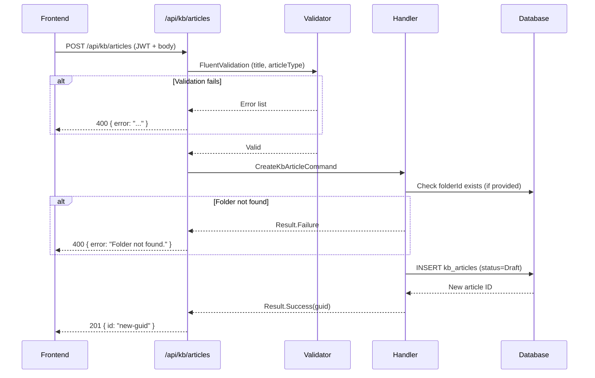
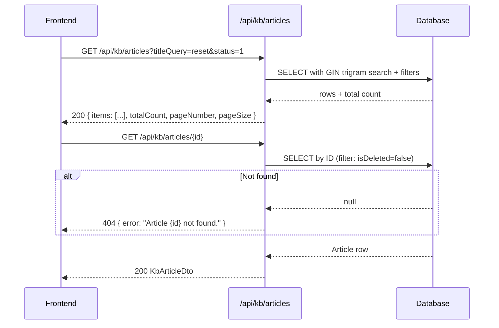
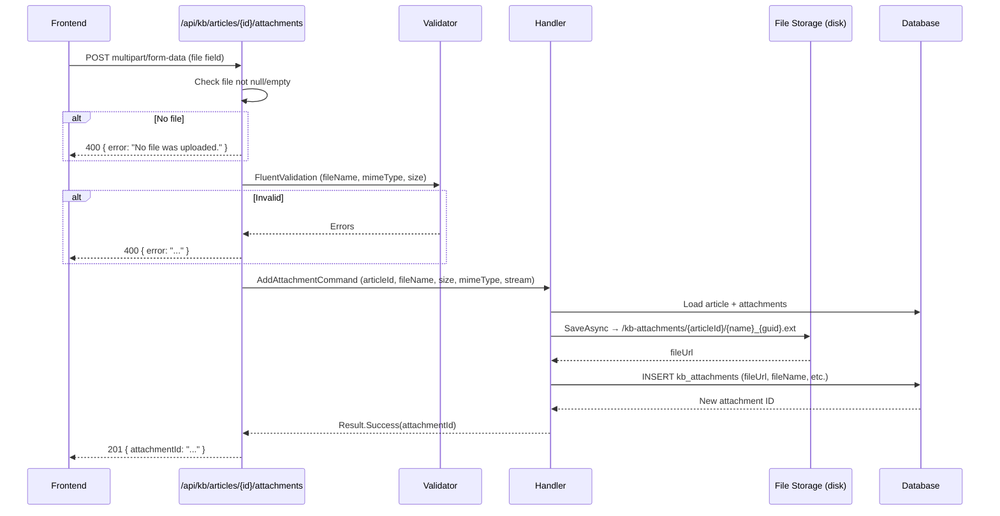
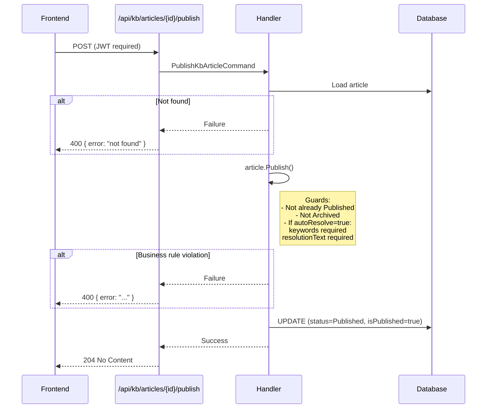
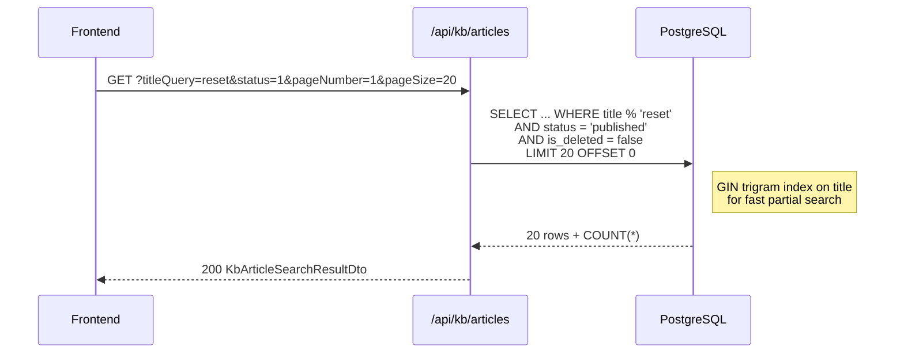

# Knowledge Base (KB) Module — Frontend Integration Guide

> **Generated from:** `Adrenalin.Modules.KnowledgeBase`, `Adrenalin.unify.API`, `Adrenalin.Persistence`
> **Target audience:** Frontend developers, QA engineers, API consumers
> **API base path:** `/api/kb`
> **Last updated:** Reflects codebase revision with `AuditStampInterceptor`, `ICurrentUserService`, domain-event dispatch, and search ordering changes.

---

## Table of Contents

1. [Module Overview](#1-module-overview)
2. [API Endpoints — Articles](#2-api-endpoints--articles)
3. [API Endpoints — Folders](#3-api-endpoints--folders)
4. [API Endpoints — Portal Banners](#4-api-endpoints--portal-banners)
5. [File Upload Endpoints](#5-file-upload-endpoints)
6. [Entity Documentation](#6-entity-documentation)
7. [TypeScript Data Models](#7-typescript-data-models)
8. [Frontend API Service Examples](#8-frontend-api-service-examples)
9. [Search, Filtering & Pagination](#9-search-filtering--pagination)
10. [Error Handling Guide](#10-error-handling-guide)
11. [API Flow Diagrams](#11-api-flow-diagrams)
12. [Frontend Integration Checklist](#12-frontend-integration-checklist)

---

## 1. Module Overview

### Purpose

The Knowledge Base (KB) module is a content management system for support articles, FAQs, release notes, user manuals, and process flows. It enables agents and customers to search and read articles, while authorised back-office users create and manage the content lifecycle.

### Main Features

- Hierarchical folder tree (max 5 levels deep) for organising articles
- Full article lifecycle: Draft → Published → Archived (and back to Draft)
- File attachments per article (PDF, images, Office documents, ZIP; max 50 MB each)
- Auto-resolution engine integration — articles can be configured with keywords and a confidence threshold so an AI engine can automatically suggest or resolve tickets
- Guardrail exclusion flag to prevent specific articles from being used by the auto-resolver
- Learning loop feedback — the system tracks match/reopen counts and can automatically raise the confidence threshold
- Customer portal banners — time-boxed announcements shown on the customer-facing portal

### User Flow

```
Agent/Admin                            Customer Portal
──────────────────────────────────     ──────────────────────
1. Create folder tree                  1. View active banners
2. Create article (Draft)              2. Search articles
3. Upload attachments                  3. Read article content
4. Publish article                        (with attachments)
5. Enable auto-resolve (optional)
6. Archive / restore as needed
```

### High-Level Architecture

```
Browser / Mobile App
      │
      ▼
  REST API  (/api/kb/*)
      │
  MediatR pipeline (FluentValidation → handler)
      │
  Domain Layer (KbArticle, KbFolder, PortalBanner aggregates)
      │         └─ raises Domain Events (dispatched by AppDbContext after SaveChanges)
      │
  Persistence Layer (PostgreSQL — schema: kb)
      │   └─ AuditStampInterceptor — auto-stamps CreatedAt/UpdatedAt/CreatedBy/UpdatedBy
      │      via ICurrentUserService (resolved from JWT)
      │
  File Storage (local disk  →  /kb-attachments/{articleId}/{fileName})
```

### Authentication Model

| Endpoint group | Auth required |
|---|---|
| GET articles (search, by-id, with-attachments) | **Public** |
| GET auto-resolve candidates | **JWT required** |
| All write operations (POST/PUT/DELETE articles, folders, banners) | **JWT required** |
| GET banners/active | **Public** |
| GET banners (all / by-id) | **JWT required** |

The JWT must carry a `sub` claim (or `NameIdentifier` claim) containing the user's GUID. The backend reads this as the `ActorId` recorded in audit fields. Additionally, a new `AuditStampInterceptor` now **automatically** stamps `createdAt`, `updatedAt`, `createdBy`, and `updatedBy` on every EF entity save using `ICurrentUserService` — the controllers no longer need to pass audit fields manually for those columns.

---

## 2. API Endpoints — Articles

### 2.1 Search Articles

**HTTP Method:** `GET`

**Route:** `/api/kb/articles`

**Description:** Returns a paginated list of articles. Supports full-text trigram search on the title via a GIN index in PostgreSQL. All parameters are optional.

**Authentication:** Public (no token required)

**Query Parameters:**

| Parameter | Type | Default | Description |
|---|---|---|---|
| `titleQuery` | `string` | — | Partial title search (case-insensitive trigram) |
| `articleType` | `ArticleType` enum | — | Filter by type: `0`=Faq, `1`=ReleaseNote, `2`=UserManual, `3`=Patch, `4`=ProcessFlow |
| `status` | `ArticleStatus` enum | — | Filter by status: `0`=Draft, `1`=Published, `2`=Archived |
| `folderId` | `uuid` | — | Filter articles in a specific folder |
| `pageNumber` | `int` | `1` | 1-based page number |
| `pageSize` | `int` | `20` | Number of results per page |

> **Ordering:** Results are sorted by `updatedAt DESC` (falling back to `createdAt DESC` when `updatedAt` is null). Most recently modified articles appear first. This ordering is fixed and cannot be changed via query parameters.

**Success Response: `200 OK`**

```json
{
  "items": [
    {
      "id": "3fa85f64-5717-4562-b3fc-2c963f66afa6",
      "title": "How to Reset Your Password",
      "articleType": 0,
      "status": 1,
      "isPublished": true,
      "autoResolve": false,
      "guardrailExcluded": false,
      "folderId": "a1b2c3d4-0000-0000-0000-000000000000",
      "updatedAt": "2026-05-01T10:00:00+00:00"
    }
  ],
  "totalCount": 42,
  "pageNumber": 1,
  "pageSize": 20
}
```

**Error Responses:**

| Status | Condition | Body |
|---|---|---|
| `400 Bad Request` | Handler error | `{ "error": "..." }` |

---

### 2.2 Get Article By ID

**HTTP Method:** `GET`

**Route:** `/api/kb/articles/{id}`

**Description:** Returns the full article including auto-resolve settings and counters. Does **not** include attachments — use endpoint 2.3 for that.

**Authentication:** Public

**Path Parameters:**

| Parameter | Type | Description |
|---|---|---|
| `id` | `uuid` | Article GUID |

**Success Response: `200 OK`**

```json
{
  "id": "3fa85f64-5717-4562-b3fc-2c963f66afa6",
  "title": "How to Reset Your Password",
  "content": "<p>Step-by-step instructions...</p>",
  "articleType": 0,
  "status": 1,
  "isPublished": true,
  "authorId": "user-guid",
  "folderId": "folder-guid",
  "autoResolve": true,
  "confidenceThreshold": 0.850,
  "keywords": ["password", "reset", "login"],
  "resolutionText": "Please follow the password reset instructions in this article.",
  "guardrailExcluded": false,
  "timesMatched": 14,
  "timesReopened": 2,
  "createdAt": "2026-04-01T08:00:00+00:00",
  "updatedAt": "2026-05-01T10:00:00+00:00"
}
```

**Error Responses:**

| Status | Condition | Body |
|---|---|---|
| `404 Not Found` | Article does not exist or is soft-deleted | `{ "error": "Article {id} not found." }` |

---

### 2.3 Get Article With Attachments

**HTTP Method:** `GET`

**Route:** `/api/kb/articles/{id}/attachments`

**Description:** Returns the full article object together with the list of all non-deleted attachments.

**Authentication:** Public

**Success Response: `200 OK`**

```json
{
  "article": { /* full KbArticleDto — see 2.2 */ },
  "attachments": [
    {
      "id": "att-guid",
      "articleId": "article-guid",
      "fileUrl": "/kb-attachments/article-guid/manual_abc123.pdf",
      "fileName": "manual.pdf",
      "fileSizeBytes": 204800,
      "mimeType": "application/pdf",
      "createdAt": "2026-04-10T09:00:00+00:00"
    }
  ]
}
```

**Error Responses:**

| Status | Condition | Body |
|---|---|---|
| `404 Not Found` | Article not found | `{ "error": "Article {id} not found." }` |

**Frontend Usage Notes:**

Use `fileUrl` directly as an `<a href>` or ``. The server maps `/kb-attachments/*` as static files — no auth header is required to download.

---

### 2.4 Get Auto-Resolve Candidates

**HTTP Method:** `GET`

**Route:** `/api/kb/articles/auto-resolve-candidates`

**Description:** Returns all published articles where `autoResolve=true` and `guardrailExcluded=false`. Used by the AI engine to warm its candidate set. Not intended for general article browsing.

**Authentication:** JWT required

**Success Response: `200 OK`** — array of `KbArticleDto` (same shape as 2.2)

---

### 2.5 Create Article

**HTTP Method:** `POST`

**Route:** `/api/kb/articles`

**Authentication:** JWT required

**Request Headers:**

```
Authorization: Bearer {token}
Content-Type: application/json
```

**Request Body:**

```json
{
  "title": "How to Reset Your Password",
  "content": "<p>Step-by-step instructions...</p>",
  "articleType": 0,
  "folderId": "a1b2c3d4-0000-0000-0000-000000000000"
}
```

**Field Descriptions:**

| Field | Type | Required | Description |
|---|---|---|---|
| `title` | `string` | Yes | Max 300 characters |
| `content` | `string \| null` | No | HTML or plain text body |
| `articleType` | `int` (enum) | Yes | 0=Faq, 1=ReleaseNote, 2=UserManual, 3=Patch, 4=ProcessFlow |
| `folderId` | `uuid \| null` | No | Place article in a folder; omit for root |

**Validation Rules:**

- `title` is required (non-blank)
- `title` max 300 characters
- `articleType` must be a valid enum value (0–4)
- If `folderId` is provided, the folder must exist and not be soft-deleted

**Success Response: `201 Created`**

```json
{ "id": "new-article-guid" }
```

`Location` header: `/api/kb/articles/{id}`

**Error Responses:**

| Status | Condition | Body |
|---|---|---|
| `400 Bad Request` | Validation failure or folder not found | `{ "error": "Article title is required." }` |
| `401 Unauthorized` | Missing or invalid JWT | — |

**Frontend Usage Notes:**

Article is created in `Draft` status. You must explicitly call the Publish endpoint (2.7) when ready.

---

### 2.6 Update Article

**HTTP Method:** `PUT`

**Route:** `/api/kb/articles/{id}`

**Authentication:** JWT required

**Request Body:**

```json
{
  "newTitle": "Updated Title",
  "newContent": "<p>Updated content.</p>"
}
```

**Validation Rules:**

- `newTitle` is required, max 300 characters
- Cannot update an `Archived` article — restore to Draft first

**Success Response: `204 No Content`**

**Error Responses:**

| Status | Condition |
|---|---|
| `400` | Validation failure, article deleted, or article is archived |
| `404` (via 400) | Article not found |

---

### 2.7 Publish Article

**HTTP Method:** `POST`

**Route:** `/api/kb/articles/{id}/publish`

**Authentication:** JWT required

**Request Body:** None

**Business Rules:**

- Article must be in `Draft` status (not already Published or Archived)
- If `autoResolve=true`, `keywords` must be non-empty and `resolutionText` must be set

**Success Response: `204 No Content`**

**Error Responses:**

| Status | Condition |
|---|---|
| `400` | Article is already published, is archived, or auto-resolve config is incomplete |

---

### 2.8 Archive Article

**HTTP Method:** `POST`

**Route:** `/api/kb/articles/{id}/archive`

**Authentication:** JWT required

**Request Body:** None

**Side Effects:** Automatically sets `autoResolve=false` and `isPublished=false`.

**Success Response: `204 No Content`**

---

### 2.9 Restore Article to Draft

**HTTP Method:** `POST`

**Route:** `/api/kb/articles/{id}/restore-to-draft`

**Authentication:** JWT required

**Request Body:** None

**Business Rule:** Only `Archived` articles can be restored. Calling this on a Draft or Published article returns an error.

**Success Response: `204 No Content`**

---

### 2.10 Delete Article (Soft Delete)

**HTTP Method:** `DELETE`

**Route:** `/api/kb/articles/{id}`

**Authentication:** JWT required

**Description:** Soft-deletes the article. The record remains in the database but is hidden from all queries. Side effects: `isPublished=false`, `autoResolve=false`.

**Success Response: `204 No Content`**

---

### 2.11 Enable Auto-Resolve

**HTTP Method:** `POST`

**Route:** `/api/kb/articles/{id}/auto-resolve/enable`

**Authentication:** JWT required

**Request Body:**

```json
{
  "keywords": ["password", "reset", "forgot login"],
  "resolutionText": "Please follow the password reset steps described in this article.",
  "confidenceThreshold": 0.850
}
```

**Field Descriptions:**

| Field | Type | Required | Description |
|---|---|---|---|
| `keywords` | `string[]` | Yes | At least 1 keyword; each max 100 chars; no blank entries |
| `resolutionText` | `string` | Yes | Text shown to the customer when auto-resolved; max 5000 chars |
| `confidenceThreshold` | `decimal` | No | Default `0.850`; must be between `0.500` and `1.000` |

**Business Rule:** Article must be in `Published` status. The article must not be `guardrailExcluded`.

**Success Response: `204 No Content`**

**Error Responses:**

| Status | Condition |
|---|---|
| `400` | Article not published, article is guardrail-excluded, or validation failure |

---

### 2.12 Disable Auto-Resolve

**HTTP Method:** `POST`

**Route:** `/api/kb/articles/{id}/auto-resolve/disable`

**Authentication:** JWT required

**Request Body:** None

**Success Response: `204 No Content`**

---

### 2.13 Guardrail-Exclude Article

**HTTP Method:** `POST`

**Route:** `/api/kb/articles/{id}/guardrail-exclude`

**Authentication:** JWT required

**Description:** Permanently flags the article so the auto-resolve engine will never use it. Also sets `autoResolve=false`. There is no "un-exclude" endpoint — this is a one-way operation per the source code.

**Request Body:** None

**Success Response: `204 No Content`**

---

### 2.14 Move Article to Folder

**HTTP Method:** `PUT`

**Route:** `/api/kb/articles/{id}/move`

**Authentication:** JWT required

**Request Body:**

```json
{ "targetFolderId": "folder-guid-or-null" }
```

Pass `null` to move the article to the root (no folder).

**Business Rule:** Target folder must exist and not be soft-deleted.

**Success Response: `204 No Content`**

---

## 3. API Endpoints — Folders

### 3.1 Get Folder Tree

**HTTP Method:** `GET`

**Route:** `/api/kb/folders/tree`

**Description:** Returns the full recursive folder hierarchy. Root folders contain nested `children` arrays. Ideal for rendering a sidebar tree navigation.

**Authentication:** Public

**Success Response: `200 OK`**

```json
[
  {
    "id": "root-folder-guid",
    "name": "Product Documentation",
    "parentId": null,
    "displayOrder": 0,
    "children": [
      {
        "id": "child-folder-guid",
        "name": "User Guides",
        "parentId": "root-folder-guid",
        "displayOrder": 1,
        "children": []
      }
    ]
  }
]
```

**Error Responses:**

| Status | Condition |
|---|---|
| `404` | Repository error |

---

### 3.2 Get Folder By ID

**HTTP Method:** `GET`

**Route:** `/api/kb/folders/{id}`

**Authentication:** Public

**Success Response: `200 OK`**

```json
{
  "id": "folder-guid",
  "name": "User Guides",
  "parentId": "parent-folder-guid",
  "displayOrder": 1,
  "createdAt": "2026-03-01T00:00:00+00:00",
  "updatedAt": null
}
```

**Error Responses:** `404` if folder not found or soft-deleted.

---

### 3.3 Get Folder Children

**HTTP Method:** `GET`

**Route:** `/api/kb/folders/{id}/children`

**Description:** Returns the direct children of a given folder (one level only), ordered by `displayOrder`.

**Authentication:** Public

**Success Response: `200 OK`** — array of `KbFolderDto` (same shape as 3.2, without nested children)

---

### 3.4 Create Folder

**HTTP Method:** `POST`

**Route:** `/api/kb/folders`

**Authentication:** JWT required

**Request Body:**

```json
{
  "name": "Release Notes",
  "parentId": "parent-folder-guid-or-null",
  "displayOrder": 2
}
```

**Field Descriptions:**

| Field | Type | Required | Description |
|---|---|---|---|
| `name` | `string` | Yes | Max 150 characters |
| `parentId` | `uuid \| null` | No | Parent folder; omit or null for root |
| `displayOrder` | `int` | No | Default `0`; must be ≥ 0 |

**Validation Rules:**

- `name` required, max 150 characters
- `displayOrder` must be ≥ 0
- `parentId` folder must exist and not be soft-deleted
- Nesting depth cannot exceed 5 levels

**Success Response: `201 Created`**

```json
{ "id": "new-folder-guid" }
```

**Error Responses:**

| Status | Condition |
|---|---|
| `400` | Validation failure, parent not found, or max nesting depth exceeded |

---

### 3.5 Rename Folder

**HTTP Method:** `PUT`

**Route:** `/api/kb/folders/{id}/rename`

**Authentication:** JWT required

**Request Body:**

```json
{ "newName": "Updated Folder Name" }
```

**Validation Rules:** `newName` required, max 150 characters. Cannot rename a deleted folder.

**Success Response: `204 No Content`**

---

### 3.6 Reorder Folder

**HTTP Method:** `PUT`

**Route:** `/api/kb/folders/{id}/reorder`

**Authentication:** JWT required

**Request Body:**

```json
{ "newDisplayOrder": 3 }
```

**Validation Rules:** `newDisplayOrder` must be ≥ 0. Requires a valid authenticated user.

**Success Response: `204 No Content`**

**Error Responses:** `401 Unauthorized` if JWT is missing.

---

### 3.7 Delete Folder (Soft Delete)

**HTTP Method:** `DELETE`

**Route:** `/api/kb/folders/{id}`

**Authentication:** JWT required

**Business Rule:** Cannot delete a folder that still contains articles. Move or delete all articles first.

**Success Response: `204 No Content`**

**Error Responses:**

| Status | Condition |
|---|---|
| `400` | Folder still contains articles |
| `401` | Missing JWT |

---

## 4. API Endpoints — Portal Banners

### 4.1 Get Active Banners (Public)

**HTTP Method:** `GET`

**Route:** `/api/kb/banners/active`

**Description:** Returns banners currently visible on the customer portal. A banner is visible when `isActive=true` AND the current UTC time is within `activeFrom`–`activeTo` (if specified).

**Authentication:** Public (customer-facing endpoint)

**Success Response: `200 OK`**

```json
[
  {
    "id": "banner-guid",
    "title": "Planned Maintenance",
    "message": "The system will be offline on Sunday 12:00–14:00 UTC."
  }
]
```

---

### 4.2 Get All Banners (Admin)

**HTTP Method:** `GET`

**Route:** `/api/kb/banners`

**Authentication:** JWT required

**Success Response: `200 OK`** — array of full `PortalBannerDto` including schedule and `isActive` flag.

```json
[
  {
    "id": "banner-guid",
    "title": "Planned Maintenance",
    "message": "The system will be offline...",
    "activeFrom": "2026-06-08T12:00:00+00:00",
    "activeTo": "2026-06-08T14:00:00+00:00",
    "isActive": true,
    "createdAt": "2026-06-01T08:00:00+00:00",
    "updatedAt": null
  }
]
```

---

### 4.3 Get Banner By ID

**HTTP Method:** `GET`

**Route:** `/api/kb/banners/{id}`

**Authentication:** JWT required

**Success Response: `200 OK`** — single `PortalBannerDto`

**Error Responses:** `404` if banner not found.

---

### 4.4 Create Banner

**HTTP Method:** `POST`

**Route:** `/api/kb/banners`

**Authentication:** JWT required

**Request Body:**

```json
{
  "title": "Planned Maintenance",
  "message": "The system will be offline on Sunday 12:00–14:00 UTC.",
  "activeFrom": "2026-06-08T12:00:00+00:00",
  "activeTo": "2026-06-08T14:00:00+00:00"
}
```

**Field Descriptions:**

| Field | Type | Required | Description |
|---|---|---|---|
| `title` | `string` | Yes | Max 200 characters |
| `message` | `string` | Yes | No length limit in DB (text column) |
| `activeFrom` | `DateTimeOffset \| null` | No | Schedule start (UTC recommended) |
| `activeTo` | `DateTimeOffset \| null` | No | Schedule end; must be after `activeFrom` |

**Validation Rules:**

- `title` required, max 200 characters
- `message` required
- If both `activeFrom` and `activeTo` are provided, `activeTo` must be after `activeFrom`
- Banner is created with `isActive=true` by default

**Success Response: `201 Created`**

```json
{ "id": "new-banner-guid" }
```

---

### 4.5 Update Banner

**HTTP Method:** `PUT`

**Route:** `/api/kb/banners/{id}`

**Authentication:** JWT required

**Request Body:** Same shape as Create Banner (section 4.4).

**Success Response: `204 No Content`**

---

### 4.6 Activate Banner

**HTTP Method:** `POST`

**Route:** `/api/kb/banners/{id}/activate`

**Authentication:** JWT required

**Description:** Sets `isActive=true` on a banner, re-enabling it for display (subject to schedule).

**Request Body:** None

**Success Response: `204 No Content`**

---

### 4.7 Deactivate Banner

**HTTP Method:** `POST`

**Route:** `/api/kb/banners/{id}/deactivate`

**Authentication:** JWT required

**Description:** Immediately hides the banner by setting `isActive=false`, overriding the schedule.

**Request Body:** None

**Success Response: `204 No Content`**

---

## 5. File Upload Endpoints

### 5.1 Upload Attachment

**HTTP Method:** `POST`

**Route:** `/api/kb/articles/{id}/attachments`

**Authentication:** JWT required

**Description:** Uploads a single file and associates it with an article. The server saves the file to `{KbStorage:BasePath}/{articleId}/{sanitised_filename}_{guid}.ext` and returns the attachment ID.

### Upload Process

1. Open `multipart/form-data` form
2. Attach file under the field name **`file`**
3. POST to `/api/kb/articles/{id}/attachments`
4. On success receive `201` with `attachmentId`

### Multipart Form Data Structure

```
Content-Type: multipart/form-data; boundary=----boundary

------boundary
Content-Disposition: form-data; name="file"; filename="manual.pdf"
Content-Type: application/pdf

<binary file content>
------boundary--
```

> Note: There is no `articleId` field in the form body — the article ID comes from the URL path parameter.

### Allowed MIME Types

| Category | MIME Types |
|---|---|
| Documents | `application/pdf`, `application/msword`, `application/vnd.openxmlformats-officedocument.wordprocessingml.document` |
| Spreadsheets | `application/vnd.ms-excel`, `application/vnd.openxmlformats-officedocument.spreadsheetml.sheet` |
| Images | `image/png`, `image/jpeg`, `image/gif`, `image/webp` |
| Text | `text/plain`, `text/csv` |
| Archive | `application/zip` |

### Maximum File Size

**50 MB** (`52,428,800` bytes). Enforced at both the HTTP layer (`[RequestSizeLimit]`) and the FluentValidation layer.

### Request Headers

```
Authorization: Bearer {token}
Content-Type: multipart/form-data
```

Do **not** set `Content-Type` manually in `fetch`/`axios` when using `FormData` — the browser sets it automatically including the boundary parameter.

### Success Response: `201 Created`

```json
{ "attachmentId": "new-attachment-guid" }
```

### Error Responses

| Status | Condition |
|---|---|
| `400` | No file supplied, file is empty, file size exceeds 50 MB, or MIME type is not allowed |
| `401` | Missing JWT |
| `404` (via 400) | Article not found |

### Download URL Structure

The `fileUrl` stored in the DB and returned by the API has the format:

```
/kb-attachments/{articleId}/{sanitised_filename}_{guid}.ext
```

Example:

```
/kb-attachments/3fa85f64-5717-4562-b3fc-2c963f66afa6/manual_a1b2c3d4e5f60000.pdf
```

This is a **server-relative URL**. Prepend the API base URL for absolute links:

```
https://api.example.com/kb-attachments/3fa85f64.../manual_abc.pdf
```

### File Preview Support

The backend serves files as static files at `/kb-attachments/*`. No authentication is required to **download** an attachment once you have its URL. The frontend is responsible for any in-browser preview (e.g. `<iframe>` for PDFs, `` for images).

### Frontend Implementation Notes

```typescript
async function uploadAttachment(articleId: string, file: File): Promise<string> {
  const form = new FormData();
  form.append('file', file);  // field name must be 'file'

  const response = await fetch(`/api/kb/articles/${articleId}/attachments`, {
    method: 'POST',
    headers: { Authorization: `Bearer ${token}` },
    body: form
    // Do NOT set Content-Type here
  });

  if (!response.ok) {
    const err = await response.json();
    throw new Error(err.error);
  }

  const { attachmentId } = await response.json();
  return attachmentId;
}
```

---

### 5.2 Remove Attachment

**HTTP Method:** `DELETE`

**Route:** `/api/kb/articles/{id}/attachments/{attachmentId}`

**Authentication:** JWT required

**Description:** Soft-deletes the attachment record. The physical file on disk is **not** deleted by this endpoint (the storage service's `DeleteAsync` is not called from `RemoveAttachmentCommandHandler`).

**Success Response: `204 No Content`**

**Error Responses:**

| Status | Condition |
|---|---|
| `400` | Attachment not found on the article |

---

## 6. Entity Documentation

### 6.1 KbArticle

**DB Table:** `kb.kb_articles`
**Purpose:** Aggregate root for a knowledge base article. Tracks the full lifecycle from authoring to auto-resolution.

| Field | Type | Required | Description |
|---|---|---|---|
| `id` | `uuid` | Yes | Primary key, auto-generated |
| `title` | `string` (max 300) | Yes | Article heading |
| `content` | `text \| null` | No | HTML or plain text body |
| `articleType` | `string` (enum) | Yes | `faq`, `release_note`, `user_manual`, `patch`, `process_flow` |
| `status` | `string` (enum) | Yes | `draft` (default), `published`, `archived` |
| `isPublished` | `bool` | Yes | Derived from status; true only when Published |
| `authorId` | `uuid \| null` | No | FK to auth user (set from JWT at creation) |
| `folderId` | `uuid \| null` | No | FK to `kb_folders`; null = root level |
| `autoResolve` | `bool` | Yes | Default false; enables AI auto-resolution |
| `confidenceThreshold` | `decimal(4,3)` | Yes | Default 0.850; range 0.500–1.000 |
| `keywords` | `text[] \| null` | No | Array of keywords for auto-resolution |
| `resolutionText` | `text \| null` | No | Text shown when ticket is auto-resolved |
| `guardrailExcluded` | `bool` | Yes | Default false; if true, cannot be auto-resolved |
| `timesMatched` | `int` | Yes | Counter incremented by learning loop |
| `timesReopened` | `int` | Yes | Counter incremented when matched ticket reopens |
| `createdBy` | `uuid \| null` | No | Audit: user who created |
| `updatedBy` | `uuid \| null` | No | Audit: user who last updated |
| `createdAt` | `timestamptz` | Yes | Auto-set to `now()` |
| `updatedAt` | `timestamptz \| null` | No | Set on every update |
| `isDeleted` | `bool` | Yes | Soft-delete flag; hidden from all queries when true |

**Relationships:**
- `folderId` → `kb_folders.id` (SET NULL on folder delete)
- Has many `kb_attachments` (CASCADE delete)

**Status State Machine:**

```
Draft ──────► Published ──────► Archived
  ▲                               │
  └───────────────────────────────┘ (RestoreToDraft)
```

---

### 6.2 KbFolder

**DB Table:** `kb.kb_folders`
**Purpose:** Self-referencing hierarchy node for organising articles into a tree. Maximum 5 levels of nesting.

| Field | Type | Required | Description |
|---|---|---|---|
| `id` | `uuid` | Yes | Primary key |
| `name` | `string` (max 150) | Yes | Folder display name |
| `parentId` | `uuid \| null` | No | FK to self; null = root folder |
| `displayOrder` | `int` | Yes | Default 0; used for sidebar ordering |
| `createdBy` | `uuid \| null` | No | Audit |
| `updatedBy` | `uuid \| null` | No | Audit |
| `createdAt` | `timestamptz` | Yes | Auto-set |
| `updatedAt` | `timestamptz \| null` | No | Set on rename/reorder |
| `isDeleted` | `bool` | Yes | Soft-delete; hidden from queries |

**Relationships:**
- Self-referencing: `parentId` → `kb_folders.id` (RESTRICT on delete — cannot delete if has children)

---

### 6.3 KbAttachment

**DB Table:** `kb.kb_attachments`
**Purpose:** Metadata record for a file associated with a KB article. The physical file is stored separately on disk.

| Field | Type | Required | Description |
|---|---|---|---|
| `id` | `uuid` | Yes | Primary key |
| `articleId` | `uuid` | Yes | FK to `kb_articles.id` |
| `fileUrl` | `string` | Yes | Server-relative URL: `/kb-attachments/{articleId}/{filename}` |
| `fileName` | `string` (max 255) | Yes | Original filename as uploaded |
| `fileSizeBytes` | `bigint \| null` | No | File size in bytes |
| `mimeType` | `string` (max 100) \| null | No | MIME type (e.g. `application/pdf`) |
| `isDeleted` | `bool` | Yes | Soft-delete flag |
| `createdAt` | `timestamptz` | Yes | Auto-set |

**Note:** `KbAttachment` does not have `updatedAt`, `updatedBy`, or `createdBy` columns in the database schema.

---

### 6.4 PortalBanner

**DB Table:** `kb.portal_banners`
**Purpose:** Time-boxed announcement displayed on the customer portal. Visibility is controlled by `isActive` (manual switch) AND the `activeFrom`/`activeTo` schedule window.

| Field | Type | Required | Description |
|---|---|---|---|
| `id` | `uuid` | Yes | Primary key |
| `title` | `string` (max 200) | Yes | Banner heading |
| `message` | `text` | Yes | Banner body text |
| `activeFrom` | `timestamptz \| null` | No | Start of visibility window |
| `activeTo` | `timestamptz \| null` | No | End of visibility window |
| `isActive` | `bool` | Yes | Default true; manual kill switch |
| `createdBy` | `uuid \| null` | No | Audit |
| `updatedBy` | `uuid \| null` | No | Audit |
| `createdAt` | `timestamptz` | Yes | Auto-set |
| `updatedAt` | `timestamptz \| null` | No | Set on update/activate/deactivate |

**Note:** `PortalBanner` does **not** have an `isDeleted` column — records are not soft-deleted.

**Visibility Logic:**
A banner is shown when ALL of the following are true:
1. `isActive = true`
2. Current UTC time ≥ `activeFrom` (if set)
3. Current UTC time ≤ `activeTo` (if set)

---

### 6.5 Enum Values

#### ArticleType

| Numeric Value | String (DB) | Description |
|---|---|---|
| `0` | `faq` | Frequently asked question |
| `1` | `release_note` | Product release note |
| `2` | `user_manual` | User manual |
| `3` | `patch` | Patch or hotfix note |
| `4` | `process_flow` | Business process guide |

#### ArticleStatus

| Numeric Value | String (DB) | Description |
|---|---|---|
| `0` | `draft` | Work in progress, not visible to customers |
| `1` | `published` | Live and searchable |
| `2` | `archived` | Retired; hidden from search |

#### MatchPhase (internal — AI engine)

| Numeric Value | Description |
|---|---|
| `0` | `keyword` — matched by keyword only |
| `1` | `semantic` — matched by semantic similarity |
| `2` | `both` — matched by both methods |

> `MatchPhase` is used in `ai.auto_resolution_log` and is not exposed through the KB API directly.

---

### 6.6 Audit Stamping — AuditStampInterceptor

A new `AuditStampInterceptor` (`SaveChangesInterceptor`) is registered in the persistence layer. It automatically sets the following fields on every EF save — **the frontend does not need to send these**:

| Field | On INSERT | On UPDATE |
|---|---|---|
| `createdAt` | Set to current UTC time (if not already set) | Left unchanged |
| `createdBy` | Set to `ICurrentUserService.UserId` (if not already set) | Left unchanged |
| `updatedAt` | Set to current UTC time | Set to current UTC time |
| `updatedBy` | Set to `ICurrentUserService.UserId` | Set to `ICurrentUserService.UserId` |

`ICurrentUserService` resolves the user's GUID from the current HTTP request's JWT. This replaces the previous pattern where each command handler manually stamped audit fields.

**Frontend implication:** You never need to send `createdBy`, `updatedBy`, `createdAt`, or `updatedAt` in any request body. They are always server-managed.

---

## 7. TypeScript Data Models

```typescript
// ─── Enums ────────────────────────────────────────────────────────────────────

export enum ArticleType {
  Faq = 0,
  ReleaseNote = 1,
  UserManual = 2,
  Patch = 3,
  ProcessFlow = 4,
}

export enum ArticleStatus {
  Draft = 0,
  Published = 1,
  Archived = 2,
}

// ─── Folder ───────────────────────────────────────────────────────────────────

export interface KbFolderDto {
  id: string;
  name: string;
  parentId: string | null;
  displayOrder: number;
  createdAt: string; // ISO 8601 DateTimeOffset
  updatedAt: string | null;
}

export interface KbFolderTreeNodeDto {
  id: string;
  name: string;
  parentId: string | null;
  displayOrder: number;
  children: KbFolderTreeNodeDto[];
}

// ─── Article ──────────────────────────────────────────────────────────────────

export interface KbArticleDto {
  id: string;
  title: string;
  content: string | null;
  articleType: ArticleType;
  status: ArticleStatus;
  isPublished: boolean;
  authorId: string | null;
  folderId: string | null;
  // Auto-resolve
  autoResolve: boolean;
  confidenceThreshold: number; // 0.500 – 1.000
  keywords: string[] | null;
  resolutionText: string | null;
  guardrailExcluded: boolean;
  timesMatched: number;
  timesReopened: number;
  createdAt: string;
  updatedAt: string | null;
}

export interface KbArticleSummaryDto {
  id: string;
  title: string;
  articleType: ArticleType;
  status: ArticleStatus;
  isPublished: boolean;
  autoResolve: boolean;
  guardrailExcluded: boolean;
  folderId: string | null;
  updatedAt: string | null;
}

export interface KbArticleSearchResultDto {
  items: KbArticleSummaryDto[];
  totalCount: number;
  pageNumber: number;
  pageSize: number;
}

// ─── Attachments ──────────────────────────────────────────────────────────────

export interface KbAttachmentDto {
  id: string;
  articleId: string;
  fileUrl: string; // server-relative: /kb-attachments/{articleId}/{filename}
  fileName: string;
  fileSizeBytes: number | null;
  mimeType: string | null;
  createdAt: string;
}

export interface KbArticleWithAttachmentsDto {
  article: KbArticleDto;
  attachments: KbAttachmentDto[];
}

// ─── Portal Banners ───────────────────────────────────────────────────────────

export interface PortalBannerDto {
  id: string;
  title: string;
  message: string;
  activeFrom: string | null;
  activeTo: string | null;
  isActive: boolean;
  createdAt: string;
  updatedAt: string | null;
}

export interface ActivePortalBannerDto {
  id: string;
  title: string;
  message: string;
}

// ─── Request Bodies ───────────────────────────────────────────────────────────

export interface CreateArticleRequest {
  title: string;
  content?: string | null;
  articleType: ArticleType;
  folderId?: string | null;
}

export interface UpdateArticleRequest {
  newTitle: string;
  newContent?: string | null;
}

export interface MoveArticleRequest {
  targetFolderId: string | null;
}

export interface EnableAutoResolveRequest {
  keywords: string[];
  resolutionText: string;
  confidenceThreshold?: number; // default 0.850
}

export interface CreateFolderRequest {
  name: string;
  parentId?: string | null;
  displayOrder?: number; // default 0
}

export interface RenameFolderRequest {
  newName: string;
}

export interface ReorderFolderRequest {
  newDisplayOrder: number;
}

export interface CreateBannerRequest {
  title: string;
  message: string;
  activeFrom?: string | null;
  activeTo?: string | null;
}

export interface UpdateBannerRequest {
  title: string;
  message: string;
  activeFrom?: string | null;
  activeTo?: string | null;
}

// ─── API Error ────────────────────────────────────────────────────────────────

export interface ApiError {
  error: string;
}
```

---

## 8. Frontend API Service Examples

### 8.1 Axios Service

```typescript
import axios from 'axios';
import type {
  KbArticleDto, KbArticleSummaryDto, KbArticleSearchResultDto,
  KbArticleWithAttachmentsDto, KbFolderDto, KbFolderTreeNodeDto,
  PortalBannerDto, ActivePortalBannerDto,
  CreateArticleRequest, UpdateArticleRequest, EnableAutoResolveRequest,
  CreateFolderRequest, CreateBannerRequest, UpdateBannerRequest,
  ArticleStatus, ArticleType,
} from './kb.types';

const api = axios.create({
  baseURL: process.env.REACT_APP_API_URL ?? 'https://api.example.com',
});

// Attach JWT automatically
api.interceptors.request.use((config) => {
  const token = localStorage.getItem('token');
  if (token) config.headers.Authorization = `Bearer ${token}`;
  return config;
});

// ── Articles ──────────────────────────────────────────────────────────────────

export const searchArticles = (params: {
  titleQuery?: string;
  articleType?: ArticleType;
  status?: ArticleStatus;
  folderId?: string;
  pageNumber?: number;
  pageSize?: number;
}) => api.get<KbArticleSearchResultDto>('/api/kb/articles', { params });

export const getArticleById = (id: string) =>
  api.get<KbArticleDto>(`/api/kb/articles/${id}`);

export const getArticleWithAttachments = (id: string) =>
  api.get<KbArticleWithAttachmentsDto>(`/api/kb/articles/${id}/attachments`);

export const createArticle = (body: CreateArticleRequest) =>
  api.post<{ id: string }>('/api/kb/articles', body);

export const updateArticle = (id: string, body: UpdateArticleRequest) =>
  api.put(`/api/kb/articles/${id}`, body);

export const publishArticle = (id: string) =>
  api.post(`/api/kb/articles/${id}/publish`);

export const archiveArticle = (id: string) =>
  api.post(`/api/kb/articles/${id}/archive`);

export const restoreArticleToDraft = (id: string) =>
  api.post(`/api/kb/articles/${id}/restore-to-draft`);

export const deleteArticle = (id: string) =>
  api.delete(`/api/kb/articles/${id}`);

export const moveArticle = (id: string, targetFolderId: string | null) =>
  api.put(`/api/kb/articles/${id}/move`, { targetFolderId });

export const enableAutoResolve = (id: string, body: EnableAutoResolveRequest) =>
  api.post(`/api/kb/articles/${id}/auto-resolve/enable`, body);

export const disableAutoResolve = (id: string) =>
  api.post(`/api/kb/articles/${id}/auto-resolve/disable`);

export const guardrailExclude = (id: string) =>
  api.post(`/api/kb/articles/${id}/guardrail-exclude`);

export const uploadAttachment = (id: string, file: File) => {
  const form = new FormData();
  form.append('file', file);
  return api.post<{ attachmentId: string }>(
    `/api/kb/articles/${id}/attachments`,
    form
    // axios sets Content-Type with boundary automatically
  );
};

export const removeAttachment = (articleId: string, attachmentId: string) =>
  api.delete(`/api/kb/articles/${articleId}/attachments/${attachmentId}`);

// ── Folders ───────────────────────────────────────────────────────────────────

export const getFolderTree = () =>
  api.get<KbFolderTreeNodeDto[]>('/api/kb/folders/tree');

export const getFolderById = (id: string) =>
  api.get<KbFolderDto>(`/api/kb/folders/${id}`);

export const getFolderChildren = (id: string) =>
  api.get<KbFolderDto[]>(`/api/kb/folders/${id}/children`);

export const createFolder = (body: CreateFolderRequest) =>
  api.post<{ id: string }>('/api/kb/folders', body);

export const renameFolder = (id: string, newName: string) =>
  api.put(`/api/kb/folders/${id}/rename`, { newName });

export const reorderFolder = (id: string, newDisplayOrder: number) =>
  api.put(`/api/kb/folders/${id}/reorder`, { newDisplayOrder });

export const deleteFolder = (id: string) =>
  api.delete(`/api/kb/folders/${id}`);

// ── Portal Banners ────────────────────────────────────────────────────────────

export const getActiveBanners = () =>
  api.get<ActivePortalBannerDto[]>('/api/kb/banners/active');

export const getAllBanners = () =>
  api.get<PortalBannerDto[]>('/api/kb/banners');

export const getBannerById = (id: string) =>
  api.get<PortalBannerDto>(`/api/kb/banners/${id}`);

export const createBanner = (body: CreateBannerRequest) =>
  api.post<{ id: string }>('/api/kb/banners', body);

export const updateBanner = (id: string, body: UpdateBannerRequest) =>
  api.put(`/api/kb/banners/${id}`, body);

export const activateBanner = (id: string) =>
  api.post(`/api/kb/banners/${id}/activate`);

export const deactivateBanner = (id: string) =>
  api.post(`/api/kb/banners/${id}/deactivate`);
```

---

### 8.2 Fetch API

```typescript
const BASE = process.env.REACT_APP_API_URL ?? '';
const token = () => localStorage.getItem('token');

const authHeaders = () => ({
  'Content-Type': 'application/json',
  Authorization: `Bearer ${token()}`,
});

export async function searchArticles(params: Record<string, string | number | undefined>) {
  const qs = new URLSearchParams(
    Object.entries(params)
      .filter(([, v]) => v !== undefined)
      .map(([k, v]) => [k, String(v)])
  ).toString();
  const res = await fetch(`${BASE}/api/kb/articles?${qs}`);
  if (!res.ok) throw await res.json();
  return res.json() as Promise<KbArticleSearchResultDto>;
}

export async function createArticle(body: CreateArticleRequest) {
  const res = await fetch(`${BASE}/api/kb/articles`, {
    method: 'POST',
    headers: authHeaders(),
    body: JSON.stringify(body),
  });
  if (!res.ok) throw await res.json();
  return res.json() as Promise<{ id: string }>;
}

export async function uploadAttachment(articleId: string, file: File) {
  const form = new FormData();
  form.append('file', file);
  const res = await fetch(`${BASE}/api/kb/articles/${articleId}/attachments`, {
    method: 'POST',
    headers: { Authorization: `Bearer ${token()}` }, // No Content-Type!
    body: form,
  });
  if (!res.ok) throw await res.json();
  return res.json() as Promise<{ attachmentId: string }>;
}
```

---

### 8.3 React Query (TanStack Query)

```typescript
import { useQuery, useMutation, useQueryClient } from '@tanstack/react-query';
import * as kbApi from './kb.api'; // the axios service above

// ── Query hooks ───────────────────────────────────────────────────────────────

export function useFolderTree() {
  return useQuery({
    queryKey: ['kb', 'folders', 'tree'],
    queryFn: () => kbApi.getFolderTree().then(r => r.data),
    staleTime: 5 * 60 * 1000,
  });
}

export function useArticleSearch(params: Parameters<typeof kbApi.searchArticles>[0]) {
  return useQuery({
    queryKey: ['kb', 'articles', 'search', params],
    queryFn: () => kbApi.searchArticles(params).then(r => r.data),
    keepPreviousData: true,
  });
}

export function useArticle(id: string) {
  return useQuery({
    queryKey: ['kb', 'articles', id],
    queryFn: () => kbApi.getArticleById(id).then(r => r.data),
    enabled: !!id,
  });
}

export function useArticleWithAttachments(id: string) {
  return useQuery({
    queryKey: ['kb', 'articles', id, 'attachments'],
    queryFn: () => kbApi.getArticleWithAttachments(id).then(r => r.data),
    enabled: !!id,
  });
}

export function useActiveBanners() {
  return useQuery({
    queryKey: ['kb', 'banners', 'active'],
    queryFn: () => kbApi.getActiveBanners().then(r => r.data),
    staleTime: 60 * 1000, // refetch every minute
  });
}

// ── Mutation hooks ────────────────────────────────────────────────────────────

export function useCreateArticle() {
  const qc = useQueryClient();
  return useMutation({
    mutationFn: kbApi.createArticle,
    onSuccess: () => qc.invalidateQueries({ queryKey: ['kb', 'articles'] }),
  });
}

export function usePublishArticle() {
  const qc = useQueryClient();
  return useMutation({
    mutationFn: (id: string) => kbApi.publishArticle(id),
    onSuccess: (_data, id) => {
      qc.invalidateQueries({ queryKey: ['kb', 'articles', id] });
      qc.invalidateQueries({ queryKey: ['kb', 'articles', 'search'] });
    },
  });
}

export function useUploadAttachment() {
  const qc = useQueryClient();
  return useMutation({
    mutationFn: ({ articleId, file }: { articleId: string; file: File }) =>
      kbApi.uploadAttachment(articleId, file),
    onSuccess: (_data, { articleId }) => {
      qc.invalidateQueries({ queryKey: ['kb', 'articles', articleId, 'attachments'] });
    },
  });
}
```

---

## 9. Search, Filtering & Pagination

### Endpoint

`GET /api/kb/articles`

### All Query Parameters

| Parameter | Type | Example | Notes |
|---|---|---|---|
| `titleQuery` | `string` | `password reset` | Case-insensitive partial match via PostgreSQL GIN trigram index |
| `articleType` | `int` | `0` | 0=Faq, 1=ReleaseNote, 2=UserManual, 3=Patch, 4=ProcessFlow |
| `status` | `int` | `1` | 0=Draft, 1=Published, 2=Archived |
| `folderId` | `uuid` | `a1b2c3d4-...` | Exact folder match; does not recurse into children |
| `pageNumber` | `int` | `2` | 1-based; default `1` |
| `pageSize` | `int` | `10` | Default `20` |

### Example Requests

```
# Search published FAQs
GET /api/kb/articles?status=1&articleType=0&pageSize=10

# Search by title within a folder
GET /api/kb/articles?titleQuery=reset&folderId=a1b2c3d4-...&pageNumber=1&pageSize=20

# Second page
GET /api/kb/articles?pageNumber=2&pageSize=20
```

### Pagination Response Fields

```json
{
  "items": [...],
  "totalCount": 85,
  "pageNumber": 2,
  "pageSize": 20
}
```

Use `totalCount` and `pageSize` to calculate total pages: `Math.ceil(totalCount / pageSize)`.

### Sorting

Results are ordered by `updatedAt DESC`, falling back to `createdAt DESC` when `updatedAt` is null. This means the most recently modified article always appears first. Custom sort order is **not** supported — this ordering is fixed in the repository layer.

### Filtering Notes

- All filters are **optional** and combinable
- `folderId` filter is an exact match; it does **not** return articles in child folders
- When `titleQuery` is provided, PostgreSQL's GIN trigram index is used — minimum 3 characters recommended for useful results
- Soft-deleted articles are **never** returned (EF global query filter applied at DB level)

---

## 10. Error Handling Guide

### Error Response Shape

All error responses return a JSON object with a single `error` field:

```json
{ "error": "Article title is required." }
```

Multiple validation errors are pipe-separated:

```json
{ "error": "Article title is required. | Title cannot exceed 300 characters." }
```

### HTTP Status Codes

| Status Code | Meaning | When it occurs |
|---|---|---|
| `200 OK` | Success with body | GET requests |
| `201 Created` | Created successfully | POST create endpoints |
| `204 No Content` | Success, no body | PUT, DELETE, POST action endpoints |
| `400 Bad Request` | Validation failure or business rule violation | Invalid input, domain rule broken |
| `401 Unauthorized` | Missing or invalid JWT | Any `[Authorize]` endpoint without a token |
| `404 Not Found` | Resource not found | GET by ID endpoints |
| `500 Internal Server Error` | Unhandled server error | Not documented in source — should be rare |

### Validation Errors (400)

Validation runs **before** the handler via a MediatR pipeline behaviour. All `FluentValidation` errors are concatenated and returned as a single `400` response. The frontend should:

1. Display the `error` string to the user
2. Highlight the relevant field(s) if possible

### Business Rule Errors (400)

Business rule violations also return `400`. Common messages to handle:

| Error Message | Cause |
|---|---|
| `Article {id} not found.` | Article was deleted or ID is wrong |
| `Folder {id} not found.` | Folder was deleted or ID is wrong |
| `Cannot edit an archived article. Restore it to Draft first.` | Tried to update an archived article |
| `Article is already published.` | Called publish on already-published article |
| `Cannot publish an archived article. Restore to Draft first.` | Status transition violation |
| `Auto-resolve can only be enabled on a Published article. Publish it first.` | Tried to enable auto-resolve on draft/archived |
| `Guardrail-excluded articles cannot be auto-resolved.` | Cannot enable auto-resolve on excluded article |
| `Cannot delete a folder that still contains articles.` | Must empty folder before deleting |
| `No file was uploaded.` | File field missing or empty in multipart form |
| `File size cannot exceed 50 MB.` | File too large |
| `MIME type is not in the allowed list.` | Unsupported file type |

### Frontend Error Handler Example

```typescript
import axios, { AxiosError } from 'axios';

function handleApiError(error: unknown): string {
  if (axios.isAxiosError(error)) {
    const err = error as AxiosError<{ error: string }>;
    if (err.response?.status === 401) {
      // Redirect to login
      window.location.href = '/login';
      return 'Session expired. Please log in again.';
    }
    if (err.response?.data?.error) {
      return err.response.data.error;
    }
    if (err.response?.status === 404) {
      return 'The requested resource was not found.';
    }
  }
  return 'An unexpected error occurred. Please try again.';
}
```

---

## 11. API Flow Diagrams

### 11.1 Article Creation Flow



---

### 11.2 Article Retrieval Flow



---

### 11.3 Attachment Upload Flow



---

### 11.4 Article Publish Flow



---

### 11.5 Search Flow



---

## 12. Frontend Integration Checklist

### Authentication Setup
- [ ] Store JWT in memory or a secure cookie (avoid `localStorage` for sensitive tokens)
- [ ] Add an Axios/fetch interceptor to attach `Authorization: Bearer {token}` on every request
- [ ] Handle `401` responses globally — redirect to login or refresh token
- [ ] Note: `createdBy` / `updatedBy` audit fields are stamped automatically server-side via `ICurrentUserService` — never send them in request bodies

### Environment Variables
- [ ] `REACT_APP_API_URL` (or equivalent) — base URL pointing to the API server
- [ ] Example: `https://api.yourapp.com` — do **not** include `/api/kb` in the base URL

### API Base URL
- [ ] All KB endpoints are under `/api/kb` — configure your HTTP client base URL accordingly

### Error Handling
- [ ] Parse the `{ "error": "..." }` body from `400` responses
- [ ] Handle `404` for article/folder/banner not found
- [ ] Handle `401` to trigger re-authentication
- [ ] Show concatenated validation messages to users (messages are pipe-separated)

### File Uploads
- [ ] Use `FormData` — the file field must be named **`file`**
- [ ] Do **not** manually set `Content-Type` on multipart requests
- [ ] Validate file size (< 50 MB) and MIME type client-side before uploading to improve UX
- [ ] Show upload progress using `axios` `onUploadProgress` or `XMLHttpRequest`

### Attachment Downloads
- [ ] Use `fileUrl` as-is for `<a href>` or `` — no auth header required
- [ ] Prepend the API base URL if `fileUrl` is server-relative (starts with `/`)

### Pagination
- [ ] Pass `pageNumber` and `pageSize` as query params
- [ ] Use `totalCount` from the response to render page controls
- [ ] Default `pageSize` is `20` if omitted
- [ ] Results are always ordered by `updatedAt DESC` (then `createdAt DESC`) — no client-side sort param available

### Search
- [ ] Debounce `titleQuery` input by at least 300ms before firing a request
- [ ] Minimum 3 characters recommended for the trigram search to return meaningful results
- [ ] Note: `folderId` filter is exact-match only (does not search child folders)

### Folder Tree
- [ ] Fetch `/api/kb/folders/tree` once on mount and cache (it changes infrequently)
- [ ] The tree is pre-sorted by `displayOrder` — render it in returned order
- [ ] Maximum nesting depth is 5 levels

### Auto-Resolve Configuration (Admin UI)
- [ ] Only allow enabling auto-resolve on **Published** articles
- [ ] Enforce: at least 1 keyword, `resolutionText` required, `confidenceThreshold` 0.500–1.000
- [ ] Disable the auto-resolve toggle if `guardrailExcluded=true`

### Portal Banners
- [ ] Poll `/api/kb/banners/active` periodically (e.g. every 60 seconds) for the customer portal
- [ ] `ActivePortalBannerDto` only contains `id`, `title`, `message` — no schedule fields
- [ ] Schedule filtering is done server-side; render all items returned

### Caching Recommendations

| Resource | Suggested stale time |
|---|---|
| Folder tree | 5 minutes |
| Article search results | 1 minute |
| Individual article | 2 minutes |
| Active banners | 1 minute |
| Article with attachments | 2 minutes |

---

*End of Knowledge Base Frontend Integration Guide*
