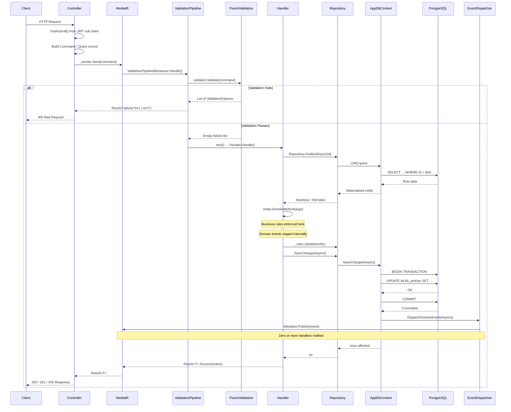
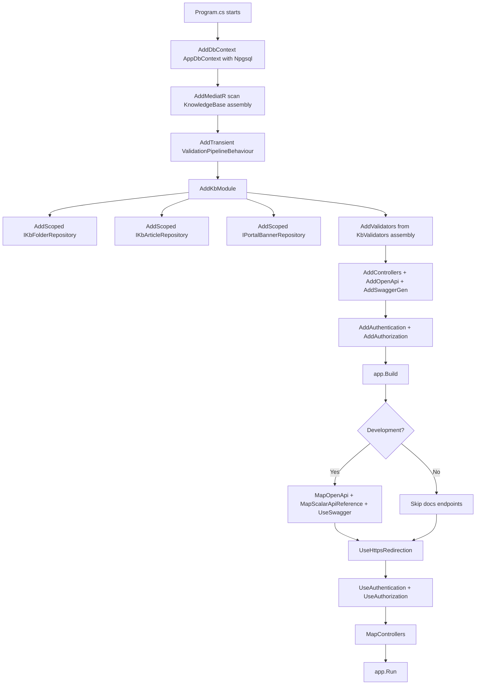
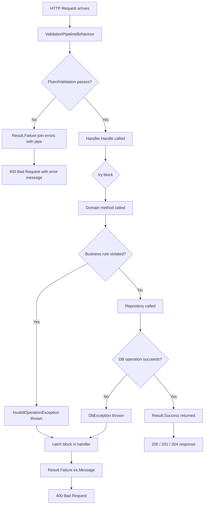
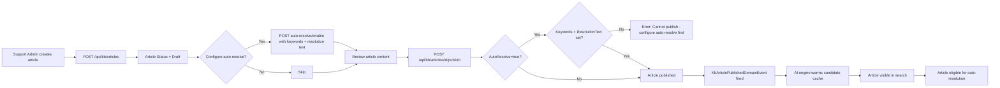
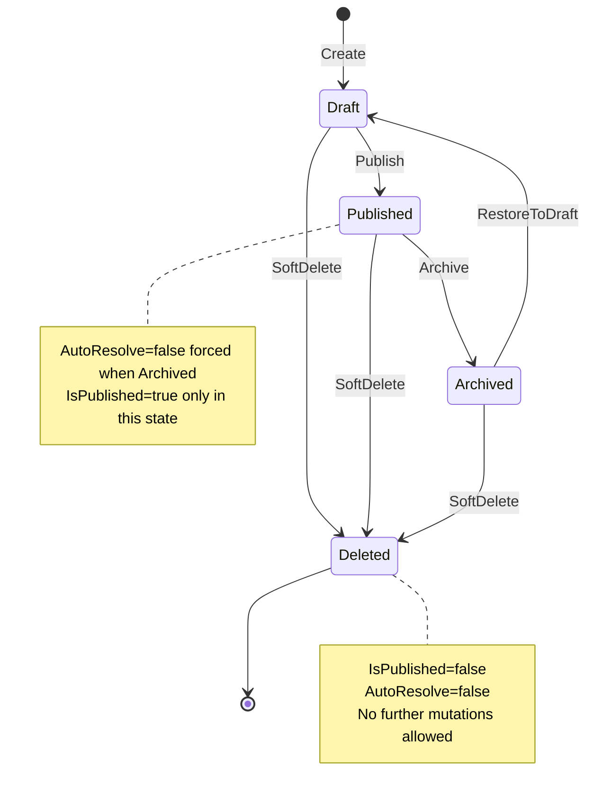
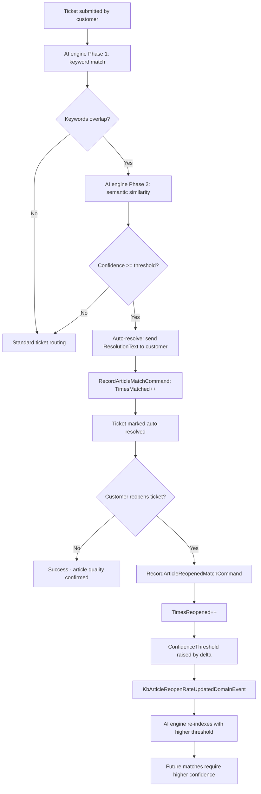

# Adrenalin Knowledge Base (KB) Module — Enterprise Technical Documentation

> **Target Audience:** Developers, Architects, Testers, Future Maintainers
> **Framework:** .NET 10 · C# 13 · PostgreSQL · Entity Framework Core 10 · MediatR 14 · FluentValidation 12
> **Architecture:** Modular Monolith · Clean Architecture · Domain-Driven Design · CQRS

---

## 1. Executive Summary

### Purpose

The Knowledge Base (KB) module is a self-contained domain module within the Adrenalin backend platform. Its primary purpose is to manage a structured, searchable library of support articles organised into a hierarchical folder system, surfaced to customers through a portal interface with optional announcement banners.

### Business Problem It Solves

Support teams create and maintain documentation (FAQs, release notes, user manuals, patches, process flows) that customers and agents need to find quickly. Without a structured KB:

- Support agents repeat the same answers manually, wasting time
- Customers cannot self-serve, increasing ticket volume
- AI auto-resolution engines have no curated article pool to match against
- There is no mechanism to show time-sensitive announcements on the portal

The KB module solves all four problems in a single, cleanly-separated domain module.

### Main Capabilities

| Capability | Description |
|---|---|
| Article lifecycle management | Create → Draft → Publish → Archive → Restore |
| Hierarchical folder organisation | Self-referencing tree, max 5 levels deep |
| Full-text search | GIN trigram index on article title |
| File attachments | Object-storage URL references per article |
| Auto-resolution engine integration | Keywords + confidence threshold + guardrail exclusion |
| Learning loop | Tracks `times_matched`/`times_reopened`; auto-adjusts confidence threshold |
| Portal banners | Scheduled, time-boxed announcements for the customer portal |
| Soft delete | No hard deletes — all data auditable and recoverable |
| Domain events | Published after every significant state change for downstream modules |

### High-Level Architecture

```
┌──────────────────────────────────────────────────────────────┐
│  Adrenalin.unify.API                                         │
│  KbArticlesController · KbFoldersController · PortalBannersCtrl │
└─────────────────────┬────────────────────────────────────────┘
                      │ MediatR ISender
┌─────────────────────▼────────────────────────────────────────┐
│  Adrenalin.Modules.KnowledgeBase (Application)               │
│  Commands · Queries · Handlers · Validators · DTOs           │
└─────────────────────┬────────────────────────────────────────┘
                      │ IKbArticleRepository / IKbFolderRepository
┌─────────────────────▼────────────────────────────────────────┐
│  Adrenalin.Modules.KnowledgeBase (Domain)                    │
│  KbArticle · KbFolder · KbAttachment · PortalBanner          │
│  ValueObjects · Enums · Events · Interfaces                  │
└─────────────────────┬────────────────────────────────────────┘
                      │ EF Core
┌─────────────────────▼────────────────────────────────────────┐
│  Adrenalin.Persistence                                       │
│  KbArticleRepository · KbFolderRepository                    │
│  EF Configurations · AppDbContext                            │
└─────────────────────┬────────────────────────────────────────┘
                      │ Npgsql
             ┌────────▼────────┐
             │  PostgreSQL     │
             │  Schema: kb.*   │
             └─────────────────┘
```

### Technologies

| Technology | Version | Role |
|---|---|---|
| .NET | 10.0 | Runtime |
| C# | 13 | Language |
| MediatR | 14.1.0 | CQRS mediator + domain event bus |
| FluentValidation | 12.1.1 | Input validation pipeline |
| Entity Framework Core | 10.0.8 | ORM |
| Npgsql EF Core | 10.0.2 | PostgreSQL provider |
| Scalar.AspNetCore | 2.6.0 | API documentation UI |
| Swashbuckle.AspNetCore | 10.2.1 | OpenAPI spec |

---

## 2. Folder Structure Analysis

```
Adrenalin/
├── Adrenalin.SharedKernel/
│   ├── Entities/
│   │   ├── BaseEntity.cs                    ← Id only
│   │   ├── AuditableEntity.cs               ← + audit fields
│   │   ├── SoftDeleteEntity.cs              ← + IsDeleted
│   │   └── SoftDeleteActiveEntity.cs        ← + IsActive
│   └── Results/
│       └── Result.cs                        ← Result<T> monad
│
├── Adrenalin.Modules.KnowledgeBase/
│   ├── Domain/
│   │   ├── Entities/
│   │   │   ├── KbArticle.cs                 ← AGGREGATE ROOT
│   │   │   ├── KbFolder.cs                  ← Folder hierarchy node
│   │   │   ├── KbAttachment.cs              ← File reference
│   │   │   └── PortalBanner.cs              ← Portal announcement
│   │   ├── Enums/
│   │   │   ├── ArticleStatus.cs
│   │   │   ├── ArticleType.cs
│   │   │   └── MatchPhase.cs
│   │   ├── Events/
│   │   │   └── KbDomainEvents.cs
│   │   ├── Interfaces/
│   │   │   └── IKbRepositories.cs
│   │   └── ValueObjects/
│   │       ├── ArticleTitle.cs
│   │       ├── FolderName.cs
│   │       └── ConfidenceThreshold.cs
│   └── Application/
│       ├── Commands/KbCommands.cs
│       ├── Queries/KbQueries.cs
│       ├── DTOs/KbDtos.cs
│       ├── Validators/KbValidators.cs
│       └── Handlers/
│           ├── KbFolderCommandHandlers.cs
│           ├── KbArticleCommandHandlers.cs
│           ├── KbAutoResolveAndBannerHandlers.cs
│           └── KbQueryHandlers.cs
│
├── Adrenalin.Persistence/
│   ├── Context/AppDbContext.cs
│   ├── Configurations/KnowledgeBase/
│   │   ├── KbArticleConfiguration.cs
│   │   ├── KbFolderConfiguration.cs
│   │   └── KbAttachmentAndBannerConfiguration.cs
│   ├── Repositories/KnowledgeBase/
│   │   ├── KbArticleRepository.cs
│   │   ├── KbFolderRepository.cs
│   │   └── PortalBannerRepository.cs
│   └── DependencyInjection/KbServiceRegistration.cs
│
└── Adrenalin.unify.API/
    ├── Controllers/KnowledgeBase/
    │   ├── KbArticlesController.cs
    │   ├── KbFoldersController.cs
    │   └── PortalBannersController.cs
    └── Program.cs
```

### Folder Responsibilities

| Folder | Purpose | Why It Exists |
|---|---|---|
| `Domain/Entities` | Business logic and invariants | Core — all rules live here |
| `Domain/Enums` | Named constants mapping to DB CHECK constraints | Avoid magic strings |
| `Domain/Events` | Domain notifications for downstream modules | Decouples KB from AI/Notification/SLA |
| `Domain/Interfaces` | Repository contracts | Domain depends on abstractions, not EF Core |
| `Domain/ValueObjects` | Self-validating primitive wrappers | Enforce constraints at the type level |
| `Application/Commands` | Write intent records | CQRS write side |
| `Application/Queries` | Read intent records | CQRS read side |
| `Application/Handlers` | Use-case orchestrators | One handler per command/query |
| `Application/Validators` | Input validation rules | Stops bad data before handlers run |
| `Application/DTOs` | API response shapes | Never expose domain entities to the API |
| `Persistence/Configurations` | EF Core table/column/index mappings | Keeps EF config out of domain entities |
| `Persistence/Repositories` | Concrete EF data access | Implements domain interfaces |
| `Persistence/DependencyInjection` | Service registration | Single entry point for KB module |
| `Controllers` | HTTP surface | HTTP → Command/Query → Result → HTTP |
---

## 3. Complete File-by-File Documentation

---

### 3.1 SharedKernel Files

---

#### `BaseEntity.cs`
**Namespace:** `Adrenalin.SharedKernel.Entities` | **Layer:** SharedKernel

The absolute root of every entity in the system.

| Property | Type | Modifier | Description |
|---|---|---|---|
| `Id` | `Guid` | `protected set` | UUID primary key — all entities use GUIDs |

**Why it exists:** Centralises the primary key declaration. The `protected set` ensures only the entity itself or subclasses can assign the Id — prevents external code from accidentally reassigning it.

**Depended on by:** Every domain entity in every module via the inheritance chain.

---

#### `AuditableEntity.cs`
**Namespace:** `Adrenalin.SharedKernel.Entities` | **Layer:** SharedKernel | **Inherits:** `BaseEntity`

Adds full audit trail fields.

| Property | Type | Nullable | Description |
|---|---|---|---|
| `CreatedBy` | `Guid?` | Yes | ID of user who created the record |
| `UpdatedBy` | `Guid?` | Yes | ID of user who last modified |
| `CreatedAt` | `DateTimeOffset` | No | UTC creation timestamp |
| `UpdatedAt` | `DateTimeOffset?` | Yes | UTC last-modification timestamp |
| `RowVersion` | `byte[]?` | Yes | EF Core optimistic concurrency token |

**Important for KB:** `KbArticle` and `KbFolder` configurations call `builder.Ignore(x => x.RowVersion)` because the PostgreSQL KB tables have no `row_version` column. The property is inherited but explicitly excluded from the EF mapping.

---

#### `SoftDeleteEntity.cs`
**Namespace:** `Adrenalin.SharedKernel.Entities` | **Layer:** SharedKernel | **Inherits:** `AuditableEntity`

Adds soft-delete capability.

| Property | Type | Default | Description |
|---|---|---|---|
| `IsDeleted` | `bool` | `false` | Logical deletion flag — record retained physically |

**Used by KB:** `KbArticle`, `KbFolder`, `KbAttachment` all inherit this.
**EF Query Filter:** All KB configurations apply `builder.HasQueryFilter(x => !x.IsDeleted)` so deleted records are excluded from all standard queries automatically.

---

#### `SoftDeleteActiveEntity.cs`
**Namespace:** `Adrenalin.SharedKernel.Entities` | **Layer:** SharedKernel | **Inherits:** `SoftDeleteEntity`

Adds an additional manual active/inactive toggle on top of soft-delete.

| Property | Type | Default | Description |
|---|---|---|---|
| `IsActive` | `bool` | `true` | Manual on/off toggle independent of deletion |

**Not used by KB entities directly** — KB entities use `SoftDeleteEntity`. This class exists for Auth/Lookup entities that need both flags.

---

#### `Result.cs`
**Namespace:** `Adrenalin.SharedKernel.Results` | **Layer:** SharedKernel

Railway-Oriented Programming monad. Every command and query handler returns `Result` or `Result<T>` — never throws exceptions across layer boundaries.

**Class: `Result`**

| Member | Type | Description |
|---|---|---|
| `IsSuccess` | `bool` | True when operation succeeded |
| `Error` | `string?` | Error message when IsSuccess=false |
| `Success()` | static method | Creates successful result |
| `Failure(string error)` | static method | Creates failed result with message |

**Class: `Result<T>`** inherits `Result`

| Member | Type | Description |
|---|---|---|
| `Value` | `T?` | Returned data when successful |
| `Success(T value)` | static method | Successful result with data |
| `Failure(string error)` | static method | Failed result — Value=default |

**Why it exists:** Controllers check `result.IsSuccess` and return the appropriate HTTP code. Handlers catch all exceptions internally and return `Result.Failure(ex.Message)`. This keeps error flow explicit and testable without exception propagation across layers.

```csharp
// Handler wraps everything
return Result<Guid>.Failure("Article not found.");

// Controller maps cleanly
return result.IsSuccess
    ? Ok(result.Value)
    : NotFound(new { error = result.Error });
```

---

### 3.2 Domain Layer Files

---

#### `ArticleStatus.cs`
**Namespace:** `Adrenalin.Modules.KB.Domain.Enums` | **Layer:** Domain

Maps to `kb.kb_articles.status` PostgreSQL CHECK constraint.

| Value | DB String | Business Meaning |
|---|---|---|
| `Draft` | `"draft"` | Being written — not visible to customers |
| `Published` | `"published"` | Live and searchable — eligible for auto-resolution |
| `Archived` | `"archived"` | Retired — read-only — excluded from search |

**State machine (enforced by `KbArticle`):**
```
Draft ──────► Published ──────► Archived
  ▲                                │
  └────────── RestoreToDraft ◄─────┘
```

**Invalid transitions throw `InvalidOperationException`:**
- Published → Published
- Archived → Published (must go Draft first)
- Any state → any mutation if `IsDeleted = true`

---

#### `ArticleType.cs`
**Namespace:** `Adrenalin.Modules.KB.Domain.Enums` | **Layer:** Domain

| Value | DB String | Business Meaning |
|---|---|---|
| `Faq` | `"faq"` | Frequently Asked Questions |
| `ReleaseNote` | `"release_note"` | Product release notes |
| `UserManual` | `"user_manual"` | Step-by-step user guides |
| `Patch` | `"patch"` | Hotfix / patch descriptions |
| `ProcessFlow` | `"process_flow"` | Business process documentation |

**DB Conversion:** `KbArticleConfiguration` applies `ToSnakeCase()` so `ReleaseNote` → `"release_note"` and `ProcessFlow` → `"process_flow"` in the database.

---

#### `MatchPhase.cs`
**Namespace:** `Adrenalin.Modules.KB.Domain.Enums` | **Layer:** Domain

Describes which phase of the AI auto-resolution engine produced the match. Maps to `ai.auto_resolution_log.match_phase`.

| Value | Business Meaning |
|---|---|
| `Keyword` | Phase 1 — exact keyword array overlap |
| `Semantic` | Phase 2 — vector/semantic similarity |
| `Both` | Both phases agreed on the same article |

Defined in the KB domain because it conceptually belongs to the KB auto-resolution feature. The `ai.auto_resolution_log` table is written by the AI module using this shared vocabulary.

---

#### `ArticleTitle.cs`
**Namespace:** `Adrenalin.Modules.KB.Domain.ValueObjects` | **Layer:** Domain

Validated wrapper around an article title string. Enforces max 300 chars and non-blank at the type level.

| Member | Description |
|---|---|
| `MaxLength = 300` | Matches `kb.kb_articles.title VARCHAR(300)` |
| `Value` | The validated string |
| `Create(string title)` | Factory — throws `ArgumentException` if blank or > 300 chars |
| `ToString()` | Returns `Value` |
| implicit `string` operator | Allows use where `string` is expected |

**Why a value object instead of just a string?** Without it, the 300-character constraint would need checking in the validator, the handler, and the entity. The value object enforces it once, at creation, making it impossible to have an invalid title anywhere in the codebase.

---

#### `FolderName.cs`
**Namespace:** `Adrenalin.Modules.KB.Domain.ValueObjects` | **Layer:** Domain

| Member | Description |
|---|---|
| `MaxLength = 150` | Matches `kb.kb_folders.name VARCHAR(150)` |
| `Value` | The validated string |
| `Create(string name)` | Factory — throws if blank or > 150 chars |
| implicit `string` operator | Seamless string interop |

---

#### `ConfidenceThreshold.cs`
**Namespace:** `Adrenalin.Modules.KB.Domain.ValueObjects` | **Layer:** Domain

Validated wrapper for the AI auto-resolution confidence score. Enforces `0.500–1.000` range and provides `Raise()` for the learning loop.

| Member | Description |
|---|---|
| `Minimum = 0.500m` | Minimum allowed value |
| `Maximum = 1.000m` | Maximum allowed value |
| `Default = 0.850m` | Default applied to new auto-resolve articles |
| `Value` | The decimal threshold |
| `Create(decimal value)` | Factory — throws `ArgumentOutOfRangeException` if out of range |
| `CreateDefault()` | Returns threshold at 0.850 |
| `Raise(decimal delta)` | Returns new threshold raised by delta, capped at 1.000 |
| implicit `decimal` operator | Seamless decimal interop |

**Learning loop usage:**
```csharp
// When a matched ticket is reopened:
var raised = threshold.Raise(0.025m);
// 0.850 → 0.875 → 0.900 → ... → 1.000 (capped)
// Makes the engine more selective next time
```

---

#### `KbDomainEvents.cs`
**Namespace:** `Adrenalin.Modules.KB.Domain.Events` | **Layer:** Domain

All KB domain event records. Each implements `INotification` so MediatR can dispatch them to zero or more registered handlers.

| Event | Fired When | Key Payload |
|---|---|---|
| `KbFolderCreatedDomainEvent` | `KbFolder.Create()` called | FolderId, ParentId, FolderName |
| `KbFolderDeletedDomainEvent` | `KbFolder.SoftDelete()` called | FolderId |
| `KbArticleCreatedDomainEvent` | `KbArticle.Create()` called | ArticleId, Title, ArticleType |
| `KbArticlePublishedDomainEvent` | `KbArticle.Publish()` succeeds | ArticleId, Title |
| `KbArticleDeletedDomainEvent` | `KbArticle.SoftDelete()` called | ArticleId |
| `KbArticleReopenRateUpdatedDomainEvent` | `KbArticle.RecordReopenedMatch()` called | ArticleId, TimesMatched, TimesReopened, NewThreshold |

**`KbArticlePublishedDomainEvent`** is the primary integration point between KB and the AI engine — the AI module listens to this event to warm its candidate cache.

**How events are dispatched — critical detail:**

Events are NOT published immediately when fired on the entity. They accumulate in `_domainEvents` (a `List<INotification>`). After `AppDbContext.SaveChangesAsync()` commits successfully, `DispatchDomainEventsAsync()` publishes them via `IMediator.Publish()`. This guarantees:
1. Events only fire after the DB write has committed — no ghost events from failed transactions
2. The entity lists are cleared before publishing — re-entrant saves do not re-fire events

---

#### `IKbRepositories.cs`
**Namespace:** `Adrenalin.Modules.KB.Domain.Interfaces` | **Layer:** Domain

Defines the three repository contracts. The Domain defines what it needs; Persistence provides it. This is the Dependency Inversion Principle applied at the module boundary.

**`IKbFolderRepository`**

| Method | Returns | Description |
|---|---|---|
| `GetByIdAsync(Guid, ct)` | `KbFolder?` | Single folder — uses `IgnoreQueryFilters` |
| `GetRootFoldersAsync(ct)` | `IReadOnlyList<KbFolder>` | All non-deleted roots, ordered by DisplayOrder |
| `GetSubtreeAsync(Guid, ct)` | `IReadOnlyList<KbFolder>` | All non-deleted descendants of a root |
| `GetDepthAsync(Guid, ct)` | `int` | Parent chain depth (root = 0) |
| `HasArticlesAsync(Guid, ct)` | `bool` | True if folder has non-deleted articles |
| `Add(KbFolder)` | `void` | Register with EF change tracker |
| `Update(KbFolder)` | `void` | Mark as modified |
| `SaveChangesAsync(ct)` | `Task<int>` | Commit to PostgreSQL |

**`IKbArticleRepository`**

| Method | Returns | Description |
|---|---|---|
| `GetByIdAsync(Guid, ct)` | `KbArticle?` | Single article — uses `IgnoreQueryFilters` |
| `GetWithAttachmentsAsync(Guid, ct)` | `KbArticle?` | Article with all attachments loaded |
| `SearchAsync(...)` | `(Items, TotalCount)` | Paginated search with optional filters |
| `GetAutoResolveCandidatesAsync(ct)` | `IReadOnlyList<KbArticle>` | Published, auto-resolve, non-guardrail articles |
| `FindByKeywordsAsync(keywords, ct)` | `IReadOnlyList<KbArticle>` | GIN array overlap match (Phase-1 AI) |
| `Add / Update / SaveChangesAsync` | — | Standard write operations |

**`IPortalBannerRepository`**

| Method | Returns | Description |
|---|---|---|
| `GetByIdAsync(Guid, ct)` | `PortalBanner?` | Single banner |
| `GetActiveBannersAsync(DateTimeOffset, ct)` | `IReadOnlyList<PortalBanner>` | Currently schedule-active banners |
| `GetAllAsync(ct)` | `IReadOnlyList<PortalBanner>` | All banners for admin |
| `Add / Update / SaveChangesAsync` | — | Standard write operations |

---

#### `KbFolder.cs`
**Namespace:** `Adrenalin.Modules.KB.Domain.Entities` | **Layer:** Domain
**Inherits:** `SoftDeleteEntity → AuditableEntity → BaseEntity`
**Table:** `kb.kb_folders`

Self-referencing hierarchy node. Supports nesting up to 5 levels.

| Property | Type | Description |
|---|---|---|
| `MaxDepth` | `const int = 5` | Max allowed nesting depth |
| `Name` | `string` | Folder display name |
| `ParentId` | `Guid?` | Self-referencing FK — null means root |
| `DisplayOrder` | `int` | Sort weight among siblings |
| `Parent` | `KbFolder?` | EF navigation property |
| `DomainEvents` | `IReadOnlyList<INotification>` | Pending events (transient — not persisted) |

**Factory: `KbFolder.Create(...)`**

Validates depth: if `parentId` provided and `currentParentDepth >= 5`, throws. The handler fetches the actual parent depth and passes it here.

**Domain Methods:**

| Method | Pre-condition | Effect |
|---|---|---|
| `Rename(FolderName, Guid)` | Not deleted | Updates Name, UpdatedBy, UpdatedAt |
| `Reorder(int, Guid)` | None | Updates DisplayOrder |
| `SoftDelete(Guid)` | Not already deleted | IsDeleted=true; fires `KbFolderDeletedDomainEvent` |
| `ClearDomainEvents()` | — | Called by AppDbContext post-dispatch |

**Private EF constructor:** `private KbFolder() { }` — required by EF Core for materialisation. Prevents external instantiation.

---

#### `KbAttachment.cs`
**Namespace:** `Adrenalin.Modules.KB.Domain.Entities` | **Layer:** Domain
**Inherits:** `BaseEntity` directly
**Table:** `kb.kb_attachments`

File attachment metadata record. Files live in object storage; this entity holds only the URL reference.

**Why `BaseEntity` not `SoftDeleteEntity`?** The `kb.kb_attachments` schema has only: `id, article_id, file_url, file_name, file_size_bytes, mime_type, is_deleted, created_at`. There is no `updated_at`, `updated_by`, `created_by`, or `row_version`. So it cannot inherit `AuditableEntity` (which would add unmapped columns). `IsDeleted` and `CreatedAt` are declared directly on the entity.

| Property | Type | Description |
|---|---|---|
| `ArticleId` | `Guid` | FK to `kb.kb_articles.id` |
| `FileUrl` | `string` | Absolute URL to object storage |
| `FileName` | `string` | Original filename (max 255 chars) |
| `FileSizeBytes` | `long?` | File size in bytes |
| `MimeType` | `string?` | MIME content type |
| `IsDeleted` | `bool` | Soft delete flag |
| `CreatedAt` | `DateTimeOffset` | Upload timestamp |

**Access pattern:** Always accessed through the `KbArticle` aggregate:
```csharp
article.AddAttachment(url, name, size, mime);
article.RemoveAttachment(attachmentId);
```

---

#### `PortalBanner.cs`
**Namespace:** `Adrenalin.Modules.KB.Domain.Entities` | **Layer:** Domain
**Inherits:** `BaseEntity` directly
**Table:** `kb.portal_banners`

Time-boxed announcement banner for the customer portal.

**Why `BaseEntity` directly?** The `kb.portal_banners` schema has: `id, title, message, active_from, active_to, is_active, created_by, updated_by, created_at, updated_at`. No `is_deleted` or `row_version`. So only `BaseEntity` is appropriate; audit fields are defined directly on the entity.

| Property | Type | Nullable | Description |
|---|---|---|---|
| `Title` | `string` | No | Banner headline (max 200 chars) |
| `Message` | `string` | No | Banner body text |
| `ActiveFrom` | `DateTimeOffset?` | Yes | Schedule start — null = immediately active |
| `ActiveTo` | `DateTimeOffset?` | Yes | Schedule end — null = no expiry |
| `IsActive` | `bool` | No | Manual kill switch — false overrides schedule |
| `CreatedBy/UpdatedBy` | `Guid?` | Yes | Actor IDs |
| `CreatedAt/UpdatedAt` | `DateTimeOffset` | Mixed | Timestamps |

**Domain Methods:**

| Method | Effect |
|---|---|
| `Create(...)` | Validates schedule, title, message; sets IsActive=true |
| `Update(...)` | Re-validates all fields; updates properties |
| `Activate(actor)` | IsActive = true |
| `Deactivate(actor)` | IsActive = false (manual kill switch) |
| `IsCurrentlyVisible(DateTimeOffset now)` | Returns true if IsActive=true AND within schedule window |

**`IsCurrentlyVisible()` — single source of truth:**
```csharp
if (!IsActive) return false;
if (ActiveFrom.HasValue && now < ActiveFrom.Value) return false;
if (ActiveTo.HasValue   && now > ActiveTo.Value)   return false;
return true;
```
Called both in the SQL query (approximate) and in the handler (precise double-check).

---

#### `KbArticle.cs`
**Namespace:** `Adrenalin.Modules.KB.Domain.Entities` | **Layer:** Domain — **AGGREGATE ROOT**
**Inherits:** `SoftDeleteEntity → AuditableEntity → BaseEntity`
**Table:** `kb.kb_articles`

The central aggregate root. Manages the complete article lifecycle, auto-resolution configuration, learning loop counters, and attachment collection.

**Complete Property Reference:**

| Property | Type | Default | Description |
|---|---|---|---|
| `Title` | `string` | required | Article headline |
| `Content` | `string?` | null | Full article body |
| `ArticleType` | `ArticleType` | required | Classification enum |
| `Status` | `ArticleStatus` | `Draft` | Publication lifecycle state |
| `IsPublished` | `bool` | `false` | Denormalised mirror of `Status == Published` |
| `AuthorId` | `Guid?` | null | FK to auth.users |
| `FolderId` | `Guid?` | null | FK to kb.kb_folders |
| `AutoResolve` | `bool` | `false` | AI auto-resolution eligible |
| `ConfidenceThresholdValue` | `decimal` | `0.850` | Stored threshold (0.500–1.000) |
| `Keywords` | `string[]?` | null | Phase-1 keyword array |
| `ResolutionText` | `string?` | null | Auto-resolve customer response |
| `GuardrailExcluded` | `bool` | `false` | Permanently excluded from auto-resolve |
| `TimesMatched` | `int` | `0` | Cumulative AI match count |
| `TimesReopened` | `int` | `0` | Cumulative post-resolve reopen count |
| `ConfidenceThreshold` | VO accessor | computed | Not mapped by EF |
| `Folder` | `KbFolder?` | navigation | EF navigation property |
| `Attachments` | `IReadOnlyList<KbAttachment>` | empty | Owned collection |
| `DomainEvents` | `IReadOnlyList<INotification>` | empty | Pending events |

**Lifecycle Methods:**

| Method | Pre-conditions | Post-conditions | Event |
|---|---|---|---|
| `UpdateContent(title, content, actor)` | Not deleted, not Archived | Title/Content updated | None |
| `MoveToFolder(folderId, actor)` | Not deleted | FolderId updated | None |
| `Publish(actor)` | Not deleted; not Published; not Archived; if AutoResolve=true: Keywords+ResolutionText set | Status=Published, IsPublished=true | `KbArticlePublishedDomainEvent` |
| `Archive(actor)` | Not deleted; not Archived | Status=Archived, IsPublished=false, AutoResolve=false | None |
| `RestoreToDraft(actor)` | Status must be Archived | Status=Draft | None |
| `SoftDelete(actor)` | Not already deleted | IsDeleted=true, IsPublished=false, AutoResolve=false | `KbArticleDeletedDomainEvent` |

**Auto-Resolution Methods:**

| Method | Pre-conditions | Effect |
|---|---|---|
| `EnableAutoResolve(keywords, text, threshold, actor)` | Not deleted; not GuardrailExcluded; keywords non-empty; resolutionText non-blank | AutoResolve=true; sets Keywords, ResolutionText, ConfidenceThresholdValue |
| `DisableAutoResolve(actor)` | None | AutoResolve=false |
| `MarkAsGuardrailExcluded(actor)` | None | GuardrailExcluded=true, AutoResolve=false — PERMANENT |
| `RecordReopenedMatch(delta)` | None | TimesReopened++; threshold raised by delta | `KbArticleReopenRateUpdatedDomainEvent` |
| `RecordMatch()` | None | TimesMatched++ |

**Attachment Methods:**

| Method | Effect |
|---|---|
| `AddAttachment(url, name, size, mime)` | Creates `KbAttachment` via factory; adds to `_attachments` |
| `RemoveAttachment(attachmentId)` | Finds attachment; calls `attachment.SoftDelete()` |

**Private guard — `EnsureNotDeleted()`:**
Called at the start of every mutating method. Throws `InvalidOperationException("Cannot modify a deleted article.")` if `IsDeleted = true`.

---

### 3.3 Application Layer Files

---

#### `KbCommands.cs`
**Namespace:** `Adrenalin.Modules.KB.Application.Commands` | **Layer:** Application

All write-side intent records. Every command is a `sealed record` implementing `IRequest<Result>` or `IRequest<Result<Guid>>` — immutable and dispatchable via MediatR.

**Folder Commands:**

| Command | Returns | Key Parameters | Purpose |
|---|---|---|---|
| `CreateKbFolderCommand` | `Result<Guid>` | Name, ParentId?, DisplayOrder, ActorId? | Create folder |
| `RenameKbFolderCommand` | `Result` | FolderId, NewName, ActorId | Rename folder |
| `ReorderKbFolderCommand` | `Result` | FolderId, NewDisplayOrder, ActorId | Change sort order |
| `DeleteKbFolderCommand` | `Result` | FolderId, ActorId | Soft-delete folder |

**Article Commands:**

| Command | Returns | Key Parameters | Purpose |
|---|---|---|---|
| `CreateKbArticleCommand` | `Result<Guid>` | Title, Content?, ArticleType, FolderId?, ActorId? | Create Draft article |
| `UpdateKbArticleCommand` | `Result` | ArticleId, NewTitle, NewContent?, ActorId? | Edit title/content |
| `MoveKbArticleCommand` | `Result` | ArticleId, TargetFolderId?, ActorId? | Move to folder |
| `PublishKbArticleCommand` | `Result` | ArticleId, ActorId? | Draft → Published |
| `ArchiveKbArticleCommand` | `Result` | ArticleId, ActorId? | Published → Archived |
| `RestoreKbArticleToDraftCommand` | `Result` | ArticleId, ActorId? | Archived → Draft |
| `DeleteKbArticleCommand` | `Result` | ArticleId, ActorId? | Soft-delete article |

**Auto-Resolve Commands:**

| Command | Returns | Key Parameters | Purpose |
|---|---|---|---|
| `EnableAutoResolveCommand` | `Result` | ArticleId, Keywords, ResolutionText, ConfidenceThreshold, ActorId? | Enable AI matching |
| `DisableAutoResolveCommand` | `Result` | ArticleId, ActorId? | Disable AI matching |
| `MarkArticleAsGuardrailExcludedCommand` | `Result` | ArticleId, ActorId? | Permanently block auto-resolve |
| `RecordArticleReopenedMatchCommand` | `Result` | ArticleId, ThresholdRaiseDelta=0.025 | Learning loop: reopen signal |
| `RecordArticleMatchCommand` | `Result` | ArticleId | Learning loop: match signal |

**Attachment Commands:**

| Command | Returns | Purpose |
|---|---|---|
| `AddAttachmentCommand` | `Result<Guid>` | Add file reference to article |
| `RemoveAttachmentCommand` | `Result` | Soft-delete attachment |

**Portal Banner Commands:**

| Command | Returns | Purpose |
|---|---|---|
| `CreatePortalBannerCommand` | `Result<Guid>` | Create banner |
| `UpdatePortalBannerCommand` | `Result` | Update banner content/schedule |
| `ActivatePortalBannerCommand` | `Result` | Set IsActive=true |
| `DeactivatePortalBannerCommand` | `Result` | Set IsActive=false |

---

#### `KbQueries.cs`
**Namespace:** `Adrenalin.Modules.KB.Application.Queries` | **Layer:** Application

All read-side intent records. Each is a `sealed record` implementing `IRequest<Result<T>>`.

**Folder Queries:**

| Query | Returns | Purpose |
|---|---|---|
| `GetKbFolderByIdQuery` | `Result<KbFolderDto>` | Single folder |
| `GetKbFolderTreeQuery` | `Result<IReadOnlyList<KbFolderTreeNodeDto>>` | Full recursive tree |
| `GetKbFolderChildrenQuery` | `Result<IReadOnlyList<KbFolderDto>>` | Immediate children only |

**Article Queries:**

| Query | Returns | Key Parameters |
|---|---|---|
| `GetKbArticleByIdQuery` | `Result<KbArticleDto>` | ArticleId |
| `GetKbArticleWithAttachmentsQuery` | `Result<KbArticleWithAttachmentsDto>` | ArticleId |
| `SearchKbArticlesQuery` | `Result<KbArticleSearchResultDto>` | TitleQuery?, ArticleType?, Status?, FolderId?, PageNumber=1, PageSize=20 |
| `GetArticlesByFolderQuery` | `Result<IReadOnlyList<KbArticleSummaryDto>>` | FolderId |
| `GetAutoResolveCandidatesQuery` | `Result<IReadOnlyList<KbArticleDto>>` | — |

**Portal Banner Queries:**

| Query | Returns | Purpose |
|---|---|---|
| `GetActivePortalBannersQuery` | `Result<IReadOnlyList<ActivePortalBannerDto>>` | Customer-facing active banners |
| `GetAllPortalBannersQuery` | `Result<IReadOnlyList<PortalBannerDto>>` | Admin list |
| `GetPortalBannerByIdQuery` | `Result<PortalBannerDto>` | Single banner |

---

#### `KbDtos.cs`
**Namespace:** `Adrenalin.Modules.KB.Application.DTOs` | **Layer:** Application

API response shapes. DTOs decouple the HTTP surface from the domain model.

**`KbFolderDto`** — flat folder record for list/detail views

| Field | Type | Description |
|---|---|---|
| `Id` | `Guid` | Folder ID |
| `Name` | `string` | Display name |
| `ParentId` | `Guid?` | Parent folder (null = root) |
| `DisplayOrder` | `int` | Sort weight |
| `CreatedAt` | `DateTimeOffset` | Creation timestamp |
| `UpdatedAt` | `DateTimeOffset?` | Last update |

**`KbFolderTreeNodeDto`** — recursive tree node

| Field | Type | Description |
|---|---|---|
| `Id` | `Guid` | Folder ID |
| `Name` | `string` | Display name |
| `ParentId` | `Guid?` | Parent ID |
| `DisplayOrder` | `int` | Sort weight |
| `Children` | `IReadOnlyList<KbFolderTreeNodeDto>` | Recursive children |

**`KbArticleDto`** — full article detail

| Field | Type | Description |
|---|---|---|
| `Id` | `Guid` | Article ID |
| `Title` | `string` | Headline |
| `Content` | `string?` | Body |
| `ArticleType` | `ArticleType` | Classification |
| `Status` | `ArticleStatus` | Lifecycle state |
| `IsPublished` | `bool` | Published flag |
| `AuthorId` | `Guid?` | Author user ID |
| `FolderId` | `Guid?` | Containing folder |
| `AutoResolve` | `bool` | AI eligible |
| `ConfidenceThreshold` | `decimal` | AI threshold |
| `Keywords` | `string[]?` | Keyword array |
| `ResolutionText` | `string?` | Auto-resolve response |
| `GuardrailExcluded` | `bool` | Permanently excluded |
| `TimesMatched` | `int` | Match count |
| `TimesReopened` | `int` | Reopen count |
| `CreatedAt` | `DateTimeOffset` | Creation time |
| `UpdatedAt` | `DateTimeOffset?` | Last update |

**`KbArticleSummaryDto`** — lightweight card for search result lists (no Content body)

| Field | Type |
|---|---|
| `Id, Title, ArticleType, Status` | Core fields |
| `IsPublished, AutoResolve, GuardrailExcluded` | Flags |
| `FolderId, UpdatedAt` | Metadata |

**`KbArticleSearchResultDto`** — paginated wrapper

| Field | Type | Description |
|---|---|---|
| `Items` | `IReadOnlyList<KbArticleSummaryDto>` | Page of results |
| `TotalCount` | `int` | Total matching records |
| `PageNumber` | `int` | Current page |
| `PageSize` | `int` | Items per page |

**`KbAttachmentDto`**

| Field | Type |
|---|---|
| `Id, ArticleId, FileUrl, FileName` | Core fields |
| `FileSizeBytes, MimeType, CreatedAt` | Metadata |

**`KbArticleWithAttachmentsDto`**

| Field | Type |
|---|---|
| `Article` | `KbArticleDto` |
| `Attachments` | `IReadOnlyList<KbAttachmentDto>` |

**`PortalBannerDto`** — admin view

| Field | Type |
|---|---|
| `Id, Title, Message` | Content |
| `ActiveFrom, ActiveTo, IsActive` | Schedule/state |
| `CreatedAt, UpdatedAt` | Timestamps |

**`ActivePortalBannerDto`** — minimal customer-facing projection

| Field | Type |
|---|---|
| `Id, Title, Message` | Only these three — no schedule data exposed |

---

#### `KbFolderCommandHandlers.cs`
**Namespace:** `Adrenalin.Modules.KB.Application.Handlers` | **Layer:** Application

**`CreateKbFolderCommandHandler`** implements `IRequestHandler<CreateKbFolderCommand, Result<Guid>>`

```
1. If ParentId provided:
   a. Fetch parent → Failure if not found or deleted
   b. GetDepthAsync(parentId) to know current nesting level
2. KbFolder.Create(name, parentId, displayOrder, actorId, parentDepth)
   → Domain validates MaxDepth = 5
3. _repo.Add(folder) + SaveChangesAsync()
4. Return Result<Guid>.Success(folder.Id)
```

All steps wrapped in try/catch → `Result<Guid>.Failure(ex.Message)` on any exception.

**`RenameKbFolderCommandHandler`** implements `IRequestHandler<RenameKbFolderCommand, Result>`

```
1. GetByIdAsync(FolderId) → Failure if null
2. folder.Rename(FolderName.Create(NewName), ActorId)
3. Update + SaveChanges
4. Result.Success()
```

**`ReorderKbFolderCommandHandler`** implements `IRequestHandler<ReorderKbFolderCommand, Result>`

```
1. GetByIdAsync → Failure if null
2. folder.Reorder(NewDisplayOrder, ActorId)
3. Update + SaveChanges
```

**`DeleteKbFolderCommandHandler`** implements `IRequestHandler<DeleteKbFolderCommand, Result>`

```
1. GetByIdAsync → Failure if null
2. HasArticlesAsync(FolderId) → Failure if true
   (Cannot delete folder with articles — move them first)
3. folder.SoftDelete(ActorId)
4. Update + SaveChanges
```

---

#### `KbArticleCommandHandlers.cs`
**Namespace:** `Adrenalin.Modules.KB.Application.Handlers` | **Layer:** Application

**`CreateKbArticleCommandHandler`** implements `IRequestHandler<CreateKbArticleCommand, Result<Guid>>`
Dependencies: `IKbArticleRepository`, `IKbFolderRepository`

```
1. If FolderId provided: validate folder exists and !IsDeleted
2. ArticleTitle.Create(cmd.Title) — validates ≤ 300 chars, non-blank
3. KbArticle.Create(title, content, articleType, authorId, folderId, createdBy)
   → Fires KbArticleCreatedDomainEvent
4. Add + SaveChanges → event dispatched
5. Return new article Id
```

**`UpdateKbArticleCommandHandler`** — edit title/content

```
1. GetByIdAsync → Failure if null
2. article.UpdateContent(ArticleTitle.Create(NewTitle), NewContent, ActorId)
   → Domain: not deleted, not archived
3. Update + SaveChanges
```

**`MoveKbArticleCommandHandler`** — change folder

```
1. GetByIdAsync → Failure if null
2. If TargetFolderId provided: validate folder exists + !IsDeleted
3. article.MoveToFolder(TargetFolderId, ActorId)
4. Update + SaveChanges
```

**`PublishKbArticleCommandHandler`** — Draft → Published

```
1. GetByIdAsync → Failure if null
2. article.Publish(ActorId)
   → Domain enforces: not deleted, not Published, not Archived
   → If AutoResolve: Keywords + ResolutionText must be set
   → Fires KbArticlePublishedDomainEvent
3. Update + SaveChanges → event dispatched to AI engine
```

**`ArchiveKbArticleCommandHandler`** — Published → Archived

```
1. GetByIdAsync → Failure if null
2. article.Archive(ActorId)
   → Domain: not deleted, not already Archived
   → Side effect: AutoResolve = false (leaves AI pool immediately)
3. Update + SaveChanges
```

**`RestoreKbArticleToDraftCommandHandler`** — Archived → Draft

```
1. GetByIdAsync → Failure if null
2. article.RestoreToDraft(ActorId)
   → Domain: Status must be Archived
3. Update + SaveChanges
```

**`DeleteKbArticleCommandHandler`** — soft-delete

```
1. GetByIdAsync → Failure if null
2. article.SoftDelete(ActorId)
   → Domain: not already deleted
   → Side effects: IsPublished=false, AutoResolve=false
   → Fires KbArticleDeletedDomainEvent
3. Update + SaveChanges
```

---

#### `KbAutoResolveAndBannerHandlers.cs`
**Namespace:** `Adrenalin.Modules.KB.Application.Handlers` | **Layer:** Application

**`EnableAutoResolveCommandHandler`** — critical business rule enforced at APPLICATION layer

```
1. GetByIdAsync → Failure if null
2. Check article.Status == Published
   → If not: Failure("Auto-resolve can only be enabled on a Published article.")
   (This check is in the handler, not just the domain — belt and suspenders)
3. article.EnableAutoResolve(keywords.ToArray(), resolutionText,
      ConfidenceThreshold.Create(threshold), actorId)
   → Domain enforces: not guardrail-excluded, keywords non-empty, text non-blank
4. Update + SaveChanges
```

**`DisableAutoResolveCommandHandler`**

```
1. GetByIdAsync → Failure if null
2. article.DisableAutoResolve(ActorId) → AutoResolve = false
3. Update + SaveChanges
```

**`MarkArticleAsGuardrailExcludedCommandHandler`**

```
1. GetByIdAsync → Failure if null
2. article.MarkAsGuardrailExcluded(ActorId) → GuardrailExcluded=true, AutoResolve=false
3. Update + SaveChanges
Note: GuardrailExcluded is PERMANENT — no reverse operation exists
```

**`RecordArticleReopenedMatchCommandHandler`** — learning loop background job

```
1. GetByIdAsync → Failure if null
2. article.RecordReopenedMatch(ThresholdRaiseDelta)
   → TimesReopened++
   → ConfidenceThresholdValue raised by delta (capped at 1.000)
   → Fires KbArticleReopenRateUpdatedDomainEvent
3. Update + SaveChanges → event dispatched to AI engine for re-indexing
```

**`RecordArticleMatchCommandHandler`** — AI engine match signal

```
1. GetByIdAsync → Failure if null
2. article.RecordMatch() → TimesMatched++
3. Update + SaveChanges
```

**`AddAttachmentCommandHandler`**

```
1. GetWithAttachmentsAsync (NOT GetByIdAsync — must load attachment collection)
2. article.AddAttachment(FileUrl, FileName, FileSizeBytes, MimeType)
   → Creates KbAttachment via factory, adds to _attachments list
3. Update + SaveChanges
4. Return attachment Id
```

**`RemoveAttachmentCommandHandler`**

```
1. GetWithAttachmentsAsync
2. article.RemoveAttachment(AttachmentId)
   → Finds attachment in list → attachment.SoftDelete()
3. Update + SaveChanges
```

**Portal Banner Handlers** — all follow same pattern:

```
Create: PortalBanner.Create(...) → Add + SaveChanges → return Id
Update: GetByIdAsync → banner.Update(...) → Update + SaveChanges
Activate: GetByIdAsync → banner.Activate(actor) → Update + SaveChanges
Deactivate: GetByIdAsync → banner.Deactivate(actor) → Update + SaveChanges
```

---

#### `KbQueryHandlers.cs`
**Namespace:** `Adrenalin.Modules.KB.Application.Handlers` | **Layer:** Application

**`GetKbFolderByIdQueryHandler`**

```
1. GetByIdAsync → null or IsDeleted → Failure("Folder not found")
2. Map KbFolder → KbFolderDto
3. Return Result<KbFolderDto>.Success(dto)
```

Contains internal static `MapFolder(KbFolder)` reused by other folder handlers.

**`GetKbFolderTreeQueryHandler`**

```
1. GetRootFoldersAsync() → list of root folders
2. For each root: GetSubtreeAsync(root.Id) → flat list of descendants
3. BuildNode(root, subtreeList) → recursive KbFolderTreeNodeDto
   BuildNode filters subtree by ParentId == current.Id, sorts by DisplayOrder,
   recursively builds children
4. Return tree list
```

**`GetKbFolderChildrenQueryHandler`**

```
1. GetSubtreeAsync(ParentFolderId)
2. Filter: ParentId == q.ParentFolderId (immediate children only)
3. Sort by DisplayOrder → map to KbFolderDto list
```

**`GetKbArticleByIdQueryHandler`**

Contains two internal static mappers used by ALL other article handlers:
- `MapArticle(KbArticle a)` → full `KbArticleDto`
- `MapSummary(KbArticle a)` → lightweight `KbArticleSummaryDto`

**`GetKbArticleWithAttachmentsQueryHandler`**

```
1. GetWithAttachmentsAsync (loads Attachments collection)
2. MapArticle → KbArticleDto
3. Filter attachments: .Where(a => !a.IsDeleted) — in-memory post-filter
4. Map each to KbAttachmentDto
5. Return KbArticleWithAttachmentsDto(article, attachments)
```

**`SearchKbArticlesQueryHandler`**

```
1. _repo.SearchAsync(TitleQuery, ArticleType, Status, FolderId, PageNumber, PageSize)
   → ILike leverages GIN trigram index
2. Map each result to KbArticleSummaryDto via MapSummary
3. Return KbArticleSearchResultDto(summaries, totalCount, page, size)
```

**`GetArticlesByFolderQueryHandler`**

Hardcodes `status = Published` and `pageSize = 200`. Folder detail views show only published articles with a practical upper limit.

**`GetAutoResolveCandidatesQueryHandler`**

```
1. GetAutoResolveCandidatesAsync()
   → WHERE status='published' AND auto_resolve=true AND guardrail_excluded=false
2. Map all to full KbArticleDto (AI engine needs all fields including keywords/threshold)
3. Return list
```

**`GetActivePortalBannersQueryHandler`** — double-checked visibility

```
1. GetActiveBannersAsync(now) — SQL filter (fast, indexed)
2. .Where(b => b.IsCurrentlyVisible(now)) — in-memory double check
   (Handles edge cases in DB/app clock precision differences)
3. Map to minimal ActivePortalBannerDto (id, title, message only)
```

**`GetAllPortalBannersQueryHandler`** — contains `MapBanner()` static mapper reused by `GetPortalBannerByIdQueryHandler`.

---

### 3.4 Persistence Layer Files

---

#### `KbFolderConfiguration.cs`
**Namespace:** `Adrenalin.Persistence.Configurations.KnowledgeBase` | **Layer:** Persistence

Maps `KbFolder` to `kb.kb_folders`. Implements `IEntityTypeConfiguration<KbFolder>`.

**Key mapping decisions:**

| Decision | Reason |
|---|---|
| `builder.Ignore(f => f.RowVersion)` | `kb.kb_folders` has no `row_version` column |
| `builder.Ignore(f => f.DomainEvents)` | Transient list — never persisted |
| `OnDelete(DeleteBehavior.Restrict)` on parent FK | DB prevents orphan child folders |
| `HasQueryFilter(f => !f.IsDeleted)` | All queries exclude deleted folders automatically |
| `HasDefaultValueSql("now()")` on `updated_at` | PostgreSQL fills on insert; app code fills on update |

**Indexes created:**

| Name | Columns | Purpose |
|---|---|---|
| `ix_kb_folders_parent_id` | `parent_id` | Fast child lookup by parent |
| `ix_kb_folders_parent_display_order` | `(parent_id, display_order)` | Efficient ordered sibling queries |

---

#### `KbArticleConfiguration.cs`
**Namespace:** `Adrenalin.Persistence.Configurations.KnowledgeBase` | **Layer:** Persistence

Maps `KbArticle` to `kb.kb_articles`.

**Key mapping decisions:**

| Decision | Reason |
|---|---|
| `builder.Ignore(a => a.RowVersion)` | No `row_version` column in schema |
| `builder.Ignore(a => a.ConfidenceThreshold)` | Value object computed from `ConfidenceThresholdValue` |
| `builder.Ignore(a => a.DomainEvents)` | Transient |
| `ArticleType` enum → `ToSnakeCase()` conversion | Maps `ReleaseNote` → `"release_note"` |
| `Status` enum → `.ToLower()` conversion | Maps `Published` → `"published"` |
| `Keywords` → `HasColumnType("text[]")` | PostgreSQL array type |
| `ConfidenceThresholdValue` → `numeric(4,3)` | Sufficient for 0.500–1.000 range |
| `FolderId` `OnDelete(SetNull)` | Deleting a folder nullifies article FK, not the article |
| `Attachments` `OnDelete(Cascade)` | Deleting an article cascades to its attachments |

**Indexes created by EF:**

| Name | Columns | Purpose |
|---|---|---|
| `ix_kb_articles_status` | `status` | Filter by status |
| `ix_kb_articles_folder_id` | `folder_id` | Folder detail view |
| `ix_kb_articles_auto_resolve` | `(auto_resolve, guardrail_excluded)` | AI candidate queries |

**Manual indexes required (cannot be created via EF Fluent API):**

```sql
CREATE EXTENSION IF NOT EXISTS pg_trgm;

-- Powers ILike title search
CREATE INDEX ix_kb_articles_title_trgm
    ON kb.kb_articles USING GIN (title gin_trgm_ops);

-- Powers FindByKeywordsAsync array overlap
CREATE INDEX ix_kb_articles_keywords_gin
    ON kb.kb_articles USING GIN (keywords);
```

**`ToSnakeCase()` extension:**
```csharp
Regex.Replace(value, "(?<!^)([A-Z])", "_$1").ToLower()
// ReleaseNote → release_note
// ProcessFlow → process_flow
// Faq → faq
```

---

#### `KbAttachmentAndBannerConfiguration.cs`
**Namespace:** `Adrenalin.Persistence.Configurations.KnowledgeBase` | **Layer:** Persistence

Two configurations in one file.

**`KbAttachmentConfiguration`** maps to `kb.kb_attachments`:
- No `updated_at`, `updated_by`, `created_by`, `row_version` mappings (schema doesn't have them)
- Query filter: `!a.IsDeleted`
- Index: `ix_kb_attachments_article_id` on `article_id`

**`PortalBannerConfiguration`** maps to `kb.portal_banners`:
- No soft-delete query filter (no `is_deleted` column in schema)
- `IsActive` defaults to `true`
- Index: `ix_portal_banners_is_active`

---

#### `KbFolderRepository.cs`
**Namespace:** `Adrenalin.Persistence.Repositories.KnowledgeBase` | **Layer:** Persistence

Concrete implementation of `IKbFolderRepository`.

| Method | Implementation Detail |
|---|---|
| `GetByIdAsync` | `IgnoreQueryFilters()` — handlers need to inspect IsDeleted |
| `GetRootFoldersAsync` | `Where(ParentId == null).OrderBy(DisplayOrder)` — query filter hides deleted |
| `GetSubtreeAsync` | Loads all non-deleted folders into memory; BFS via `CollectSubtree()` |
| `GetDepthAsync` | Loads all folders; walks parent chain in memory (max 5 hops) |
| `HasArticlesAsync` | `_ctx.KbArticles.AnyAsync(FolderId == folderId)` — query filter excludes deleted articles |

**`CollectSubtree()` — BFS algorithm:**
```
queue = [rootId]
result = []
while queue not empty:
  current = dequeue()
  children = all where ParentId == current
  result.AddRange(children)
  for each child: enqueue(child.Id)
return result
```

**Performance note:** `GetSubtreeAsync` and `GetDepthAsync` load the full folder table. Acceptable for shallow trees (max depth 5). For large production deployments, replace with a PostgreSQL `WITH RECURSIVE` CTE.

---

#### `KbArticleRepository.cs`
**Namespace:** `Adrenalin.Persistence.Repositories.KnowledgeBase` | **Layer:** Persistence

Concrete implementation of `IKbArticleRepository`.

| Method | Key Implementation Detail |
|---|---|
| `GetByIdAsync` | `IgnoreQueryFilters()` — needed to inspect IsDeleted in handlers |
| `GetWithAttachmentsAsync` | `.Include(a => a.Attachments)` + `IgnoreQueryFilters()` |
| `SearchAsync` | `EF.Functions.ILike(title, "%titleQuery%")` → GIN trigram index |
| `GetAutoResolveCandidatesAsync` | `Where(Published + AutoResolve + !Guardrail)` — standard LINQ |
| `FindByKeywordsAsync` | `FromSqlRaw` with PostgreSQL `&&` array overlap operator |

**`SearchAsync` ordering:**
```csharp
.OrderByDescending(a => a.UpdatedAt ?? a.CreatedAt)
```
Most recently modified articles appear first.

**`FindByKeywordsAsync` — why raw SQL:**
```csharp
.FromSqlRaw(@"
    SELECT * FROM kb.kb_articles
    WHERE  is_deleted = false
      AND  status = 'published'
      AND  auto_resolve = true
      AND  guardrail_excluded = false
      AND  keywords && {0}::text[]",
    (object)keywordArray)
```
EF Core cannot generate the PostgreSQL `&&` array overlap operator natively for `string[]` columns. The `(object)` cast passes the entire array as one parameter rather than expanding it into individual values.

---

#### `PortalBannerRepository.cs`
**Namespace:** `Adrenalin.Persistence.Repositories.KnowledgeBase` | **Layer:** Persistence

| Method | Implementation |
|---|---|
| `GetByIdAsync` | `IgnoreQueryFilters()` (defensive — no filter on banners anyway) |
| `GetActiveBannersAsync` | WHERE `is_active=true AND active_from<=now AND active_to>=now` (nulls handled) |
| `GetAllAsync` | `OrderByDescending(b => b.CreatedAt)` — admin list newest first |

---

#### `AppDbContext.cs`
**Namespace:** `Adrenalin.Persistence.Context` | **Layer:** Persistence

Single shared EF Core `DbContext`. Registers DbSets for all modules and dispatches domain events after commits.

**Constructor:**
```csharp
public AppDbContext(DbContextOptions<AppDbContext> options, IMediator mediator)
```
`IMediator` is injected to dispatch domain events post-save.

**KB DbSets:**
```csharp
public DbSet<KbFolder>     KbFolders     => Set<KbFolder>();
public DbSet<KbArticle>    KbArticles    => Set<KbArticle>();
public DbSet<KbAttachment> KbAttachments => Set<KbAttachment>();
public DbSet<PortalBanner> PortalBanners => Set<PortalBanner>();
```

**`OnModelCreating`:**
- `ApplyConfigurationsFromAssembly()` auto-discovers all `IEntityTypeConfiguration<T>` classes
- Column names normalised to lowercase for PostgreSQL snake_case

**`SaveChangesAsync` override:**
```csharp
var result = await base.SaveChangesAsync(ct); // COMMIT FIRST
await DispatchDomainEventsAsync(ct);          // THEN dispatch
return result;
```

**`DispatchDomainEventsAsync`:**
1. Collect events from all tracked `KbArticle` and `KbFolder` entities
2. Clear event lists BEFORE publishing (prevents re-entrant double-dispatch)
3. `IMediator.Publish(event)` for each event

---

#### `KbServiceRegistration.cs`
**Namespace:** `Adrenalin.Persistence.DependencyInjection` | **Layer:** Persistence

```csharp
public static IServiceCollection AddKbModule(this IServiceCollection services)
{
    services.AddScoped<IKbFolderRepository,    KbFolderRepository>();
    services.AddScoped<IKbArticleRepository,   KbArticleRepository>();
    services.AddScoped<IPortalBannerRepository, PortalBannerRepository>();
    services.AddValidatorsFromAssemblyContaining<CreateKbArticleCommandValidator>();
    return services;
}
```

All repositories are `Scoped` — one instance per HTTP request, sharing the same `AppDbContext`. Called from `Program.cs` as `builder.Services.AddKbModule()`.

---

### 3.5 API Layer Files

---

#### `KbFoldersController.cs`
**Route:** `api/kb/folders` | **Layer:** API

| Method | Route | Auth | Command/Query |
|---|---|---|---|
| GET | `/tree` | None | `GetKbFolderTreeQuery` |
| GET | `/{id}` | None | `GetKbFolderByIdQuery` |
| GET | `/{id}/children` | None | `GetKbFolderChildrenQuery` |
| POST | `/` | `[Authorize]` | `CreateKbFolderCommand` |
| PUT | `/{id}/rename` | `[Authorize]` | `RenameKbFolderCommand` |
| PUT | `/{id}/reorder` | `[Authorize]` | `ReorderKbFolderCommand` |
| DELETE | `/{id}` | `[Authorize]` | `DeleteKbFolderCommand` |

**Request models defined inline:**

| Record | Fields |
|---|---|
| `CreateFolderRequest` | `Name`, `ParentId?`, `DisplayOrder=0` |
| `RenameFolderRequest` | `NewName` |
| `ReorderFolderRequest` | `NewDisplayOrder` |

---

#### `KbArticlesController.cs`
**Route:** `api/kb/articles` | **Layer:** API

| Method | Route | Auth | Command/Query |
|---|---|---|---|
| GET | `/` | None | `SearchKbArticlesQuery` |
| GET | `/{id}` | None | `GetKbArticleByIdQuery` |
| GET | `/{id}/attachments` | None | `GetKbArticleWithAttachmentsQuery` |
| GET | `/auto-resolve-candidates` | `[Authorize]` | `GetAutoResolveCandidatesQuery` |
| POST | `/` | `[Authorize]` | `CreateKbArticleCommand` |
| PUT | `/{id}` | `[Authorize]` | `UpdateKbArticleCommand` |
| PUT | `/{id}/move` | `[Authorize]` | `MoveKbArticleCommand` |
| POST | `/{id}/publish` | `[Authorize]` | `PublishKbArticleCommand` |
| POST | `/{id}/archive` | `[Authorize]` | `ArchiveKbArticleCommand` |
| POST | `/{id}/restore-to-draft` | `[Authorize]` | `RestoreKbArticleToDraftCommand` |
| DELETE | `/{id}` | `[Authorize]` | `DeleteKbArticleCommand` |
| POST | `/{id}/auto-resolve/enable` | `[Authorize]` | `EnableAutoResolveCommand` |
| POST | `/{id}/auto-resolve/disable` | `[Authorize]` | `DisableAutoResolveCommand` |
| POST | `/{id}/guardrail-exclude` | `[Authorize]` | `MarkArticleAsGuardrailExcludedCommand` |
| POST | `/{id}/attachments` | `[Authorize]` | `AddAttachmentCommand` |
| DELETE | `/{id}/attachments/{attachmentId}` | `[Authorize]` | `RemoveAttachmentCommand` |

---

#### `PortalBannersController.cs`
**Route:** `api/kb/banners` | **Layer:** API

| Method | Route | Auth | Command/Query |
|---|---|---|---|
| GET | `/active` | **None — Public** | `GetActivePortalBannersQuery` |
| GET | `/` | `[Authorize]` | `GetAllPortalBannersQuery` |
| GET | `/{id}` | `[Authorize]` | `GetPortalBannerByIdQuery` |
| POST | `/` | `[Authorize]` | `CreatePortalBannerCommand` |
| PUT | `/{id}` | `[Authorize]` | `UpdatePortalBannerCommand` |
| POST | `/{id}/activate` | `[Authorize]` | `ActivatePortalBannerCommand` |
| POST | `/{id}/deactivate` | `[Authorize]` | `DeactivatePortalBannerCommand` |

**`GET /active` is intentionally unauthenticated** — customers viewing the portal retrieve banner data without needing a session.

---

#### `Program.cs`
**Layer:** API — Application entry point

**Registration sequence (order matters):**

```
1. AddDbContext<AppDbContext>
   → Npgsql connection string from appsettings.json
   → MigrationsAssembly = "Adrenalin.Persistence"

2. AddMediatR
   → RegisterServicesFromAssembly(typeof(CreateKbArticleCommand).Assembly)
   → Discovers all IRequestHandler<,> in KnowledgeBase project

3. AddTransient(IPipelineBehavior<,>, ValidationPipelineBehaviour<,>)
   → Runs FluentValidation before every handler

4. AddKbModule()
   → Repositories (Scoped)
   → Validators (discovered from KbValidators.cs assembly)

5. AddControllers() + AddOpenApi() + AddSwaggerGen()

6. AddAuthentication() + AddAuthorization()
   → Permissive placeholder until Auth module ships

7. Build()

8. MapOpenApi() + MapScalarApiReference() [Development only]
9. UseSwagger() + UseSwaggerUI() [Development only]
10. UseHttpsRedirection()
11. UseAuthentication() + UseAuthorization()
12. MapControllers()
13. Run()
```

**`ValidationPipelineBehaviour<TRequest, TResponse>`** (defined at end of Program.cs):

Generic pipeline interceptor with constraint `where TResponse : Result`. Runs automatically for every MediatR request that has a registered validator.

```
1. No validators? → call next() immediately
2. Run all validators → collect ValidationFailure list
3. No failures? → call next()
4. Has failures? → join messages with " | " separator
5. Reflect on TResponse.Failure(string) static method
6. Return Failure result without calling handler
```

---

## 4. Database Design Documentation

---

### Entity: `kb.kb_folders`

**Business Meaning:** A node in the hierarchical folder structure that organises KB articles — analogous to a filesystem directory.

**Table Mapping:**

| Column | PostgreSQL Type | Nullable | Default | Description |
|---|---|---|---|---|
| `id` | `uuid` | No | — | Primary key |
| `name` | `varchar(150)` | No | — | Folder display name |
| `parent_id` | `uuid` | Yes | NULL | Self-referencing FK — null = root folder |
| `display_order` | `integer` | No | `0` | Sort weight among siblings |
| `is_deleted` | `boolean` | No | `false` | Soft delete flag |
| `created_by` | `uuid` | Yes | NULL | FK to auth.users |
| `updated_by` | `uuid` | Yes | NULL | FK to auth.users |
| `created_at` | `timestamptz` | No | `now()` | Creation timestamp |
| `updated_at` | `timestamptz` | Yes | `now()` | Last update timestamp |

**Relationships:**
- **Self-referencing (One-to-Many):** `parent_id` → `kb_folders.id` with `RESTRICT` on delete. A parent folder cannot be deleted while it has child folders.
- **One-to-Many to Articles:** `kb_articles.folder_id` → `kb_folders.id`

**Indexes:**

| Index | Type | Columns | Purpose |
|---|---|---|---|
| `ix_kb_folders_parent_id` | BTREE | `parent_id` | Fast child lookup |
| `ix_kb_folders_parent_display_order` | BTREE | `(parent_id, display_order)` | Ordered sibling queries |

**Soft Delete:** EF query filter `WHERE is_deleted = false` applied automatically.

**Constraints:**
- Max 5 levels deep — enforced in `KbFolder.Create()` domain logic (not a DB constraint)
- Folders with articles cannot be soft-deleted — enforced in `DeleteKbFolderCommandHandler`

**Example Record:**
```json
{
  "id": "3f2504e0-4f89-11d3-9a0c-0305e82c3301",
  "name": "Billing & Payments",
  "parent_id": null,
  "display_order": 1,
  "is_deleted": false,
  "created_by": "user-uuid",
  "created_at": "2026-06-01T09:00:00Z"
}
```

---

### Entity: `kb.kb_articles`

**Business Meaning:** The primary content unit — a knowledge base article with its full lifecycle, auto-resolution configuration, and learning loop counters.

**Table Mapping:**

| Column | PostgreSQL Type | Nullable | Default | Description |
|---|---|---|---|---|
| `id` | `uuid` | No | — | Primary key |
| `title` | `varchar(300)` | No | — | Article headline |
| `content` | `text` | Yes | NULL | Full article body |
| `article_type` | `varchar` | No | — | CHECK: faq/release_note/user_manual/patch/process_flow |
| `status` | `varchar` | No | `'draft'` | CHECK: draft/published/archived |
| `is_published` | `boolean` | No | `false` | Denormalised mirror of status=published |
| `author_id` | `uuid` | Yes | NULL | FK to auth.users |
| `folder_id` | `uuid` | Yes | NULL | FK to kb_folders.id (SET NULL on folder delete) |
| `is_deleted` | `boolean` | No | `false` | Soft delete flag |
| `created_by` | `uuid` | Yes | NULL | FK to auth.users |
| `updated_by` | `uuid` | Yes | NULL | FK to auth.users |
| `created_at` | `timestamptz` | No | `now()` | Creation timestamp |
| `updated_at` | `timestamptz` | Yes | `now()` | Last update |
| `auto_resolve` | `boolean` | No | `false` | AI auto-resolution eligible |
| `confidence_threshold` | `numeric(4,3)` | No | `0.850` | Min AI confidence score (0.500–1.000) |
| `keywords` | `text[]` | Yes | NULL | Phase-1 keyword array |
| `resolution_text` | `text` | Yes | NULL | Response text sent to customer on auto-resolve |
| `guardrail_excluded` | `boolean` | No | `false` | Permanently excluded from auto-resolve |
| `times_matched` | `integer` | No | `0` | Cumulative AI match count |
| `times_reopened` | `integer` | No | `0` | Post-resolve reopen count |

**Relationships:**
- **Many-to-One → KbFolder:** `folder_id` with `SET NULL` on folder delete
- **One-to-Many → KbAttachment:** cascades on article delete

**Indexes:**

| Index | Type | Columns | Purpose |
|---|---|---|---|
| `ix_kb_articles_status` | BTREE | `status` | Status filter queries |
| `ix_kb_articles_folder_id` | BTREE | `folder_id` | Folder detail view |
| `ix_kb_articles_auto_resolve` | BTREE | `(auto_resolve, guardrail_excluded)` | AI candidate queries |
| `ix_kb_articles_title_trgm` | **GIN** | `title gin_trgm_ops` | ILike title search — manual SQL |
| `ix_kb_articles_keywords_gin` | **GIN** | `keywords` | Array overlap keyword match — manual SQL |

**Example Record:**
```json
{
  "id": "a1b2c3d4-e5f6-7890-abcd-ef1234567890",
  "title": "How to reset your password",
  "content": "Step 1: Navigate to the login page...",
  "article_type": "faq",
  "status": "published",
  "is_published": true,
  "auto_resolve": true,
  "confidence_threshold": 0.875,
  "keywords": ["password", "reset", "forgot", "login"],
  "resolution_text": "To reset your password go to Settings > Security > Reset Password.",
  "guardrail_excluded": false,
  "times_matched": 47,
  "times_reopened": 2
}
```

---

### Entity: `kb.kb_attachments`

**Business Meaning:** Metadata record for a file attached to a KB article. The file lives in object storage; this table is the pointer.

**Table Mapping:**

| Column | PostgreSQL Type | Nullable | Default | Description |
|---|---|---|---|---|
| `id` | `uuid` | No | — | Primary key |
| `article_id` | `uuid` | No | — | FK to kb_articles.id (CASCADE) |
| `file_url` | `text` | No | — | Absolute URL to object storage |
| `file_name` | `varchar(255)` | No | — | Original filename |
| `file_size_bytes` | `bigint` | Yes | NULL | Size in bytes |
| `mime_type` | `varchar(100)` | Yes | NULL | MIME content type |
| `is_deleted` | `boolean` | No | `false` | Soft delete flag |
| `created_at` | `timestamptz` | No | `now()` | Upload timestamp |

**Indexes:** `ix_kb_attachments_article_id` on `article_id`
**Soft Delete:** EF query filter `WHERE is_deleted = false`

---

### Entity: `kb.portal_banners`

**Business Meaning:** A time-boxed announcement displayed on the customer portal. Has both a schedule window and a manual kill switch.

**Table Mapping:**

| Column | PostgreSQL Type | Nullable | Default | Description |
|---|---|---|---|---|
| `id` | `uuid` | No | — | Primary key |
| `title` | `varchar(200)` | No | — | Banner headline |
| `message` | `text` | No | — | Banner body text |
| `active_from` | `timestamptz` | Yes | NULL | Schedule start (null = immediately active) |
| `active_to` | `timestamptz` | Yes | NULL | Schedule end (null = no expiry) |
| `is_active` | `boolean` | No | `true` | Manual on/off toggle |
| `created_by` | `uuid` | Yes | NULL | FK to auth.users |
| `updated_by` | `uuid` | Yes | NULL | FK to auth.users |
| `created_at` | `timestamptz` | No | `now()` | Creation timestamp |
| `updated_at` | `timestamptz` | Yes | `now()` | Last update |

**No `is_deleted` column** — banners are toggled inactive, not deleted.
**Index:** `ix_portal_banners_is_active` on `is_active`

**Visibility formula:**
```
visible = is_active = true
  AND (active_from IS NULL OR active_from <= now)
  AND (active_to IS NULL OR active_to >= now)
```

---

## 5. API Documentation

---

### Folder Endpoints

---

#### GET `/api/kb/folders/tree`
**Auth:** None | **Handler:** `GetKbFolderTreeQuery`

Returns the full recursive folder hierarchy from all root folders.

**Success Response (200):**
```json
[
  {
    "id": "uuid-1",
    "name": "Products",
    "parentId": null,
    "displayOrder": 1,
    "children": [
      {
        "id": "uuid-2",
        "name": "Billing",
        "parentId": "uuid-1",
        "displayOrder": 1,
        "children": []
      }
    ]
  }
]
```

---

#### GET `/api/kb/folders/{id}`
**Auth:** None | **Handler:** `GetKbFolderByIdQuery`

**Success (200):** `KbFolderDto`
**Error (404):** `{ "error": "Folder {id} not found." }`

---

#### GET `/api/kb/folders/{id}/children`
**Auth:** None | **Handler:** `GetKbFolderChildrenQuery`

Returns immediate children only (not full subtree).
**Success (200):** `KbFolderDto[]`

---

#### POST `/api/kb/folders`
**Auth:** `[Authorize]` | **Handler:** `CreateKbFolderCommand`

**Request Body:**

| Field | Type | Required | Validation |
|---|---|---|---|
| `name` | `string` | Yes | Not empty; max 150 chars |
| `parentId` | `Guid?` | No | Must exist and not be deleted if provided |
| `displayOrder` | `int` | No | Default 0; must be ≥ 0 |

**Sample Request:**
```json
{ "name": "Getting Started", "parentId": null, "displayOrder": 1 }
```

**Success (201):** `{ "id": "new-uuid" }`
**Error (400):**
```json
{ "error": "Folder nesting cannot exceed 5 levels deep." }
```

**Flow:**
```
POST /api/kb/folders
→ KbFoldersController.Create()
→ CreateKbFolderCommand
→ ValidationPipelineBehaviour → CreateKbFolderCommandValidator
→ CreateKbFolderCommandHandler
  → GetByIdAsync(parentId) [if provided]
  → GetDepthAsync(parentId)
  → KbFolder.Create() [domain validates depth]
  → Add + SaveChangesAsync
  → KbFolderCreatedDomainEvent dispatched
→ 201 { id }
```

---

#### PUT `/api/kb/folders/{id}/rename`
**Auth:** `[Authorize]`

**Body:** `{ "newName": "Updated Name" }`
**Success:** 204 No Content
**Error:** 400 `{ "error": "Cannot rename a deleted folder." }`

---

#### PUT `/api/kb/folders/{id}/reorder`
**Auth:** `[Authorize]`

**Body:** `{ "newDisplayOrder": 3 }`
**Success:** 204 No Content

---

#### DELETE `/api/kb/folders/{id}`
**Auth:** `[Authorize]`

**Business rule:** Returns 400 if folder contains any non-deleted articles.
**Success:** 204 No Content
**Error:** `{ "error": "Cannot delete a folder that still contains articles. Move or delete articles first." }`

---

### Article Endpoints

---

#### GET `/api/kb/articles`
**Auth:** None | **Handler:** `SearchKbArticlesQuery`

**Query Parameters:**

| Parameter | Type | Required | Description |
|---|---|---|---|
| `titleQuery` | `string` | No | Partial match using GIN trigram index |
| `articleType` | `int` | No | Enum: 0=Faq, 1=ReleaseNote, 2=UserManual, 3=Patch, 4=ProcessFlow |
| `status` | `int` | No | Enum: 0=Draft, 1=Published, 2=Archived |
| `folderId` | `Guid` | No | Filter by folder |
| `pageNumber` | `int` | No | Default 1 |
| `pageSize` | `int` | No | Default 20 |

**Success Response (200):**
```json
{
  "items": [
    {
      "id": "uuid",
      "title": "How to reset password",
      "articleType": 0,
      "status": 1,
      "isPublished": true,
      "autoResolve": true,
      "guardrailExcluded": false,
      "folderId": "folder-uuid",
      "updatedAt": "2026-06-01T12:00:00Z"
    }
  ],
  "totalCount": 47,
  "pageNumber": 1,
  "pageSize": 20
}
```

---

#### GET `/api/kb/articles/{id}`
**Auth:** None

**Success (200):** Full `KbArticleDto` including content, keywords, confidence threshold.
**Error (404):** `{ "error": "Article {id} not found." }`

---

#### GET `/api/kb/articles/{id}/attachments`
**Auth:** None

**Success (200):** `KbArticleWithAttachmentsDto` — article + all non-deleted attachments.

---

#### GET `/api/kb/articles/auto-resolve-candidates`
**Auth:** `[Authorize]`

Returns all published articles with `auto_resolve=true` and `guardrail_excluded=false`. Used by the AI engine on startup to warm its candidate pool.

---

#### POST `/api/kb/articles`
**Auth:** `[Authorize]`

**Body:**

| Field | Type | Required | Validation |
|---|---|---|---|
| `title` | `string` | Yes | Not empty; max 300 chars |
| `content` | `string?` | No | — |
| `articleType` | `int` | Yes | Valid enum value |
| `folderId` | `Guid?` | No | Must exist and not be deleted |

**Sample Request:**
```json
{
  "title": "How to reset your password",
  "content": "Navigate to Settings > Security...",
  "articleType": 0,
  "folderId": "folder-uuid"
}
```

**Success (201):** `{ "id": "new-article-uuid" }`

**Full Flow:**
```
POST /api/kb/articles
→ KbArticlesController.Create()
→ CreateKbArticleCommand
→ ValidationPipelineBehaviour → CreateKbArticleCommandValidator
→ CreateKbArticleCommandHandler
  → IKbFolderRepository.GetByIdAsync(folderId) [validate folder]
  → ArticleTitle.Create(title) [validates ≤ 300 chars]
  → KbArticle.Create(...) [Status=Draft; fires KbArticleCreatedDomainEvent]
  → IKbArticleRepository.Add + SaveChangesAsync
  → AppDbContext dispatches KbArticleCreatedDomainEvent
→ 201 { id }
```

---

#### PUT `/api/kb/articles/{id}`
**Auth:** `[Authorize]`

**Body:** `{ "newTitle": "Updated Title", "newContent": "..." }`
**Business rule:** Cannot update Archived articles — must RestoreToDraft first.
**Success:** 204 | **Error:** 400

---

#### PUT `/api/kb/articles/{id}/move`
**Auth:** `[Authorize]`

**Body:** `{ "targetFolderId": "uuid-or-null" }`
Passing `null` moves article to unfoldered state.
**Success:** 204

---

#### POST `/api/kb/articles/{id}/publish`
**Auth:** `[Authorize]`

No body required.

**Business rules enforced (in order):**
1. Article must not be deleted
2. Article must not be already Published
3. Article must not be Archived (RestoreToDraft first)
4. If `AutoResolve=true`: Keywords must be non-empty AND ResolutionText must be set

**Success:** 204
**Error examples:**
```json
{ "error": "Cannot publish an archived article. Restore to Draft first." }
{ "error": "Auto-resolve articles must have at least one keyword before publishing." }
```

**Side effects:**
- `IsPublished = true`
- `KbArticlePublishedDomainEvent` dispatched → AI engine warms cache

---

#### POST `/api/kb/articles/{id}/archive`
**Auth:** `[Authorize]`

**Side effects:** `AutoResolve = false` — article immediately leaves AI candidate pool.
**Success:** 204

---

#### POST `/api/kb/articles/{id}/restore-to-draft`
**Auth:** `[Authorize]`

Only works on Archived articles.
**Error:** `{ "error": "Only archived articles can be restored to Draft." }`

---

#### DELETE `/api/kb/articles/{id}`
**Auth:** `[Authorize]`

Soft-delete only. Sets `IsDeleted=true`, `IsPublished=false`, `AutoResolve=false`.
**Success:** 204

---

#### POST `/api/kb/articles/{id}/auto-resolve/enable`
**Auth:** `[Authorize]`

**Body:**

| Field | Type | Required | Validation |
|---|---|---|---|
| `keywords` | `string[]` | Yes | Non-empty; each ≤ 100 chars; no blank entries |
| `resolutionText` | `string` | Yes | Not empty; max 5000 chars |
| `confidenceThreshold` | `decimal` | No | Default 0.850; range 0.500–1.000 |

**Sample Request:**
```json
{
  "keywords": ["password", "reset", "forgot login"],
  "resolutionText": "To reset your password, visit Settings > Security > Reset Password.",
  "confidenceThreshold": 0.875
}
```

**Prerequisite:** Article must be Published — handler checks before calling domain.
**Error:** `{ "error": "Auto-resolve can only be enabled on a Published article. Publish it first." }`
**Success:** 204

---

#### POST `/api/kb/articles/{id}/auto-resolve/disable`
**Auth:** `[Authorize]`

Sets `AutoResolve=false`. Does not affect Keywords/ResolutionText stored values.
**Success:** 204

---

#### POST `/api/kb/articles/{id}/guardrail-exclude`
**Auth:** `[Authorize]`

Permanently marks article as a guardrail topic (payroll/financial/legal/compliance). Auto-resolve engine will NEVER fire for this article regardless of confidence score. **This action is irreversible** — no endpoint exists to undo it.
**Success:** 204

---

#### POST `/api/kb/articles/{id}/attachments`
**Auth:** `[Authorize]`

**Body:**

| Field | Type | Required | Validation |
|---|---|---|---|
| `fileUrl` | `string` | Yes | Valid absolute URI |
| `fileName` | `string` | Yes | Not empty; max 255 chars |
| `fileSizeBytes` | `long?` | No | If provided: > 0 and ≤ 52,428,800 (50 MB) |
| `mimeType` | `string?` | No | Must be in allowed MIME list if provided |

**Allowed MIME types:** `application/pdf`, `image/png`, `image/jpeg`, `image/gif`, `image/webp`, `text/plain`, `text/csv`, Excel/Word OpenXML formats, `application/zip`

**Success (201):** `{ "attachmentId": "uuid" }`

---

#### DELETE `/api/kb/articles/{id}/attachments/{attachmentId}`
**Auth:** `[Authorize]`

Soft-deletes the attachment. The file in object storage is NOT deleted by this operation.
**Success:** 204

---

### Banner Endpoints

---

#### GET `/api/kb/banners/active`
**Auth:** None (public endpoint)

Returns banners currently visible on the portal.
**Success (200):**
```json
[
  { "id": "uuid", "title": "System Maintenance", "message": "The system will be down on Sunday 2AM–4AM UTC." }
]
```

---

#### GET `/api/kb/banners`
**Auth:** `[Authorize]`

Returns all banners (admin management list), ordered newest first.
**Success (200):** `PortalBannerDto[]`

---

#### POST `/api/kb/banners`
**Auth:** `[Authorize]`

**Body:**

| Field | Type | Required | Validation |
|---|---|---|---|
| `title` | `string` | Yes | Not empty; max 200 chars |
| `message` | `string` | Yes | Not empty |
| `activeFrom` | `DateTimeOffset?` | No | — |
| `activeTo` | `DateTimeOffset?` | No | Must be after activeFrom if both provided |

**Sample Request:**
```json
{
  "title": "Scheduled Maintenance",
  "message": "We will be performing maintenance on June 10, 2026 from 2AM to 4AM UTC.",
  "activeFrom": "2026-06-09T00:00:00Z",
  "activeTo": "2026-06-10T04:00:00Z"
}
```
**Success (201):** `{ "id": "new-banner-uuid" }`

---

#### POST `/api/kb/banners/{id}/activate` and `/deactivate`
**Auth:** `[Authorize]`

Toggle `IsActive` manually. Deactivate acts as an immediate kill switch regardless of schedule.
**Success:** 204

---

## 6. CQRS Flow Documentation

---

### Commands

#### `CreateKbArticleCommand`
| Aspect | Detail |
|---|---|
| Handler | `CreateKbArticleCommandHandler` |
| Dependencies | `IKbArticleRepository`, `IKbFolderRepository` |
| Returns | `Result<Guid>` — new article ID |
| DB Impact | INSERT into `kb.kb_articles` |
| Domain Events | `KbArticleCreatedDomainEvent` |
| Validation | Title not empty/max 300; ArticleType valid enum |

#### `PublishKbArticleCommand`
| Aspect | Detail |
|---|---|
| Handler | `PublishKbArticleCommandHandler` |
| Returns | `Result` |
| DB Impact | UPDATE `kb.kb_articles` — status, is_published, updated_at |
| Domain Events | `KbArticlePublishedDomainEvent` |
| Exception Handling | try/catch → `Result.Failure(ex.Message)` |

#### `EnableAutoResolveCommand`
| Aspect | Detail |
|---|---|
| Handler | `EnableAutoResolveCommandHandler` |
| Returns | `Result` |
| Validation layers | FluentValidation (format); Handler (status=Published); Domain (guardrail check) |
| DB Impact | UPDATE — auto_resolve, keywords, resolution_text, confidence_threshold |

#### `RecordArticleReopenedMatchCommand`
| Aspect | Detail |
|---|---|
| Typical caller | Background learning loop job (not HTTP) |
| Handler | `RecordArticleReopenedMatchCommandHandler` |
| DB Impact | UPDATE — times_reopened++, confidence_threshold raised |
| Domain Events | `KbArticleReopenRateUpdatedDomainEvent` |

---

### Queries

#### `SearchKbArticlesQuery`
| Aspect | Detail |
|---|---|
| Handler | `SearchKbArticlesQueryHandler` |
| Returns | `Result<KbArticleSearchResultDto>` |
| DB Operation | SELECT with ILike (GIN trigram), optional WHERE clauses, ORDER BY updated_at DESC, OFFSET/LIMIT |
| Performance | GIN trigram index makes `%substring%` searches fast |

#### `GetKbFolderTreeQuery`
| Aspect | Detail |
|---|---|
| Handler | `GetKbFolderTreeQueryHandler` |
| Returns | `Result<IReadOnlyList<KbFolderTreeNodeDto>>` |
| DB Operations | Multiple: GetRootFolders + GetSubtree per root (in memory BFS assembly) |
| Note | For large trees replace with recursive CTE |

#### `GetAutoResolveCandidatesQuery`
| Aspect | Detail |
|---|---|
| Handler | `GetAutoResolveCandidatesQueryHandler` |
| Returns | `Result<IReadOnlyList<KbArticleDto>>` — full DTOs |
| DB Operation | SELECT WHERE status='published' AND auto_resolve=true AND guardrail_excluded=false |
| Use Case | AI engine warm-up at startup |

---

## 7. Request Lifecycle



---

## 8. Validation Documentation

All validators in `KbValidators.cs`, discovered automatically by `AddValidatorsFromAssemblyContaining`.

### Folder Validators

**`CreateKbFolderCommandValidator`**

| Field | Rule | Error Message | Business Reason |
|---|---|---|---|
| `Name` | NotEmpty | `"Folder name is required."` | Blank folders are confusing to users |
| `Name` | MaxLength(150) | auto-generated | Matches DB column |
| `DisplayOrder` | GreaterThanOrEqualTo(0) | `"DisplayOrder must be 0 or greater."` | Negative sort orders have no meaning |

**`RenameKbFolderCommandValidator`** — FolderId not empty; NewName not empty, max 150; ActorId not empty

**`ReorderKbFolderCommandValidator`** — FolderId not empty; NewDisplayOrder ≥ 0; ActorId not empty

**`DeleteKbFolderCommandValidator`** — FolderId not empty; ActorId not empty

---

### Article Validators

**`CreateKbArticleCommandValidator`**

| Field | Rule | Business Reason |
|---|---|---|
| `Title` | NotEmpty | Cannot create untitled articles |
| `Title` | MaxLength(300) | Matches DB column VARCHAR(300) |
| `ArticleType` | IsInEnum | Rejects unmapped integer values |

**`UpdateKbArticleCommandValidator`** — ArticleId not empty; NewTitle not empty, max 300

**`PublishKbArticleCommandValidator`** — ArticleId not empty (business rules in domain)

**`ArchiveKbArticleCommandValidator`** — ArticleId not empty

**`RestoreKbArticleToDraftCommandValidator`** — ArticleId not empty

**`DeleteKbArticleCommandValidator`** — ArticleId not empty

---

### Auto-Resolve Validators

**`EnableAutoResolveCommandValidator`**

| Field | Rule | Error Message | Business Reason |
|---|---|---|---|
| `ArticleId` | NotEmpty | — | Must target a specific article |
| `Keywords` | NotNull | — | Null array cannot be processed |
| `Keywords` | Count > 0 | `"At least one keyword is required."` | Empty array matches nothing |
| `Keywords` | All non-blank | `"Keywords must not contain blank entries."` | Blank entries match all tickets |
| `Keywords` | Each ≤ 100 chars | `"Each keyword must be 100 characters or fewer."` | Prevents bloat in text[] array |
| `ResolutionText` | NotEmpty | `"Resolution text is required."` | Nothing to send customer if blank |
| `ResolutionText` | MaxLength(5000) | — | Reasonable upper limit for automated response |
| `ConfidenceThreshold` | Between(0.500, 1.000) | `"Confidence threshold must be between 0.500 and 1.000."` | Below 0.5 = statistically unreliable; above 1.0 = impossible |

**`RecordArticleReopenedMatchCommandValidator`**

| Field | Rule | Error | Business Reason |
|---|---|---|---|
| `ThresholdRaiseDelta` | > 0 | `"Delta must be positive."` | Negative delta would lower threshold on reopen — wrong direction |
| `ThresholdRaiseDelta` | ≤ 0.1 | `"Delta cannot exceed 0.1 per step."` | Prevents aggressive threshold thrashing from single events |

---

### Attachment Validators

**`AddAttachmentCommandValidator`**

| Field | Rule | Business Reason |
|---|---|---|
| `FileUrl` | Valid absolute URI | Relative paths cannot be resolved from portal |
| `FileSizeBytes` | ≤ 52,428,800 (50 MB) | Prevents storage cost bloat |
| `MimeType` | In allowed list | Security — prevents executable uploads |

---

### Banner Validators

**`CreatePortalBannerCommandValidator` / `UpdatePortalBannerCommandValidator`**

| Field | Rule | Business Reason |
|---|---|---|
| `Title` | Not empty, max 200 | Display constraint |
| `Message` | Not empty | Nothing to show if blank |
| `ActiveTo` after `ActiveFrom` | Cross-field rule | Inverted schedule would never display |

---

## 9. Repository Layer Documentation

### `KbFolderRepository`

**Responsibility:** All data access for `kb.kb_folders`.

| Method | EF Query | Performance |
|---|---|---|
| `GetByIdAsync` | IgnoreQueryFilters + FirstOrDefaultAsync | O(1) via primary key index |
| `GetRootFoldersAsync` | Where(ParentId==null).OrderBy | Uses `ix_kb_folders_parent_id` |
| `GetSubtreeAsync` | ToListAsync() + BFS in memory | Full table load — acceptable ≤ few hundred folders |
| `GetDepthAsync` | ToListAsync() + in-memory walk | Max 5 iterations — negligible |
| `HasArticlesAsync` | KbArticles.AnyAsync(FolderId==x) | Stops at first row — fast |

---

### `KbArticleRepository`

**Responsibility:** All data access for `kb.kb_articles` + attachment navigation.

| Method | EF Query | Performance |
|---|---|---|
| `GetByIdAsync` | IgnoreQueryFilters + FirstOrDefaultAsync | O(1) via PK |
| `GetWithAttachmentsAsync` | Include(Attachments) + IgnoreQueryFilters | N+1 avoided by eager load |
| `SearchAsync` | ILike + optional Where + Skip/Take | GIN trigram O(log n + k) |
| `GetAutoResolveCandidatesAsync` | Where(Published+AutoResolve+!Guardrail) | Uses partial ix_kb_articles_auto_resolve |
| `FindByKeywordsAsync` | FromSqlRaw with && operator | GIN array index O(log n + k) |

---

### `PortalBannerRepository`

| Method | EF Query | Notes |
|---|---|---|
| `GetActiveBannersAsync` | Where(IsActive + schedule window) | Uses `ix_portal_banners_is_active` |
| `GetAllAsync` | OrderByDescending(CreatedAt) | Admin list — newest first |

---

## 10. Dependency Injection Documentation

### Service Registrations

| Interface | Implementation | Lifetime | Registered By |
|---|---|---|---|
| `IKbFolderRepository` | `KbFolderRepository` | Scoped | `AddKbModule()` |
| `IKbArticleRepository` | `KbArticleRepository` | Scoped | `AddKbModule()` |
| `IPortalBannerRepository` | `PortalBannerRepository` | Scoped | `AddKbModule()` |
| All IValidator<T> | Auto-discovered | Scoped | `AddValidatorsFromAssemblyContaining` |
| All IRequestHandler<,> | Auto-discovered | Scoped | `AddMediatR(...)` |
| `IPipelineBehavior<,>` | `ValidationPipelineBehaviour<,>` | Transient | Program.cs |
| `AppDbContext` | `AppDbContext` | Scoped | Program.cs |

**Scoped lifetime rationale:** All repositories and handlers share the same `AppDbContext` instance within a single HTTP request. This ensures EF Core's change tracking works correctly — entities loaded in one method are tracked the same instance that saves them.

### Application Startup Flow



---

## 11. Configuration Documentation

### `appsettings.json`

```json
{
  "ConnectionStrings": {
    "DefaultConnection": "Host=localhost;Port=5432;Database=adrenalin_ticketing;Username=postgres;Password=0000"
  },
  "Logging": {
    "LogLevel": {
      "Default": "Information",
      "Microsoft.AspNetCore": "Warning"
    }
  },
  "AllowedHosts": "*"
}
```

| Key | Value | Description |
|---|---|---|
| `ConnectionStrings.DefaultConnection` | Npgsql connection string | Must be updated per environment. Never commit real passwords to source control. |
| `Logging.LogLevel.Default` | `Information` | Logs all KB operations, EF queries (if configured), and app events |
| `Logging.LogLevel.Microsoft.AspNetCore` | `Warning` | Suppresses verbose request pipeline logs |
| `AllowedHosts` | `"*"` | Accepts any host header — **restrict in production** |

### Environment-Specific Configuration

| Environment | Recommendation |
|---|---|
| Development | Use `appsettings.Development.json` for local DB credentials |
| Staging/Production | Use environment variables or a secrets manager (Azure Key Vault, AWS Secrets Manager) |

**To add EF Core SQL logging in development:**
```json
"Logging": {
  "LogLevel": {
    "Microsoft.EntityFrameworkCore.Database.Command": "Information"
  }
}
```

### Scalar / OpenAPI

- Scalar UI: `https://localhost:{port}/scalar/v1` (Development)
- Swagger UI: `https://localhost:{port}/swagger` (Development)
- OpenAPI JSON: `https://localhost:{port}/openapi/v1.json`

### Authentication (Placeholder)

Current implementation uses a permissive fallback:
```csharp
options.DefaultPolicy = new AuthorizationPolicyBuilder()
    .RequireAssertion(_ => true)
    .Build();
```
**Action required:** Replace with JWT Bearer authentication when the Auth module ships.

---

## 12. Error Handling Documentation

### Error Flow Diagram



### Error Response Examples

**Validation failure:**
```json
{ "error": "Article title is required. | Title cannot exceed 300 characters." }
```

**Domain rule violation:**
```json
{ "error": "Cannot publish an archived article. Restore to Draft first." }
```

**Not found:**
```json
{ "error": "Article a1b2c3d4-... not found." }
```

**Database constraint:**
```json
{ "error": "23505: duplicate key value violates unique constraint \"pk_kb_articles\"" }
```

**⚠️ Production concern:** Raw exception messages are exposed. Add global exception middleware to sanitize technical details before shipping to production.

---

## 13. Security Documentation

### Authentication

Currently placeholder. When Auth module ships, configure:
```csharp
builder.Services.AddAuthentication(JwtBearerDefaults.AuthenticationScheme)
    .AddJwtBearer(options => {
        options.Authority = "https://your-auth-server";
        options.Audience = "adrenalin-api";
    });
```

### Authorization Layers

| Layer | Mechanism |
|---|---|
| Route-level | `[Authorize]` attribute on write endpoints |
| Actor tracking | `GetActorId()` reads `sub` claim → stored as `CreatedBy`/`UpdatedBy` |
| Future: Role-based | Add `[Authorize(Roles = "KbAdmin")]` for admin-only endpoints |

### Public Endpoints (Intentionally Unauthenticated)

| Endpoint | Reason |
|---|---|
| `GET /api/kb/articles` | Customers search KB without logging in |
| `GET /api/kb/articles/{id}` | Article detail is public |
| `GET /api/kb/folders/tree` | Portal navigation |
| `GET /api/kb/banners/active` | Portal banner strip |

### Input Validation Security

Three defensive layers:
1. **FluentValidation** — format, length, range, enum values
2. **Value Objects** — `ArticleTitle.Create()`, `ConfidenceThreshold.Create()` throw on invalid input
3. **Domain guards** — `EnsureNotDeleted()`, state machine checks

### SQL Injection Prevention

- All LINQ queries use EF Core parameterized SQL
- `FindByKeywordsAsync` uses `{0}` parameterization in `FromSqlRaw` — the array is a typed parameter, not string interpolation
- `EF.Functions.ILike` generates parameterized SQL, not raw string concatenation

### Soft Delete Protection

- `HasQueryFilter(x => !x.IsDeleted)` on all KB entities prevents deleted records from appearing in standard queries
- `IgnoreQueryFilters()` used only where explicitly needed (handler ID lookups)
- Domain methods call `EnsureNotDeleted()` — even if a deleted entity were somehow loaded, mutations would be rejected

---

## 14. Architecture Review

### Clean Architecture Compliance

| Layer | Inward Dependencies Only? | Notes |
|---|---|---|
| Domain | ✅ | Only depends on SharedKernel and MediatR (INotification) |
| Application | ✅ | References Domain entities, interfaces, SharedKernel.Results |
| Persistence | References Domain + Application | Implements Domain interfaces; knows EF Core |
| API | References Application only | Controllers use Commands, Queries, DTOs only |

### DDD Compliance

| Pattern | Status | Location |
|---|---|---|
| Aggregate Root | ✅ | `KbArticle` owns `KbAttachment` list |
| Value Objects | ✅ | `ArticleTitle`, `FolderName`, `ConfidenceThreshold` |
| Domain Events | ✅ | `KbDomainEvents.cs` fired by entity methods |
| Repository Pattern | ✅ | Interfaces in Domain; implementations in Persistence |
| Factory Methods | ✅ | `KbArticle.Create()`, `KbFolder.Create()` |
| Ubiquitous Language | ✅ | `Publish`, `Archive`, `RestoreToDraft`, `GuardrailExclude` |

### SOLID Principles

| Principle | Applied | Evidence |
|---|---|---|
| Single Responsibility | ✅ | Each handler has exactly one job |
| Open/Closed | ✅ | New commands add new files; existing handlers untouched |
| Liskov Substitution | ✅ | Repository implementations satisfy interface contracts fully |
| Interface Segregation | ✅ | Three separate repository interfaces |
| Dependency Inversion | ✅ | Domain defines interfaces; Persistence implements them |

### Strengths

- Domain encapsulation is excellent — all business rules live in entities, not scattered across handlers
- Value objects eliminate scattered validation and make invalid state unrepresentable
- `Result<T>` monad keeps error flow explicit and testable without cross-layer exceptions
- Domain events enable zero-coupling integration with AI/Notification modules
- Soft delete is consistent and EF query filters are correctly applied everywhere
- The `Publish` → auto-resolve prerequisite check is a strong business rule that prevents the AI engine from receiving misconfigured articles

### Weaknesses and Refactoring Opportunities

| Issue | Severity | Recommended Fix |
|---|---|---|
| `GetSubtreeAsync` loads full folder table | Medium | Replace with PostgreSQL `WITH RECURSIVE` CTE |
| Raw exception messages exposed to API consumers | Medium | Add `ProblemDetails` global exception handler middleware |
| `GetActorId()` duplicated in 3 controllers | Low | Extract to `ICurrentUserService` or a `ApiControllerBase` class |
| `ValidationPipelineBehaviour` uses reflection | Low | Consider source generators or explicit factory pattern |
| No `ICurrentUserService` | Medium | Build before production — critical for proper audit trails |
| Both Swashbuckle + Scalar registered | Low | Choose one — remove redundancy |
| `AllowedHosts = "*"` | High | Restrict to known domains in production |
| Password in `appsettings.json` | Critical | Move to environment variables or secrets manager |
| `GuardrailExcluded` has no reverse operation | Design decision | Document explicitly; consider an audit log entry |

---

## 15. Knowledge Base Module Workflow

### Article Creation and Publication Flow



### Article Lifecycle State Machine



### Auto-Resolution Learning Loop



---

## 16. Developer Onboarding Guide

### Prerequisites

| Tool | Version | Purpose |
|---|---|---|
| .NET SDK | 10.0+ | Build and run |
| PostgreSQL | 14+ | Database |
| Visual Studio / VS Code / Rider | Latest | IDE |
| pgAdmin / DBeaver | Any | Database inspection |

### Step-by-Step Setup

**1. Clone and restore packages**
```bash
git clone <repo-url>
cd Adrenalin
dotnet restore
```

**2. Configure database connection**

Edit `Adrenalin.unify.API/appsettings.json`:
```json
{
  "ConnectionStrings": {
    "DefaultConnection": "Host=localhost;Port=5432;Database=adrenalin_ticketing;Username=postgres;Password=YOUR_PASSWORD"
  }
}
```

**3. Apply migrations**
```bash
dotnet ef database update \
  --project Adrenalin.Persistence \
  --startup-project Adrenalin.unify.API
```

**4. Apply manual GIN indexes**
```sql
CREATE EXTENSION IF NOT EXISTS pg_trgm;

CREATE INDEX IF NOT EXISTS ix_kb_articles_title_trgm
    ON kb.kb_articles USING GIN (title gin_trgm_ops);

CREATE INDEX IF NOT EXISTS ix_kb_articles_keywords_gin
    ON kb.kb_articles USING GIN (keywords);
```

**5. Run the API**
```bash
cd Adrenalin.unify.API
dotnet run
```

**6. Open API documentation**

Navigate to: `https://localhost:{port}/scalar/v1`

### Quick Test Sequence

```bash
# 1. Create a folder
curl -X POST https://localhost:{port}/api/kb/folders \
  -H "Content-Type: application/json" \
  -d '{"name":"FAQ","displayOrder":1}'

# 2. Create an article (use folder ID from step 1)
curl -X POST https://localhost:{port}/api/kb/articles \
  -H "Content-Type: application/json" \
  -d '{"title":"How to reset password","articleType":0,"folderId":"<uuid>"}'

# 3. Publish the article
curl -X POST https://localhost:{port}/api/kb/articles/<uuid>/publish

# 4. Search
curl "https://localhost:{port}/api/kb/articles?titleQuery=password"

# 5. Get folder tree
curl https://localhost:{port}/api/kb/folders/tree
```

### Debugging Tips

| Problem | Solution |
|---|---|
| `ReflectionTypeLoadException` on startup | Check all EF Core packages in `Persistence.csproj` are same version |
| `Swashbuckle` startup crash | Remove Swashbuckle; use Scalar + `AddOpenApi()` only |
| Query returns no data | Check query filters — `IsDeleted=true` rows are hidden; use `IgnoreQueryFilters()` |
| ILike search not fast | Verify GIN trigram index was created — run EXPLAIN ANALYZE |
| Domain event not firing | Confirm handler registered via MediatR scan; check `_domainEvents` not cleared too early |
| `NullReferenceException` on `GetActorId()` | JWT `sub` claim missing — check auth middleware order |

---

## 17. Testing Guide

### Unit Test Scenarios

**Domain — `KbArticle`**

| Test | Input | Expected |
|---|---|---|
| `Create` sets Status=Draft | Valid title, type | Status=Draft, IsPublished=false |
| `Publish` from Draft succeeds | Valid article | Status=Published, event fired |
| `Publish` when Published throws | Already published | InvalidOperationException |
| `Publish` when Archived throws | Archived article | InvalidOperationException |
| `Publish` with AutoResolve=true, no keywords throws | — | InvalidOperationException |
| `Archive` sets AutoResolve=false | Published article | AutoResolve=false |
| `RestoreToDraft` from Published throws | Published article | InvalidOperationException |
| `RestoreToDraft` from Archived succeeds | Archived article | Status=Draft |
| `EnableAutoResolve` when GuardrailExcluded throws | Excluded article | InvalidOperationException |
| `MarkAsGuardrailExcluded` disables AutoResolve | AutoResolve=true | AutoResolve=false, GuardrailExcluded=true |
| `RecordReopenedMatch` raises threshold | Threshold=0.850 | Threshold=0.875 |
| `RecordReopenedMatch` caps at 1.000 | Threshold=0.990, delta=0.025 | Threshold=1.000 |
| `SoftDelete` prevents further mutations | Deleted article | InvalidOperationException on any method |

**Domain — `KbFolder`**

| Test | Expected |
|---|---|
| `Create` with depth=5 throws | InvalidOperationException |
| `Create` with depth=4 succeeds | KbFolder created |
| `Rename` deleted folder throws | InvalidOperationException |
| `SoftDelete` already deleted throws | InvalidOperationException |

**Value Objects**

| Test | Input | Expected |
|---|---|---|
| `ArticleTitle.Create("")` | Blank | ArgumentException |
| `ArticleTitle.Create("a" * 301)` | 301 chars | ArgumentException |
| `ConfidenceThreshold.Create(0.499m)` | Below min | ArgumentOutOfRangeException |
| `ConfidenceThreshold.Create(1.001m)` | Above max | ArgumentOutOfRangeException |
| `ConfidenceThreshold.Raise(0.200m)` from 0.900 | — | 1.000 (capped) |

**Handler Tests (mock repositories)**

| Handler | Scenario | Expected |
|---|---|---|
| `CreateKbFolderHandler` | Parent not found | `Result<Guid>.Failure("not found")` |
| `CreateKbFolderHandler` | Deleted parent | `Result<Guid>.Failure("deleted")` |
| `DeleteKbFolderHandler` | Has articles | `Result.Failure("contains articles")` |
| `EnableAutoResolveHandler` | Draft article | `Result.Failure("must be Published")` |
| `PublishKbArticleHandler` | Not found | `Result.Failure("not found")` |
| `AddAttachmentHandler` | Uses GetWithAttachmentsAsync | Attachment added to collection |

### Integration Test Scenarios

| Scenario | Setup | Assertions |
|---|---|---|
| Full article lifecycle | Real DB | Create → Publish → Archive → RestoreToDraft → Delete |
| ILike title search | Real DB + GIN index | Search "password" returns correct articles |
| Auto-resolve: match then reopen | Real DB | TimesReopened=1, threshold raised |
| Folder delete blocked | Real DB | 400 error when articles exist |
| Domain event dispatched | Real DB + MediatR | `KbArticlePublishedDomainEvent` handler called |
| Banner schedule window | Real DB + clock mock | Banner visible at `activeFrom`, invisible after `activeTo` |
| Soft delete hides from search | Real DB | Deleted article not in search results |
| `IgnoreQueryFilters` returns deleted | Real DB | Handler can inspect `IsDeleted` flag |

### Edge Cases to Test

- `Content = null` — article with no body (valid)
- `FolderId = null` — unfoldered article (valid)
- Keywords array with empty string entry → validator catches
- `ConfidenceThreshold` exactly at 0.500 and 1.000 → both allowed
- `ActiveFrom == ActiveTo` on banner → validator catches
- `ThresholdRaiseDelta = 0` → validator catches (must be positive)
- Concurrent saves (optimistic concurrency) — test with `RowVersion` on entities that have it

---

## 18. Summary

### Architecture Overview

The KB module is a textbook implementation of Clean Architecture with Domain-Driven Design in a Modular Monolith. The domain layer is completely isolated — it has no reference to EF Core, HTTP, or any infrastructure concern. The application layer orchestrates domain objects. The persistence layer implements repository contracts. The API layer translates HTTP into intent records and HTTP responses from Result objects.

### Main Execution Paths

| Scenario | Key Files |
|---|---|
| Create article | `KbArticlesController` → `CreateKbArticleCommand` → `CreateKbArticleCommandHandler` → `KbArticle.Create()` → `KbArticleRepository` → `AppDbContext` |
| Publish article | `PublishKbArticleCommandHandler` → `KbArticle.Publish()` → `AppDbContext` → `KbArticlePublishedDomainEvent` → AI module |
| Search articles | `SearchKbArticlesQueryHandler` → `KbArticleRepository.SearchAsync()` → `EF.Functions.ILike` → GIN trigram index |
| Enable auto-resolve | `EnableAutoResolveCommandHandler` → status check → `KbArticle.EnableAutoResolve()` |
| Learning loop signal | Background job → `RecordArticleReopenedMatchCommand` → `KbArticle.RecordReopenedMatch()` → threshold raised → event |
| Portal banners | `PortalBannersController` → `GetActivePortalBannersQuery` → `PortalBannerRepository.GetActiveBannersAsync()` |

### Important Files

| File | Why Critical |
|---|---|
| `KbArticle.cs` | All business invariants live here — the authoritative source of truth |
| `ConfidenceThreshold.cs` | Core value object for the AI learning loop with capped raise logic |
| `KbDomainEvents.cs` | All integration points between KB and downstream modules |
| `KbArticleRepository.cs` | Raw SQL for GIN keyword array matching; ILike search |
| `AppDbContext.cs` | Domain event dispatch orchestration — commit then publish |
| `KbValidators.cs` | All input validation in one file — first line of defence |
| `Program.cs` | All wiring — if DI is broken, start here |
| `KbServiceRegistration.cs` | Single AddKbModule() entry point |

### Critical Business Logic (Must Not Change Without Review)

1. **Publication gate with auto-resolve:** An article with `AutoResolve=true` CANNOT be published without `Keywords` and `ResolutionText`. Enforced in `KbArticle.Publish()`.
2. **Guardrail exclusion is permanent:** Once `GuardrailExcluded=true`, no endpoint reverses it. This protects payroll/financial/legal topics from automated responses.
3. **Folder deletion guard:** A folder containing non-deleted articles cannot be soft-deleted. Enforced in `DeleteKbFolderCommandHandler.HasArticlesAsync()`.
4. **Learning loop delta cap:** Threshold delta ≤ 0.1 per step (validator) and threshold ≤ 1.0 (value object `Raise()`). Prevents threshold thrashing.
5. **Domain events fire AFTER commit:** `AppDbContext` commits first, then dispatches. Ghost events from failed transactions are impossible.
6. **Archive auto-disables auto-resolve:** `KbArticle.Archive()` sets `AutoResolve=false`. Archived articles immediately leave the AI candidate pool.

### Future Improvements

| Improvement | Priority | Impact |
|---|---|---|
| Replace `GetSubtreeAsync` BFS with recursive CTE | Medium | Scalability for large folder trees |
| `ICurrentUserService` for actor resolution | High | Proper audit trail; removes `GetActorId()` duplication |
| Global `ProblemDetails` exception handler | High | Security — stops raw exceptions reaching API consumers |
| Granular role-based authorization (`KbAdmin`) | Medium | Prevent non-admins from publishing/deleting |
| Response caching for `GetAutoResolveCandidates` | Medium | Performance — this result changes infrequently |
| Move DB credentials to secrets manager | Critical | Security — never commit passwords to source control |
| Restrict `AllowedHosts` in production | High | Prevents host header injection attacks |
| Audit log for article lifecycle transitions | Medium | Compliance — who published/archived what and when |
| Unit + Integration test suite | High | Confidence for future changes |
